# 🏗️ 分层架构

> FoundationX 量化交易基础设施的完整依赖拓扑

## 依赖关系图

```mermaid
graph TD
    subgraph L6["L6 · 应用层"]
        xgo["x.go"]
    end

    subgraph L5["L5 · 引擎层"]
        st["strategies"]
    end

    subgraph L4["L4 · 领域数据层"]
        subgraph L4M["xgo-market-data"]
            binance["binance"]
            okx["okx"]
            bybit["bybit"]
            bitget["bitget"]
            kucoin["kucoin"]
            gate["gate"]
            mexc["mexc"]
            htx["htx"]
            coinbase["coinbase"]
            hyperliquid["hyperliquid"]
            lighter["lighter"]
            upbit["upbit"]
            coinglass["coinglass"]
            yc["yield-curve"]
        end
        subgraph L4C["xgo-macro-data"]
            fred["fred"]
            treasury["treasury"]
            bea["bea"]
            ecb["ecb"]
            ukcb["uk-cb"]
            jpncb["japan-cb"]
            eastmoney["eastmoney"]
            jinshi["jinshi"]
            jin10["jin10"]
            yahoo["yahoo"]
        end
    end

    subgraph L3["L3 · 契约层"]
        contracts["contracts"]
    end

    subgraph L2["L2 · 存储与中间件层"]
        redis["redisx"]
        kafka["kafkax"]
        nats["natsx"]
        pg["postgresx"]
        taos["taosx"]
        oss["ossx"]
        ch["clickhousex"]
    end

    subgraph L1["L1 · 基础设施层"]
        cfg["configx"]
        obs["observex"]
        tk["testkitx"]
        res["resiliencx"]
        sch["schedulex"]
    end

    subgraph L0["L0 · 内核层"]
        kernel["kernel"]
    end

    subgraph LS["标准库"]
        xlib["xlib-standard"]
    end

    xlib --> kernel
    kernel --> L1
    L1 --> L2
    L2 --> contracts
    contracts --> L4M
    contracts --> L4C
    L4M --> st
    L4C --> st
    st --> xgo

    style L6 fill:#1a1a2e,stroke:#e94560,color:#eee
    style L5 fill:#16213e,stroke:#0f3460,color:#eee
    style L4 fill:#0f3460,stroke:#533483,color:#eee
    style L4M fill:#0f3460,stroke:#533483,color:#eee
    style L4C fill:#0f3460,stroke:#533483,color:#eee
    style L3 fill:#1b1b2f,stroke:#e43f5a,color:#eee
    style L2 fill:#162447,stroke:#1f4068,color:#eee
    style L1 fill:#1b262c,stroke:#3282b8,color:#eee
    style L0 fill:#0c0032,stroke:#190061,color:#eee
    style LS fill:#1a1a2e,stroke:#e94560,color:#eee
```



## 纯文本视图

```
┌──────────────────────────────────────────────────────────────────────┐
│                       xlib-standard (标准库)                           │
└──────────────────────────────────────┬───────────────────────────────┘
                                       ↓
┌──────────────────────────────────────────────────────────────────────┐
│                          L0: kernel                                   │
└──────────────────────────────────────┬───────────────────────────────┘
                                       ↓
┌──────────────────────────────────────────────────────────────────────┐
│        L1: configx · observex · testkitx · resiliencx · schedulex          │
└──────────────────────────────────────┬───────────────────────────────┘
                                       ↓
┌──────────────────────────────────────────────────────────────────────┐
│    L2: redisx · kafkax · natsx · postgresx · taosx · ossx · clickhousex     │
└──────────────────────────────────────┬───────────────────────────────┘
                                       ↓
┌──────────────────────────────────────────────────────────────────────┐
│                        L3: contracts                                  │
└──────────────────────────────┬───────┴───────────────────────────────┘
                               ↓
┌──────────────────────────────────────────────────────────────────────┐
│  L4: xgo-market-data                          xgo-macro-data         │
│  ├─ binance · okx · bybit · bitget            ├─ fred · treasury      │
│  ├─ kucoin · gate · mexc · htx                ├─ bea · ecb · uk-cb    │
│  ├─ coinbase · hyperliquid · lighter          ├─ japan-cb · eastmoney │
│  └─ upbit · coinglass · yield-curve           └─ jinshi · jin10 · yahoo│
└──────────────────────────────────────┬───────────────────────────────┘
                                       ↓
┌──────────────────────────────────────────────────────────────────────┐
│                        L5: strategies                                 │
└──────────────────────────────────────┬───────────────────────────────┘
                                       ↓
┌──────────────────────────────────────────────────────────────────────┐
│                          L6: x.go                                     │
└──────────────────────────────────────────────────────────────────────┘
```

## 各层说明

| 层级 | 名称 | 职责 | 组件 |
|------|------|------|------|
| LS | 标准库 | 基础类型与工具约定 | xlib-standard |
| L0 | 内核层 | 生命周期、依赖注入、启动引导 | kernel |
| L1 | 基础设施层 | 配置、可观测性、测试、弹性、调度 | configx, observex, testkitx, resiliencx, schedulex |
| L2 | 存储与中间件层 | 数据存储与消息中间件抽象 | redisx, kafkax, natsx, postgresx, taosx, ossx, clickhousex |
| L3 | 契约层 | 跨模块接口与协议定义 | contracts |
| L4 | 领域数据层 | 行情数据与宏观数据采集 | xgo-market-data (12 交易所 SDK + coinglass + yield-curve), xgo-macro-data (10 宏观数据源) |
| L5 | 引擎层 | 策略引擎与信号生成 | strategies |
| L6 | 应用层 | 最终可执行程序 | x.go |

### L4 子模块明细

#### xgo-market-data（行情数据）

| 模块 | 说明 |
|------|------|
| [binance](https://github.com/ZoneCNH/binance) | 币安 Binance |
| [okx](https://github.com/ZoneCNH/okx) | OKX |
| [bybit](https://github.com/ZoneCNH/bybit) | Bybit |
| [bitget](https://github.com/ZoneCNH/bitget) | Bitget |
| [kucoin](https://github.com/ZoneCNH/kucoin) | KuCoin |
| [gate](https://github.com/ZoneCNH/gate) | Gate.io |
| [mexc](https://github.com/ZoneCNH/mexc) | MEXC |
| [htx](https://github.com/ZoneCNH/htx) | HTX (火币) |
| [coinbase](https://github.com/ZoneCNH/coinbase) | Coinbase |
| [hyperliquid](https://github.com/ZoneCNH/hyperliquid) | Hyperliquid |
| [lighter](https://github.com/ZoneCNH/lighter) | Lighter |
| [upbit](https://github.com/ZoneCNH/upbit) | Upbit |
| [coinglass](https://github.com/ZoneCNH/coinglass) | Coinglass 加密货币数据 |
| [yield-curve](https://github.com/ZoneCNH/yield-curve) | 收益率曲线 |

#### xgo-macro-data（宏观数据）

| 模块 | 说明 |
|------|------|
| [fred](https://github.com/ZoneCNH/fred) | 美联储经济数据 (FRED) |
| [treasury](https://github.com/ZoneCNH/treasury) | 美国国债/财政数据 |
| [bea](https://github.com/ZoneCNH/bea) | 美国经济分析局 (BEA) |
| [ecb](https://github.com/ZoneCNH/ecb) | 欧洲央行 (ECB) |
| [uk-cb](https://github.com/ZoneCNH/uk-cb) | 英国央行 |
| [japan-cb](https://github.com/ZoneCNH/japan-cb) | 日本央行 |
| [eastmoney](https://github.com/ZoneCNH/eastmoney) | 东方财富 |
| [jinshi](https://github.com/ZoneCNH/jinshi) | 金十快讯 |
| [jin10](https://github.com/ZoneCNH/jin10) | 金十快讯 |
| [yahoo](https://github.com/ZoneCNH/yahoo) | Yahoo Finance |
