# 🏗️ 分层架构

> FoundationX 量化交易基础设施的完整依赖拓扑

## 依赖关系图

```mermaid
graph TD
    subgraph L6["L6 · 应用层"]
        xgo["x.go"]
    end

    subgraph L5["L5 · 引擎层"]
        me["market-engine"]
        mae["macro-engine"]
        re["regime-engine"]
    end

    subgraph L4["L4 · 领域数据层"]
        md["xgo-market-data"]
        mad["xgo-macro-data"]
    end

    subgraph L3["L3 · 契约层"]
        contracts["xgo-contracts"]
    end

    subgraph L2["L2 · 存储与中间件层"]
        redis["redisx"]
        kafka["kafkax"]
        nats["natsx"]
        pg["postgresx"]
        taos["taosx"]
        oss["ossx"]
        ch["clickhousex"]
    end

    subgraph L1["L1 · 基础设施层"]
        cfg["configx"]
        obs["observex"]
        tk["testkitx"]
        res["resiliencx"]
        sch["schedulex"]
    end

    subgraph L0["L0 · 内核层"]
        kernel["kernel"]
    end

    subgraph LS["标准库"]
        xlib["xlib-standard"]
    end

    xlib --> kernel
    kernel --> L1
    L1 --> L2
    L2 --> contracts
    contracts --> L4
    L4 --> L5
    L5 --> xgo

    style L6 fill:#1a1a2e,stroke:#e94560,color:#eee
    style L5 fill:#16213e,stroke:#0f3460,color:#eee
    style L4 fill:#0f3460,stroke:#533483,color:#eee
    style L3 fill:#1b1b2f,stroke:#e43f5a,color:#eee
    style L2 fill:#162447,stroke:#1f4068,color:#eee
    style L1 fill:#1b262c,stroke:#3282b8,color:#eee
    style L0 fill:#0c0032,stroke:#190061,color:#eee
    style LS fill:#1a1a2e,stroke:#e94560,color:#eee
```



## 纯文本视图

```
┌──────────────────────────────────────────────────────────────┐
│                     xlib-standard (标准库)                      │
└──────────────────────────────┬───────────────────────────────┘
                               ↓
┌──────────────────────────────────────────────────────────────┐
│                        L0: kernel                             │
└──────────────────────────────┬───────────────────────────────┘
                               ↓
┌──────────────────────────────────────────────────────────────┐
│      L1: configx · observex · testkitx · resiliencx · schedulex     │
└──────────────────────────────┬───────────────────────────────┘
                               ↓
┌──────────────────────────────────────────────────────────────┐
│  L2: redisx · kafkax · natsx · postgresx · taosx · ossx · clickhousex  │
└──────────────────────────────┬───────────────────────────────┘
                               ↓
┌──────────────────────────────────────────────────────────────┐
│                      L3: xgo-contracts                        │
└──────────────────────────────┬───────────────────────────────┘
                               ↓
┌──────────────────────────────────────────────────────────────┐
│             L4: xgo-market-data · xgo-macro-data              │
└──────────────────────────────┬───────────────────────────────┘
                               ↓
┌──────────────────────────────────────────────────────────────┐
│          L5: market-engine · macro-engine · regime-engine           │
└──────────────────────────────┬───────────────────────────────┘
                               ↓
┌──────────────────────────────────────────────────────────────┐
│                          L6: x.go                             │
└──────────────────────────────────────────────────────────────┘
```

## 各层说明

| 层级 | 名称 | 职责 | 组件 |
|------|------|------|------|
| LS | 标准库 | 基础类型与工具约定 | xlib-standard |
| L0 | 内核层 | 生命周期、依赖注入、启动引导 | kernel |
| L1 | 基础设施层 | 配置、可观测性、测试、弹性、调度 | configx, observex, testkitx, resiliencx, schedulex |
| L2 | 存储与中间件层 | 数据存储与消息中间件抽象 | redisx, kafkax, natsx, postgresx, taosx, ossx, clickhousex |
| L3 | 契约层 | 跨模块接口与协议定义 | xgo-contracts |
| L4 | 领域数据层 | 行情数据与宏观数据采集 | xgo-market-data, xgo-macro-data |
| L5 | 引擎层 | 策略引擎与信号生成 | market-engine, macro-engine, regime-engine |
| L6 | 应用层 | 最终可执行程序 | x.go |
