# Hey there, I'm ZoneCNH 👋

**量化交易基础设施工程师** | 构建高性能、高可靠的金融数据与交易系统

## 🔧 Tech Stack

Go 🐹 (主要) · Rust 🦀 (底层) · Python 🐍 (脚本/数据) · TypeScript ⚡ (前端)

## 🏗️ 分层架构

```mermaid
graph TD
    subgraph L6["L6 · 应用层"]
        xgo["x.go"]
    end

    subgraph L5["L5 · 引擎层"]
        me["market-engine"]
        mae["macro-engine"]
        re["regime-engine"]
    end

    subgraph L4["L4 · 领域数据层"]
        md["xgo-market-data"]
        mad["xgo-macro-data"]
    end

    subgraph L3["L3 · 契约层"]
        contracts["xgo-contracts"]
    end

    subgraph L2["L2 · 存储与中间件层"]
        redis["redisx"]
        kafka["kafkax"]
        nats["natsx"]
        pg["postgresx"]
        taos["taosx"]
        oss["ossx"]
        ch["clickhousex"]
    end

    subgraph L1["L1 · 基础设施层"]
        cfg["configx"]
        obs["observex"]
        tk["testkitx"]
        res["resiliencx"]
        sch["schedulex"]
    end

    subgraph L0["L0 · 内核层"]
        kernel["kernel"]
    end

    subgraph LS["标准库"]
        xlib["xlib-standard"]
    end

    xlib --> kernel
    kernel --> L1
    L1 --> L2
    L2 --> contracts
    contracts --> L4
    L4 --> L5
    L5 --> xgo

    style L6 fill:#1a1a2e,stroke:#e94560,color:#eee
    style L5 fill:#16213e,stroke:#0f3460,color:#eee
    style L4 fill:#0f3460,stroke:#533483,color:#eee
    style L3 fill:#1b1b2f,stroke:#e43f5a,color:#eee
    style L2 fill:#162447,stroke:#1f4068,color:#eee
    style L1 fill:#1b262c,stroke:#3282b8,color:#eee
    style L0 fill:#0c0032,stroke:#190061,color:#eee
    style LS fill:#1a1a2e,stroke:#e94560,color:#eee
```



<details>
<summary>📐 依赖关系（纯文本）</summary>

```
┌─────────────────────────────────────────────────────────┐
│                    xlib-standard (标准库)                  │
└───────────────────────────┬─────────────────────────────┘
                            ↓
┌─────────────────────────────────────────────────────────┐
│                      L0: kernel                          │
└───────────────────────────┬─────────────────────────────┘
                            ↓
┌─────────────────────────────────────────────────────────┐
│    L1: configx · observex · testkitx · resiliencx · schedulex    │
└───────────────────────────┬─────────────────────────────┘
                            ↓
┌─────────────────────────────────────────────────────────┐
│   L2: redisx · kafkax · natsx · postgresx · taosx · ossx · clickhousex  │
└───────────────────────────┬─────────────────────────────┘
                            ↓
┌─────────────────────────────────────────────────────────┐
│                    L3: xgo-contracts                     │
└───────────────────────────┬─────────────────────────────┘
                            ↓
┌─────────────────────────────────────────────────────────┐
│           L4: xgo-market-data · xgo-macro-data          │
└───────────────────────────┬─────────────────────────────┘
                            ↓
┌─────────────────────────────────────────────────────────┐
│        L5: market-engine · macro-engine · regime-engine         │
└───────────────────────────┬─────────────────────────────┘
                            ↓
┌─────────────────────────────────────────────────────────┐
│                        L6: x.go                          │
└─────────────────────────────────────────────────────────┘
```

</details>

## 📦 核心项目

### 📦 基础设施框架 (FoundationX)

| 项目 | 说明 |
|------|------|
| [kernel](https://github.com/ZoneCNH/kernel) | 核心基础框架 |
| [configx](https://github.com/ZoneCNH/configx) | 配置管理模块 |
| [resiliencx](https://github.com/ZoneCNH/resiliencx) | 弹性与容错模块 |
| [observex](https://github.com/ZoneCNH/observex) | 可观测性模块 |
| [schedulex](https://github.com/ZoneCNH/schedulex) | 调度任务模块 |
| [natsx](https://github.com/ZoneCNH/natsx) | NATS 内部通信模块 |
| [testkitx](https://github.com/ZoneCNH/testkitx) | 测试工具包 |
| [xlib-standard](https://github.com/ZoneCNH/xlib-standard) | 基础库规范 |
| [xlibgate](https://github.com/ZoneCNH/xlibgate) | 门禁与验证运行时 |

### 💹 交易所 SDK

| 项目 | 交易所 |
|------|--------|
| [binance](https://github.com/ZoneCNH/binance) | 币安 Binance |
| [okx](https://github.com/ZoneCNH/okx) | OKX |
| [bybit](https://github.com/ZoneCNH/bybit) | Bybit |
| [bitget](https://github.com/ZoneCNH/bitget) | Bitget |
| [kucoin](https://github.com/ZoneCNH/kucoin) | KuCoin |
| [gate](https://github.com/ZoneCNH/gate) | Gate.io |
| [mexc](https://github.com/ZoneCNH/mexc) | MEXC |
| [htx](https://github.com/ZoneCNH/htx) | HTX (火币) |
| [coinbase](https://github.com/ZoneCNH/coinbase) | Coinbase |
| [hyperliquid](https://github.com/ZoneCNH/hyperliquid) | Hyperliquid |
| [lighter](https://github.com/ZoneCNH/lighter) | Lighter |
| [upbit](https://github.com/ZoneCNH/upbit) | Upbit |

### 📊 数据采集 SDK

| 项目 | 数据源 |
|------|--------|
| [fred](https://github.com/ZoneCNH/fred) | 美联储经济数据 (FRED) |
| [treasury](https://github.com/ZoneCNH/treasury) | 美国国债/财政数据 |
| [bea](https://github.com/ZoneCNH/bea) | 美国经济分析局 (BEA) |
| [ecb](https://github.com/ZoneCNH/ecb) | 欧洲央行 (ECB) |
| [uk-cb](https://github.com/ZoneCNH/uk-cb) | 英国央行 |
| [japan-cb](https://github.com/ZoneCNH/japan-cb) | 日本央行 |
| [eastmoney](https://github.com/ZoneCNH/eastmoney) | 东方财富 |
| [coinglass](https://github.com/ZoneCNH/coinglass) | Coinglass |
| [jinshi](https://github.com/ZoneCNH/jinshi) | 金十快讯 |
| [jin10](https://github.com/ZoneCNH/jin10) | 金十快讯 |
| [yahoo](https://github.com/ZoneCNH/yahoo) | Yahoo Finance |

### 🔌 存储与中间件

| 项目 | 说明 |
|------|------|
| [postgresx](https://github.com/ZoneCNH/postgresx) | PostgreSQL 模块 |
| [redisx](https://github.com/ZoneCNH/redisx) | Redis 模块 |
| [clickhousex](https://github.com/ZoneCNH/clickhousex) | ClickHouse 模块 |
| [taosx](https://github.com/ZoneCNH/taosx) | TDengine 模块 |
| [kafkax](https://github.com/ZoneCNH/kafkax) | Kafka 模块 |
| [ossx](https://github.com/ZoneCNH/ossx) | 对象存储 (OSS) 模块 |

### 🦀 Rust

| 项目 | 说明 |
|------|------|
| [stdlib.rs](https://github.com/ZoneCNH/stdlib.rs) | 标准库 |

## 📊 GitHub Stats

<p align="center">
  
</p>

---

<p align="center">
  <i>构建稳定可靠的量化基础设施 ⚡</i>
</p>
