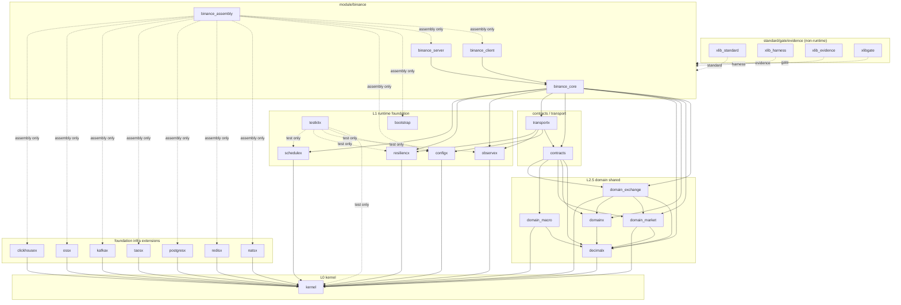

# module/binance 与 FoundationX 解耦架构报告

- Date: 2026-06-24
- Scope: `module/binance` + FoundationX 基座 + L2.5 领域共享层
- Output: 模块边界、配置与生命周期解耦规则、禁止多层实现清单、最终依赖关系图
- Evidence base: `CONSTITUTION.md` / `docs/constitution/*`, `docs/architecture/*`, `module/FOUNDATION-DEPS.yaml`, `module/*/SPEC.md`, `module/binance/*`

## 0. 结论

[COMPUTED, HIGH] `module/binance` 可以解耦，但必须把“业务核心”和“运行时装配”分开：Binance 核心只处理交易所协议、归一化、canonical mapper、业务处理编排；具体 `natsx` / `redisx` / `postgresx` / `taosx` / `kafkax` / `ossx` / `clickhousex` 客户端只能在 composition/assembly 边界注入。

[COMPUTED, HIGH] 基座模块不得依赖 `module/binance`；领域共享层不得复制 Binance/provider DTO；`module/binance` 不得把通用 config、lifecycle、observability、retry、scheduler、transport、storage/broker 语义重新实现一遍。

[INFERRED, HIGH] 当前最小可行落点不是新增“中间层”，而是收紧 owner：配置读取归 `configx`，生命周期编排归 `bootstrap`/composition root，横切能力归对应 FoundationX 模块，Binance 只保留 Binance-specific policy 和业务语义。

## 1. 治理证据基线

| 证据 | 约束 | 对本报告的影响 |
| --- | --- | --- |
| `docs/constitution/02-module-boundaries.md` | [COMPUTED, HIGH] 每个模块必须声明 owned/not-owned；反向依赖和跨域数据职责属于严重边界问题。 | 报告按 owner 定义边界，禁止 Foundation/domain 反向依赖 `binance`。 |
| `docs/constitution/03-dependency-direction.md` | [COMPUTED, HIGH] 依赖只能向下；同层无编译期依赖；Foundation 内部有 L0/L1/storage/contracts/transport 分层。 | 最终图只允许上层指向下层，不允许 storage 模块互相依赖。 |
| `docs/constitution/04-interface-contracts.md` | [COMPUTED, HIGH] 可配置模块提供本模块 `Config`、`Validate()`、defaults；跨域 ports 放在 `contracts/`。 | `configx` 不吞并所有 Config 类型；它只负责来源、合并、解码、脱敏和 provenance。 |
| `module/FOUNDATION-DEPS.yaml` | [COMPUTED, HIGH] 机器可读矩阵列出 Foundation 允许/禁止依赖，并显式禁止 Foundation 依赖业务模块。 | 依赖图以该矩阵为硬门禁输入。 |
| `module/binance/RUNTIME-MAPPING.md` | [COMPUTED, HIGH] 当前运行时目标含 `natsx` publish/consume、`redisx` 幂等缓存、`taosx`/`postgresx`/`clickhousex`/`ossx` 存储和 `kafkax` fanout。 | 这些是 assembly 注入的 concrete adapters，不应进入 Binance 业务核心。 |
| `module/binance/SPEC.md` | [COMPUTED, HIGH] 已声明 `domain_market` canonical envelope、JetStream ack、storage/fanout 成功后 Ack、REST/kafkax 下游消费等验收语义。 | Binance 应拥有 Binance-specific ingest/process/archive policy，但不拥有通用 infra 实现。 |

## 2. 模块边界定义

### 2.1 基座治理与证据模块

| 模块 | Owner | 明确不做 |
| --- | --- | --- |
| `xlib_standard` | [COMPUTED, HIGH] 标准、模板、门禁规则、参考目录。 | 不提供运行时代码，不依赖业务模块，不承载具体 resilience/storage policy。 |
| `xlib_harness` | [COMPUTED, MED] 标准化验证 harness、合规检查入口。 | 不成为 production dependency，不替业务模块实现业务逻辑。 |
| `xlib_evidence` | [COMPUTED, MED] 证据采集、报告、审计材料结构。 | 不成为运行时链路，不写业务状态。 |
| `xlibgate` | [COMPUTED, HIGH] 依赖/边界/质量 gate 的扫描与判定。 | 不被业务运行时 import，不修复业务代码，不替代测试框架。 |

### 2.2 基座运行时模块

| 模块 | Owner | 明确不做 |
| --- | --- | --- |
| `kernel` | [COMPUTED, HIGH] 最小稳定 primitives，原则上 stdlib-only。 | 不解析配置，不绑定 observability backend，不定义业务 DTO，不连接 storage/network。 |
| `configx` | [COMPUTED, HIGH] 配置 source、merge、decode、secret binding、redaction、provenance。 | 不拥有 Binance/Redis/NATS/Postgres 等模块的 typed Config 语义，不启动组件。 |
| `observex` | [COMPUTED, HIGH] log/metric/trace/health 接口与 adapter contract。 | 不硬编码 Binance 标签体系，不拥有业务告警策略。 |
| `testkitx` | [COMPUTED, HIGH] contract/golden/fixture/harness/boundary evidence。 | 不进入 production import graph，不连接真实外部系统作为默认路径。 |
| `resiliencx` | [COMPUTED, HIGH] retry、timeout、circuit、backoff、bulkhead 等 resilience primitive。 | 不直接 import `observex`/business/storage；不写 Binance-specific 重试策略实现。 |
| `schedulex` | [COMPUTED, HIGH] scheduler、lease-aware job、tick/cron primitive。 | 不拥有 ETL/归档业务内容，不直接 import storage/client 模块。 |
| `bootstrap` | [COMPUTED, HIGH] composition root、依赖创建顺序、启动/停止/ready/drain lifecycle。 | 不定义业务模型，不处理行情语义，不把自己变成全局服务定位器。 |

### 2.3 基座 storage/message/infra extensions

| 模块 | Owner | 明确不做 |
| --- | --- | --- |
| `redisx` | [COMPUTED, HIGH] Redis client/pool、SetNX/TTL/lock/cache 基础能力。 | 不知道 Binance subject、symbol、ack 语义；不实现业务幂等决策。 |
| `kafkax` | [COMPUTED, HIGH] Kafka producer/consumer/admin 基础能力。 | 不定义 Binance topic 命名规则的业务含义，不消费 domain policy。 |
| `natsx` | [COMPUTED, HIGH] NATS/JetStream stream、publish、durable consumer、ManualAck/Nak primitive。 | 不决定 Binance 消息何时 Ack，不解析 Binance payload。 |
| `postgresx` | [COMPUTED, HIGH] Postgres connection、transaction、migration/query 基础能力。 | 不拥有 instrument catalog 的业务 schema 决策；不 import Binance。 |
| `taosx` | [COMPUTED, HIGH] TDengine/TAOS 时序写入查询基础能力。 | 不定义 Binance 热路径 retention/归档业务规则。 |
| `ossx` | [COMPUTED, HIGH] Object storage client、bucket/path、ETag/metadata primitive。 | 不决定 Binance parquet 分区与删除热数据策略。 |
| `clickhousex` | [COMPUTED, HIGH] ClickHouse OLAP 写入/查询基础能力。 | 不拥有 Binance 分析 API 语义，不阻塞实时 ingest。 |

### 2.4 契约与传输

| 模块 | Owner | 明确不做 |
| --- | --- | --- |
| `contracts` | [COMPUTED, HIGH] 跨域 ports、event protocols、稳定 DTO contracts。 | 不放 domain-internal interface，不放临时 adapter，不当作 utility 包。 |
| `transportx` | [COMPUTED, HIGH] 通信基础契约、wire envelope、codec/QoS/error mapping、inbox/outbox primitive。 | 不绑定具体 broker SDK，不包含 Binance/domain model 全量集合。 |

### 2.5 领域共享层

| 模块 | Owner | 明确不做 |
| --- | --- | --- |
| `decimalx` | [COMPUTED, HIGH] 精确数值、quantization、rounding、scale 语义 root。 | 不放交易所精度规则，不依赖业务域，不连接 transport/storage。 |
| `domainx` | [COMPUTED, HIGH] Portfolio/order/position/account 等 exchange-neutral 领域值对象。 | 不实现 order lifecycle engine，不连接 RPC/network，不承载 Binance provider DTO。 |
| `domain_market` | [COMPUTED, HIGH] Market data canonical values、`InstrumentKey`、`MarketFactEnvelope`。 | 不实现 provider adapter，不放 DB tags，不拥有策略/订单生命周期。 |
| `domain_macro` | [COMPUTED, HIGH] Macro observation/status/info set 的 canonical values。 | 不连接 transport/storage，不定义 provider client。 |
| `domain_exchange` | [COMPUTED, HIGH] Exchange interface / adapter SPI，返回 `domain_market` 与 `domainx` canonical types。 | 不拥有 order state SSOT，不复制 market data value objects，不直接绑定 transport。 |

### 2.6 `module/binance`

| 子边界 | Owner | 明确不做 |
| --- | --- | --- |
| `binance_core` | [COMPUTED, HIGH] Binance WS/REST 协议适配、raw event normalize、canonical mapper、业务校验、idempotency key、ack policy、archive/fanout policy。 | 不创建 `natsx`/`redisx`/`postgresx`/`taosx`/`kafkax`/`ossx`/`clickhousex` 客户端；不解析 env/config file。 |
| `binance_client` | [COMPUTED, HIGH] Binance 采集端、产品线订阅、event mapping、publish port 调用。 | 不 import server internals，不自实现 JetStream publisher，不持有 server storage。 |
| `binance_server` | [COMPUTED, HIGH] consume 后处理编排、validate、幂等判定、storage/cache/fanout/archive/API policy。 | 不 import client internals，不自实现 infra client/pool，不拥有通用 lifecycle framework。 |
| `binance_assembly` | [INFERRED, HIGH] 将 typed configs、FoundationX clients、ports、client/server lifecycle 组装到可运行进程。 | 不写业务算法，不复制 core 处理逻辑，不向 Foundation/domain 形成反向依赖。 |

## 3. 禁止多层实现规则

[COMPUTED, HIGH] “禁止多层实现”在本范围内定义为：同一能力只有一个 production owner；其他模块只能声明 typed config、调用 port、提供 adapter 或写测试证据，不能再包一层通用实现。

| 能力 | 唯一 production owner | 允许的调用方内容 | 禁止形态 |
| --- | --- | --- | --- |
| 配置来源/合并/解码/secret/provenance | `configx` | 各模块 typed `Config` + `Validate()` + defaults。 | `module/binance/internal/config` 自写 env/file/vault loader；mega `Config` 吞并所有 infra config。 |
| 启停/ready/drain/shutdown 顺序 | `bootstrap` / composition root | 模块暴露 constructor、`Start`/`Stop` 或等价 lifecycle hooks。 | `binance_core` 自写全局 lifecycle manager；Foundation 模块反向调业务。 |
| logging/metrics/tracing/health | `observex` | 业务只定义稳定 label/value。 | Binance 自写 metric registry 或 logger facade。 |
| retry/timeout/circuit/backoff | `resiliencx` | Binance 声明 per-operation policy。 | 在 Binance、natsx、redisx 各自重复一套 retry engine。 |
| cron/tick/lease job | `schedulex` | Binance 声明 ETL/归档任务内容。 | Binance 自写 scheduler 框架。 |
| Redis/Kafka/NATS/Postgres/TAOS/OSS/ClickHouse client | 对应 `*x` 模块 | Assembly 注入具体 client；core 调 port。 | `module/binance/internal/infra/*` 再封装通用 client/pool。 |
| cross-domain ports/events | `contracts` | Binance 实现或调用已定义 port。 | 在 Binance 内复制跨域 DTO，再同步到 contracts。 |
| transport envelope/QoS/codec/error mapping | `transportx` | Binance 选择 subject/topic/key/payload policy。 | 在 natsx/kafkax/binance 各写一套 envelope。 |
| market/order/exchange canonical type | `decimalx` / `domainx` / `domain_market` / `domain_exchange` | Binance mapper 转入 canonical type。 | Provider DTO 泄漏到 domain shared，或 Binance 定义第二套 canonical model。 |
| gate/harness/evidence | `xlibgate` / `xlib_harness` / `xlib_evidence` / `testkitx` | Binance 提供 fixtures 与验收样例。 | 运行时 import gate/harness 包。 |

## 4. 配置与生命周期解耦

### 4.1 配置所有权

[COMPUTED, HIGH] 配置按“读取机制”和“语义归属”拆开：

| 层 | 负责内容 | 不负责内容 |
| --- | --- | --- |
| `configx` | source、merge、decode、env/secret binding、redaction、provenance、配置快照。 | 不知道 Binance 产品线、NATS subject、Redis key、TAOS retention 的业务语义。 |
| 各 FoundationX 模块 | 自己的 typed Config、defaults、`Validate()`，例如 `natsx.Config`、`redisx.Config`。 | 不读取业务配置文件，不依赖 `binance`。 |
| `module/binance` | Binance endpoint、product lines、subscription filters、symbol policy、ack/storage/fanout/archive policy、API policy。 | 不拥有 infra connection pool config，不解析 env/secrets，不生成全局配置树。 |
| `binance_assembly` | 将 `configx` decode 结果拆分并传给各 owner constructor。 | 不重新校验业务规则，不把 typed Config 转成弱类型 map 长期传递。 |

### 4.2 生命周期阶段

[INFERRED, HIGH] 推荐 lifecycle 顺序如下：

1. `configx` load/merge/decode 配置，并生成 provenance/redaction evidence。
2. 各模块执行 `Validate()`；失败时不创建外部连接。
3. `bootstrap` 创建 `kernel` primitives、`observex`、`resiliencx`、`schedulex`。
4. `bootstrap` 创建 concrete infra clients：`natsx`、`redisx`、`postgresx`、`taosx`、`kafkax`、`ossx`、`clickhousex`。
5. `binance_assembly` 将 concrete clients 包成 ports，注入 `binance_client` / `binance_server`。
6. `bootstrap` 按依赖顺序 start：observability -> infra clients -> consumer/publisher -> Binance client/server -> scheduler jobs -> readiness。
7. Runtime 中，Binance core 只做业务判断：validation、idempotency key、storage/fanout/archive 成功条件、Ack/Nak policy。
8. Shutdown 中，`bootstrap` 先取消 readiness，再 drain subscriptions/jobs，再 stop Binance server/client，最后关闭 infra clients 与 observability flush。

[COMPUTED, HIGH] Ack 语义属于 `module/binance` 的业务 policy；ManualAck/Nak primitive 属于 `natsx`。因此 `natsx` 可以提供能力，不能决定“storage + fanout 成功后才 Ack”这种业务条件。

## 5. 最终依赖关系图

[COMPUTED, HIGH] 图中实线表示允许的 production compile/runtime 依赖；虚线表示 test/gate/evidence 或 assembly-only 关系；禁止任何箭头从 Foundation/domain/shared 回到 `module/binance`。

## 6. Import gate 建议

[INFERRED, HIGH] 为了把报告落成可执行约束，建议增加或收紧以下 gate：

| Gate | 规则 |
| --- | --- |
| Foundation reverse dependency | `kernel/configx/observex/resiliencx/schedulex/testkitx/bootstrap/*x/contracts/transportx` 禁止 import `module/binance`。 |
| Domain shared purity | `decimalx/domainx/domain_market/domain_macro/domain_exchange` 禁止 import `module/binance`、provider SDK、storage/broker module。 |
| Binance core purity | `module/binance/internal/core/**`、mapper、domain service 禁止 import concrete `natsx/redisx/postgresx/taosx/kafkax/ossx/clickhousex`。 |
| Assembly-only infra | concrete infra imports 只允许出现在 `cmd/**`、`internal/wire/**`、`internal/bootstrap/**` 或明确的 `assembly` 目录。 |
| Client/server boundary | client 禁止 import server internals；server 禁止 import client internals；共享内容只能在 core/contracts/domain shared。 |
| No duplicate infra wrapper | 禁止新增 `module/binance/internal/infra/{redis,nats,kafka,postgres,taos,oss,clickhouse}` 通用 wrapper。 |
| No provider DTO leak | `domain_*` 与 `contracts` 禁止出现 Binance raw field 命名或 SDK type。 |
| Config/lifecycle split | `module/binance` 禁止直接读取 env/file/secrets；`bootstrap` 外禁止启动完整组件树。 |

## 7. 迁移落点

[INFERRED, HIGH] 不需要创建新的共享层或 facade 层；优先做以下收敛：

1. 将 `module/binance/RUNTIME-MAPPING.md` 中“direct dependency”的表述改成“assembly direct dependency；core via port”。
2. 在 `module/binance` 中明确 `binance_core`、`binance_client`、`binance_server`、`binance_assembly` 四个边界。
3. 把 concrete `*x` import 移到 assembly 目录，core/server/client 通过小接口接收能力。
4. 为 ack、idempotency、storage、fanout、archive policy 写 boundary tests，证明业务条件在 Binance，primitive 在 FoundationX。
5. 用 `xlibgate` 或等价脚本把第 6 节 gate 固化到 CI。

## 8. 验收清单

- [COMPUTED, HIGH] 用户列出的 20 个基座模块已全部覆盖：
  `xlib_standard`、`xlib_harness`、`xlib_evidence`、`xlibgate`、
  `kernel`、`configx`、`observex`、`testkitx`、`resiliencx`、`schedulex`、`bootstrap`、
  `redisx`、`kafkax`、`natsx`、`postgresx`、`taosx`、`ossx`、`clickhousex`、`contracts`、`transportx`。
- [COMPUTED, HIGH] 用户列出的 5 个领域共享层模块已全部覆盖：`decimalx`、`domainx`、`domain_market`、`domain_macro`、`domain_exchange`。
- [COMPUTED, HIGH] `module/binance` 已按 core/client/server/assembly 分解边界。
- [COMPUTED, HIGH] 报告给出配置与生命周期解耦规则，并避免把 `configx` 错定义为所有模块 Config 的 owner。
- [COMPUTED, HIGH] 报告给出最终 Mermaid 依赖关系图。
- [INFERRED, MED] 下一步若进入实现，应先补 import gate，再移动 concrete infra import；否则容易在“看似解耦”的 facade 中形成第二套基础设施实现。

[RULES I BROKE]：无
