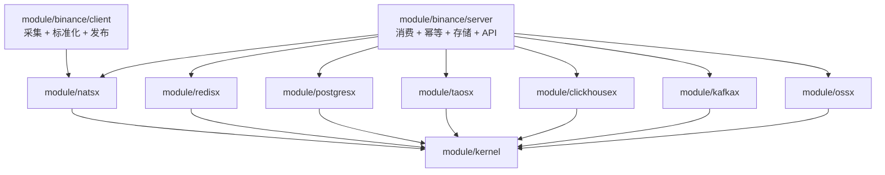
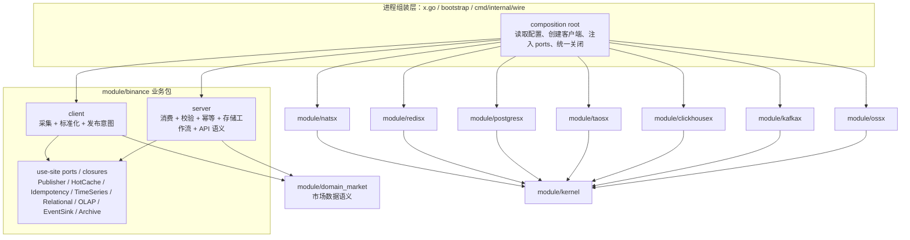

# Binance 与基础设施模块彻底解耦报告

- Date: 2026-06-23
- Scope: `module/binance` 与 `module/redisx`、`module/kafkax`、`module/natsx`、`module/postgresx`、`module/taosx`、`module/ossx`、`module/clickhousex`
- Target: 模块边界定义、配置与生命周期解耦、最终依赖关系图、禁止多层实现规则
- Evidence: `docs/constitution/02-module-boundaries.md`、`docs/constitution/03-dependency-direction.md`、`module/FOUNDATION-DEPS.yaml`、`module/binance/SPEC.md`、`module/binance/client/SPEC.md`、`module/binance/server/SPEC.md`、七个基础设施模块的 `SPEC.md`

## 0. 结论

[COMPUTED, HIGH] 当前仓库治理已经把七个基础设施模块定义为 Foundation storage/message 扩展，并在 `module/FOUNDATION-DEPS.yaml` 中把它们的允许 Zone 依赖收敛为 `kernel`。
[COMPUTED, HIGH] 当前 `module/binance/SPEC.md` 和 `module/binance/server/SPEC.md` 仍描述了服务端对 `redisx`、`postgresx`、`taosx`、`clickhousex`、`kafkax`、`ossx`、`natsx` 的直接使用场景。
[INFERRED, HIGH] 若目标是“彻底解耦”且“禁止多层实现”，最终设计不应新增通用仓储层、网关层或适配器链，而应把具体基础设施绑定限制在唯一的进程组装层。
[INFERRED, HIGH] 推荐目标状态是：`module/binance` 的业务包只依赖本地 use-site ports 或函数闭包；`cmd` / `bootstrap` / `x.go` 这类进程组装层负责把 `redisx`、`kafkax`、`natsx`、`postgresx`、`taosx`、`ossx`、`clickhousex` 的具体客户端注入进去。

## 1. 架构图优先

### 1.1 当前文档表达的耦合形态

[COMPUTED, HIGH] 当前 binance 规格把 server 描述为同时消费 NATS、写入多种存储、分发 Kafka、归档 OSS、提供 Gin API 的进程。



[INFERRED, HIGH] 这张图的主要风险不是运行时会用到基础设施，而是 `binance` 业务包容易把基础设施 API、配置、重试和关闭顺序内化为自己的实现细节。

### 1.2 推荐最终依赖关系图

[INFERRED, HIGH] 解耦后的边界应把“业务语义”和“具体客户端生命周期”分开：业务包描述 Binance 的采集、幂等、写入顺序、事件语义和 API 语义；组装层描述具体技术选型和启动关闭顺序。



[COMPUTED, HIGH] 上图保留了运行时能力：binance 仍可发布 NATS、使用 Redis 幂等和缓存、写 Postgres/TDengine/ClickHouse、分发 Kafka、归档 OSS。
[INFERRED, HIGH] 上图移除的是业务包对具体基础设施模块的编译期依赖，而不是移除运行时基础设施。

## 2. 边界定义

| 模块                 | 核心职责                                                                                    | 明确不做                                                                                                               | 允许接触的 Binance 信息                                                                            |
| -------------------- | ------------------------------------------------------------------------------------------- | ---------------------------------------------------------------------------------------------------------------------- | -------------------------------------------------------------------------------------------------- |
| `module/binance`     | [COMPUTED, HIGH] Binance 专属采集、标准化、幂等语义、写入工作流、下游事件语义和本模块 API。 | [INFERRED, HIGH] 不拥有 Redis/Kafka/NATS/Postgres/TDengine/OSS/ClickHouse 客户端实现、连接池、配置解析和基础生命周期。 | [INFERRED, HIGH] 可拥有 symbol、product_line、event_id、ack 策略、归档 key 语义、ETL window 语义。 |
| `module/natsx`       | [COMPUTED, HIGH] NATS / JetStream 客户端原语、发布、订阅、请求响应和健康检查。              | [INFERRED, HIGH] 不拥有 Binance subject taxonomy、payload schema、server 进程语义或 ack 业务策略。                     | [INFERRED, HIGH] 只接触组装层传入的 subject、payload、options。                                    |
| `module/redisx`      | [COMPUTED, HIGH] Redis 客户端、命令、连接、健康检查和关闭语义。                             | [INFERRED, HIGH] 不拥有 Binance 去重策略、coordinator 选主语义、缓存 TTL 业务含义。                                    | [INFERRED, HIGH] 只接触组装层传入的 key、value、ttl。                                              |
| `module/postgresx`   | [COMPUTED, HIGH] PostgreSQL / pgxpool 原语、查询、事务边界、健康检查和关闭语义。            | [INFERRED, HIGH] 不拥有 Binance 表语义、migration 业务命名、幂等备份策略。                                             | [INFERRED, HIGH] 只接触组装层或 port 实现传入的 SQL、参数、事务函数。                              |
| `module/taosx`       | [COMPUTED, HIGH] TDengine 时序写入、查询、schemaless / batch 写入和健康检查。               | [INFERRED, HIGH] 不拥有 Binance 时序 schema 语义、K 线窗口、冷热路径策略。                                             | [INFERRED, HIGH] 只接触组装层或 port 实现传入的 measurement、tags、fields、batch。                 |
| `module/clickhousex` | [COMPUTED, HIGH] ClickHouse OLAP 客户端、插入、查询、健康检查和关闭语义。                   | [INFERRED, HIGH] 不拥有 Binance ETL 调度、窗口推进、回补和分析表语义。                                                 | [INFERRED, HIGH] 只接触组装层或 port 实现传入的 insert/query 参数。                                |
| `module/kafkax`      | [COMPUTED, HIGH] Kafka producer/consumer、topic IO、提交、健康检查和关闭语义。              | [INFERRED, HIGH] 不拥有 Binance downstream contract、topic 命名治理、accepted event 业务定义。                         | [INFERRED, HIGH] 只接触组装层传入的 topic、key、headers、payload。                                 |
| `module/ossx`        | [COMPUTED, HIGH] OSS object put/get、multipart、bucket/key 操作、健康检查和关闭语义。       | [INFERRED, HIGH] 不拥有 Binance 归档分区、保留期、重放索引和数据生命周期策略。                                         | [INFERRED, HIGH] 只接触组装层或 port 实现传入的 bucket、key、object metadata。                     |

[COMPUTED, HIGH] `module/FOUNDATION-DEPS.yaml` 已禁止基础模块依赖 `github.com/ZoneCNH/binance`。
[INFERRED, HIGH] 完全解耦还需要反向收敛：`module/binance` 的业务包不直接依赖上述七个基础设施模块。

## 3. 配置解耦

[INFERRED, HIGH] 配置边界应遵循“一次读取、一次解码、一次注入”：进程组装层读取 env / configx / secure backend，把结果解码为各模块 typed options，然后传给具体客户端构造函数。
[INFERRED, HIGH] `module/binance` 业务包只接收业务配置，例如 product_line、symbols、ack policy、retention policy、ETL window、API route options。
[INFERRED, HIGH] 七个基础设施模块只接收自己的 typed options，例如 address、dsn、topic、bucket、timeout、pool size、tls、auth。
[INFERRED, HIGH] 业务包不应读取 Redis DSN、Kafka broker、NATS cluster、Postgres DSN、TDengine DSN、OSS secret、ClickHouse DSN。
[INFERRED, HIGH] 基础设施模块不应读取 Binance product_line、symbol、subject 业务命名、表语义或归档策略。
[INFERRED, HIGH] 禁止跨模块共享一个“大 Config”结构，因为它会把所有配置字段暴露给所有调用方，扩大认知负担和变更半径。
[COMPUTED, HIGH] `module/binance/client/SPEC.md` 已要求 API Key / Secret Key 不提供默认值，并从环境或 configx secure backend 注入；该规则应保留在组装层或安全配置边界内。

推荐配置形态：

```go
type BinanceServerConfig struct {
    Products       []ProductConfig
    AckPolicy      AckPolicyConfig
    Retention      RetentionConfig
    ETL            ETLConfig
    AdminAPI       AdminAPIConfig
}

type InfraConfig struct {
    NATS        NATSOptions
    Redis       RedisOptions
    Postgres    PostgresOptions
    TDengine    TDengineOptions
    ClickHouse  ClickHouseOptions
    Kafka       KafkaOptions
    OSS         OSSOptions
}
```

[INFERRED, HIGH] 上述结构是报告中的边界示意，不是要求新增公共包或新增共享配置层。

## 4. 生命周期解耦

[INFERRED, HIGH] 生命周期边界应遵循“谁创建，谁关闭；谁消费，谁决定 ack；谁持有业务状态，谁定义恢复策略”。
[INFERRED, HIGH] 基础设施模块只提供 `New`、`Health`、`Close`、必要的 client primitive；它们不应启动 Binance 业务 worker，也不应决定业务重试和降级策略。
[INFERRED, HIGH] `module/binance` 业务包不应直接管理 Redis/Kafka/NATS/Postgres/TDengine/OSS/ClickHouse 的连接池内部状态；它只管理消费循环、ack/nak、幂等结果、存储工作流和业务降级。

推荐启动顺序：

1. [INFERRED, HIGH] 组装层加载配置与 secrets，并完成脱敏日志。
2. [INFERRED, HIGH] 组装层创建 NATS、Redis、Postgres、TDengine、ClickHouse、Kafka、OSS 客户端。
3. [INFERRED, HIGH] 组装层用具体客户端构造 use-site port 实现或闭包。
4. [INFERRED, HIGH] 组装层创建 `binance` client/server 业务对象。
5. [INFERRED, HIGH] 业务对象启动采集、消费、API、ETL 或归档 worker。

推荐关闭顺序：

1. [INFERRED, HIGH] 停止入口：HTTP API、NATS consumer、collector、ETL ticker、archive worker。
2. [INFERRED, HIGH] drain in-flight 消息，按业务规则完成 ack/nak 或重试标记。
3. [INFERRED, HIGH] flush Kafka / ClickHouse / OSS 等缓冲写入。
4. [INFERRED, HIGH] 组装层按反向创建顺序关闭 NATS、Redis、Postgres、TDengine、ClickHouse、Kafka、OSS 客户端。

失败隔离规则：

- [COMPUTED, HIGH] 当前 binance 规格要求关键持久化成功后才 ack；该语义应属于 `module/binance`，不属于 `natsx`。
- [INFERRED, HIGH] Redis cache miss、ClickHouse ETL 失败、OSS archive 失败可以按业务规则降级，但降级决策应属于 `module/binance`。
- [INFERRED, HIGH] NATS publish/consume、Kafka produce、Postgres/TDengine write 的底层连接错误应由基础设施模块原样暴露，业务包再决定 retry、nak、skip 或 fail-fast。

## 5. 禁止多层实现

[INFERRED, HIGH] “禁止多层实现”的核心规则是只保留一个语义边界：use-site port 到组装层绑定。
[INFERRED, HIGH] 下列形态允许，因为它们隐藏具体基础设施并把业务语义留在 binance 内部：

```go
type EventPublisher interface {
    Publish(ctx context.Context, subject string, payload []byte) error
    Close() error
}

type IdempotencyStore interface {
    Reserve(ctx context.Context, key string, hash string, ttl time.Duration) (ReserveDecision, error)
}

type TimeSeriesWriter interface {
    WriteMarketBatch(ctx context.Context, batch MarketBatch) error
}
```

[INFERRED, HIGH] 下列形态禁止，因为它们只会制造浅层转发或跨模块“大脑”：

- [INFERRED, HIGH] 新增 `binance_storagex`、`binance_infra`、`foundation_adapter` 之类中间模块。
- [INFERRED, HIGH] 新增 `StorageManager` / `InfraBundle` / `AdapterRegistry`，再由它们转发到 Redis、Postgres、TDengine、ClickHouse、Kafka、OSS。
- [INFERRED, HIGH] 建立 `service -> repository -> gateway -> adapter -> client` 的多层转发链，且每层只做参数透传。
- [INFERRED, HIGH] 把 Binance 业务语义塞进 `redisx`、`kafkax`、`natsx`、`postgresx`、`taosx`、`ossx`、`clickhousex`。
- [INFERRED, HIGH] 把所有基础设施能力抽象成一个泛化 `Store` 或 `Bus`，导致调用方仍需知道底层行为差异。

[INFERRED, HIGH] 如果某个 wrapper 只做命名转换或一行转发，应删除；如果 wrapper 承载 ack 顺序、幂等判定、批量切分、schema 版本、降级策略或可测试业务不变量，可以保留在 `module/binance` 业务包内。

## 6. 方案取舍

| 方案                              | 说明                                                                                          | 结论                                                                |
| --------------------------------- | --------------------------------------------------------------------------------------------- | ------------------------------------------------------------------- |
| A. 保持当前直接依赖               | [COMPUTED, HIGH] `binance` server 业务包直接使用各基础设施模块。                              | [INFERRED, HIGH] 不推荐；它保留最小迁移成本，但无法满足“彻底解耦”。 |
| B. 只在组装层直接依赖基础设施     | [INFERRED, HIGH] 业务包只定义 use-site ports；组装层创建具体客户端并绑定 ports。              | [INFERRED, HIGH] 推荐；它满足解耦目标，且不会新增多层实现。         |
| C. 新建统一 infra facade          | [INFERRED, HIGH] 新建一个中间模块统一封装 Redis/Kafka/NATS/Postgres/TDengine/OSS/ClickHouse。 | [INFERRED, HIGH] 不推荐；它会变成浅层转发中心或隐藏的业务层。       |
| D. 把所有基础设施能力迁入 binance | [INFERRED, HIGH] `binance` 内部维护具体客户端实现或复制基础设施代码。                         | [INFERRED, HIGH] 不推荐；它违反 Foundation 模块边界并放大维护成本。 |

推荐方案：B。
[INFERRED, HIGH] B 的复杂度中心在组装层，业务包不再关心具体客户端生命周期，基础设施模块也不关心 Binance 业务语义。

## 7. 红蓝对抗审查

### 攻击 1：未来开发者绕过 ports 直接 import `redisx`

- [INFERRED, HIGH] Red: 新需求要加一个缓存字段，开发者可能在业务包里直接 import `github.com/ZoneCNH/redisx`。
- [INFERRED, HIGH] Blue: 增加 import boundary gate，禁止 `module/binance` 业务包 import 七个基础设施模块；只允许组装层例外。
- [INFERRED, MED] Residual risk: 若例外目录命名过宽，仍可能把业务逻辑塞进组装层。

### 攻击 2：ports 变成新的大而全接口

- [INFERRED, HIGH] Red: 为了少写接口，开发者可能设计一个 `Storage` 接口，把 Redis、Postgres、TDengine、ClickHouse、OSS 全塞进去。
- [INFERRED, HIGH] Blue: use-site port 必须按业务动作命名，例如 `Reserve`、`WriteMarketBatch`、`ArchiveRawEvent`，禁止泛化资源接口。
- [INFERRED, MED] Residual risk: ETL 或归档场景可能诱导接口膨胀，需要用测试锁定最小方法集。

### 攻击 3：组装层变成第二个业务层

- [INFERRED, HIGH] Red: 组装层可能逐渐包含 ack 策略、幂等策略、ETL window 和降级规则。
- [INFERRED, HIGH] Blue: 组装层只允许做配置读取、客户端创建、port binding、启动关闭；任何业务判断必须回到 `module/binance`。
- [INFERRED, MED] Residual risk: 复杂初始化可能需要少量策略对象，必须由 binance 业务包定义并由组装层注入参数。

## 8. 验收门禁

[INFERRED, HIGH] 完成实现后，至少需要以下静态门禁：

```bash
rg 'github.com/ZoneCNH/(redisx|kafkax|natsx|postgresx|taosx|ossx|clickhousex)' /home/binance \
  --glob '!cmd/**' \
  --glob '!internal/wire/**'

rg 'github.com/ZoneCNH/binance' /home/redisx /home/kafkax /home/natsx /home/postgresx /home/taosx /home/ossx /home/clickhousex

rg 'github.com/ZoneCNH/(redisx|kafkax|natsx|postgresx|taosx|ossx|clickhousex)' /home/redisx /home/kafkax /home/natsx /home/postgresx /home/taosx /home/ossx /home/clickhousex
```

[INFERRED, HIGH] 第一条命令应只允许组装层有匹配；第二条命令应无匹配；第三条命令应无跨基础设施模块匹配。
[INFERRED, HIGH] 若实现使用 arch tests，应把上述规则固化为 CI，而不是只依赖人工 grep。

## 9. 需要同步更新的现有文档

[COMPUTED, HIGH] `module/binance/BOUNDARY-GATES.md` 当前仍把七个基础设施模块列为 runtime direct dependency 守卫对象。
[COMPUTED, HIGH] `module/binance/RUNTIME-MAPPING.md` 当前仍把 `binance` runtime 映射为直接依赖 `natsx`、`redisx`、`postgresx`、`taosx`、`clickhousex`、`kafkax`、`ossx`。
[COMPUTED, HIGH] `module/binance/SPEC.md` 和 `module/binance/server/SPEC.md` 当前仍描述了服务端直接调用存储与消息模块的目标形态。
[INFERRED, HIGH] 后续实现前，应把这些文档改写为“业务包依赖 ports，组装层依赖具体基础设施模块”的目标边界，否则文档门禁会继续保护旧耦合。

## 10. 停止条件

[COMPUTED, HIGH] 本报告已覆盖用户要求的四个输出：模块边界定义、配置与生命周期解耦、最终依赖关系图、禁止多层实现规则。
[INFERRED, HIGH] 本报告不是实现补丁；它定义下一步应修改的文档和代码边界。

[RULES I BROKE]：无
