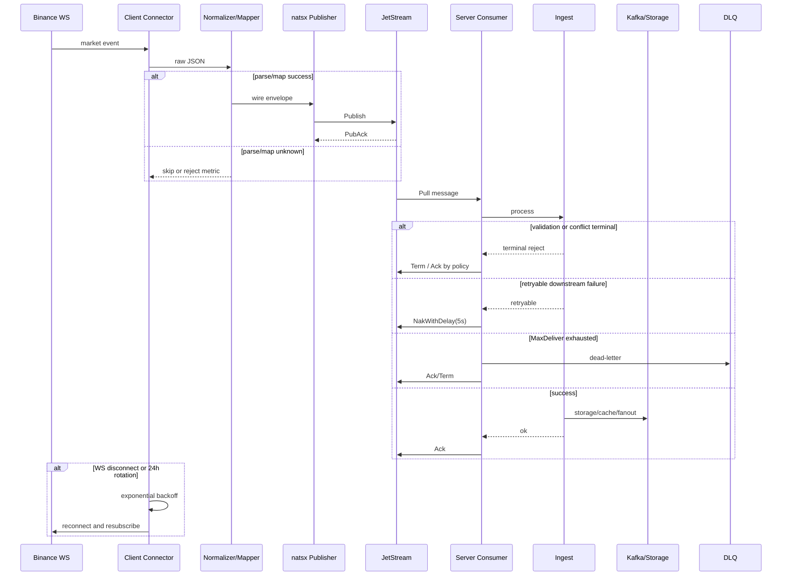

# Binance 数据流架构图与职责边界

> 分析日期：2026-06-25（Asia/Shanghai）
> 范围：`/home/binance` 运行时代码与 `module/binance/` 规格
> 证据标签：`[COMPUTED]` 来自代码/文档/官方资料；`[INFERRED]` 来自架构判断。

## 目录

- [执行摘要](#执行摘要)
- [总体数据流](#总体数据流)
- [REST 请求链路](#rest-请求链路)
- [WebSocket 实时链路](#websocket-实时链路)
- [解析、缓存与分发层](#解析缓存与分发层)
- [错误处理与重连机制](#错误处理与重连机制)
- [职责边界](#职责边界)
- [架构缺口](#架构缺口)

## 执行摘要

[COMPUTED, HIGH] 当前架构已经形成 client/server 分离：client 负责 Binance endpoint、catalog、WebSocket 采集、normalize、mapping 和 natsx publish；server 负责 JetStream durable consume、validate、idempotency、storage、Kafka fanout、hot cache、API 和 observability。

[INFERRED, MED] 生产级缺口不在“是否有架构骨架”，而在“骨架是否完整装配且有证据闭环”：USD-M endpoint 需要按官方 `/public`、`/market`、`/private` 拆分，Options 需要真实 ticker 样本与 mapper，订单簿需要 REST snapshot + diff 连续性重建，Kafka/storage/API 需要一致的 live evidence。

## 总体数据流

```mermaid
flowchart LR
    subgraph Binance["Binance Public Endpoints"]
        SpotREST["Spot REST<br/>exchangeInfo / depth snapshot"]
        FuturesREST["Futures REST<br/>exchangeInfo / depth snapshot / history"]
        OptionsREST["Options REST<br/>active contracts / depth snapshot"]
        SpotWS["Spot WS<br/>/ws or /stream"]
        UMWSPublic["USD-M WS /public<br/>depth / bookTicker"]
        UMWSMarket["USD-M WS /market<br/>trade / kline / mark"]
        CMWs["COIN-M WS<br/>dstream /ws or /stream"]
        OptionsWS["Options WS<br/>/public or /market"]
    end

    subgraph Client["binance/client"]
        Catalog["Catalog Loader<br/>exchangeInfo -> instruments"]
        SubPlan["Subscription Planner<br/>product_line + stream_class"]
        Connector["WS Connector<br/>heartbeat + reconnect"]
        Parser["Stream Parser<br/>combined/raw JSON"]
        Normalizer["Normalizer<br/>trade / quote / depth / bar / funding / mark / option"]
        BookBuilder["Local Order Book Builder<br/>snapshot + diff continuity<br/>(required gap)"]
        Mapper["Domain Mapper<br/>domain_market + wire envelope"]
        ClientIdem["Client Cursor / Retry<br/>ACK driven"]
        Publisher["natsx Publisher<br/>PubAck required"]
        ClientAdmin["Client Admin API<br/>reload / pause / drain / backfill"]
    end

    subgraph Bus["natsx JetStream"]
        JS["BINANCE_MARKET<br/>binance.market.*.*"]
    end

    subgraph Server["binance/server"]
        Consumer["Durable Consumer<br/>ManualAck / NakWithDelay / MaxDeliver"]
        Validator["Envelope Validator<br/>schema / freshness / identity"]
        ServerIdem["Idempotency<br/>Redis SETNX 72h or memory"]
        Ingest["Ingest Pipeline<br/>durable mark / strict mode"]
        Storage["Storage Adapters<br/>taosx / postgresx / clickhousex / ossx"]
        HotCache["Hot Cache<br/>redisx latest / stats"]
        Kafka["kafkax Fanout<br/>topic prefix + schema version"]
        API["Gin Query API<br/>latest / instruments / stats"]
        Metrics["Prometheus + JSON Logs<br/>SLO / gap / retry / reject"]
        DLQ["Dead Letter / Retry Exhausted"]
    end

    subgraph Downstream["Downstream Consumers"]
        MarketData["market_data"]
        Research["research / backtest"]
        Ops["ops dashboards"]
    end

    SpotREST --> Catalog
    FuturesREST --> Catalog
    OptionsREST --> Catalog
    SpotREST --> BookBuilder
    FuturesREST --> BookBuilder
    OptionsREST --> BookBuilder
    Catalog --> SubPlan

    SubPlan --> Connector
    SpotWS --> Connector
    UMWSPublic --> Connector
    UMWSMarket --> Connector
    CMWs --> Connector
    OptionsWS --> Connector

    Connector --> Parser --> Normalizer
    Normalizer --> BookBuilder
    Normalizer --> Mapper
    BookBuilder --> Mapper
    Mapper --> ClientIdem --> Publisher --> JS
    ClientAdmin --> Catalog
    ClientAdmin --> Connector

    JS --> Consumer --> Validator --> ServerIdem --> Ingest
    Ingest --> Storage
    Ingest --> HotCache
    Ingest --> Kafka
    Ingest --> Metrics
    Ingest --> DLQ
    HotCache --> API
    Storage --> API
    Kafka --> MarketData
    API --> Research
    Metrics --> Ops

    Connector -. reconnect/backoff .-> SubPlan
    Consumer -. NakWithDelay .-> JS
    Ingest -. retry exhausted .-> DLQ
```

## REST 请求链路

[COMPUTED, HIGH] Spot REST 当前有明确实现：`/home/binance/internal/client/exchangeinfo.go` 通过 `https://api.binance.com/api/v3/exchangeInfo` 拉取并解析 Spot instrument catalog。

[COMPUTED, HIGH] 规格要求 REST 也服务于 history/backfill、depth snapshot、instrument catalog 和 query fallback，见 `module/binance/SPEC.md` 与 `module/binance/server/SPEC.md`。

[INFERRED, MED] 当前 REST 链路生产化需要补齐三类能力：

| 能力             | 当前状态                                        | 生产要求                                                                         |
| ---------------- | ----------------------------------------------- | -------------------------------------------------------------------------------- |
| 四产品线 catalog | Spot 已实现，Futures/Options 未证明等价实现     | 每条产品线都有独立 endpoint、rate weight、symbol lifecycle、错误分类和缓存策略。 |
| depth snapshot   | 规格要求存在，运行时代码未证明闭环              | 与 diff depth stream 组合，满足官方本地订单簿算法。                              |
| history/backfill | client/server 有 backfill 相关 admin 与节流骨架 | 需要权威水位、优先级、限流预算和重放审计。                                       |

## WebSocket 实时链路

[COMPUTED, HIGH] 当前连接器位于 `/home/binance/internal/client/spot.go`，复用为 Spot、UM、CM、Options 四条产品线；具备 heartbeat、read loop、write control、panic recovery、指数退避重连和 event channel。

[COMPUTED, HIGH] 产品线与默认 stream 位于 `/home/binance/internal/client/product_line.go`。默认包括 trade、bookTicker、depth20、diff depth、kline；合约还包含 mark/funding 类型解析。

[COMPUTED, HIGH] 官方 WebSocket 约束会直接影响连接设计：

| 产品线  | 官方约束                                                                                    | 对架构的影响                                                                                       |
| ------- | ------------------------------------------------------------------------------------------- | -------------------------------------------------------------------------------------------------- |
| Spot    | 连接 24h 有效；server ping；5 incoming msg/s；最多 1024 streams                             | 需要 24h 主动轮换、订阅节流、stream shard。                                                        |
| USD-M   | 连接 24h；10 incoming msg/s；最多 1024 streams；新路由拆为 `/public`、`/market`、`/private` | 不能把 depth/bookTicker/trade/kline/mark 全部压到单一 legacy base URL；需要 stream class planner。 |
| COIN-M  | 连接 24h；10 incoming msg/s；最多 1024 streams                                              | 需要 shard、重连、限流和订阅预算。                                                                 |
| Options | 连接 24h；10 incoming msg/s；最多 200 streams；`/public`/`/market`                          | Options 必须独立 shard 和 symbol selection，不能复用 1024 streams 假设。                           |

## 解析、缓存与分发层

| 层         | 当前模块                                               | 职责                                                                                                                                           |
| ---------- | ------------------------------------------------------ | ---------------------------------------------------------------------------------------------------------------------------------------------- |
| Parser     | `/home/binance/internal/client/normalize.go`           | [COMPUTED, HIGH] 解包 raw/combined stream JSON，识别 trade、aggTrade、bookTicker、ticker、kline、depth、markPrice、fundingRate、optionTicker。 |
| Normalizer | `/home/binance/internal/client/normalize.go`           | [COMPUTED, HIGH] 输出 `NormalizedEvent`，保留 product line、stream、raw、timestamps、depth levels、funding/mark/options 字段。                 |
| Mapper     | `/home/binance/internal/client/mapper.go`              | [COMPUTED, HIGH] 映射 trade、tick、bar、funding_rate、mark_price 到 domain/wire；未处理 `option_tick` 和 canonical depth。                     |
| Publisher  | `/home/binance/internal/client/publisher/publisher.go` | [COMPUTED, HIGH] 通过 natsx 发布到 `binance.market.<product_line>.<event_type>`，要求 PubAck。                                                 |
| Consumer   | `/home/binance/internal/server/consumer/consumer.go`   | [COMPUTED, HIGH] JetStream durable consumer，ManualAck，NakWithDelay 5s，MaxDeliver 5。                                                        |
| Ingest     | `/home/binance/internal/server/ingest.go`              | [COMPUTED, HIGH] validate、idempotency、durable mark、dispatch retry、dead-letter、storage optional/strict。                                   |
| Cache/API  | `/home/binance/internal/server/api/query.go`           | [COMPUTED, HIGH] 当前 API 覆盖 latest、instrument、stats；规格要求还包括 ticks、bars、depth、trades。                                          |

## 错误处理与重连机制

[COMPUTED, HIGH] 错误分类已出现在 server 规格与代码中：validation reject、idempotency duplicate/conflict、retryable storage/fanout、retry exhausted/dead-letter。

[INFERRED, MED] 当前错误机制需要从“可用骨架”升级为“生产闭环”：每类错误必须有指标、日志、runbook、测试和 release evidence；尤其是 Kafka send fail、depth gap restart、rate-limit backend error 不能静默降级。

## 职责边界

| 边界              | Client 负责                                    | Server 负责                                             | 不应跨界                                 |
| ----------------- | ---------------------------------------------- | ------------------------------------------------------- | ---------------------------------------- |
| Exchange endpoint | endpoint 选择、连接、订阅、心跳、重连          | 不直接连接 Binance WebSocket                            | server 不应内嵌 exchange SDK。           |
| Catalog           | 拉取/解析 exchangeInfo，形成 subscription plan | 存储 catalog 视图，服务 query API                       | server 不应临时猜 symbol 生命周期。      |
| Data model        | 保留 raw + 生成 wire/domain event              | 验证 schema、写存储、对外查询                           | client 不应直接写持久化数据库。          |
| Reliability       | PubAck 前不推进 cursor，连接重试               | ManualAck、Nak、DLQ、idempotency、strict storage/fanout | 双方都不应在生产 profile silently drop。 |
| API               | admin/control plane for collector              | query/admin/metrics for service                         | 外部查询不应打到 client。                |

## 架构缺口

1. [COMPUTED, HIGH] `BookBuilder` 是生产必需组件，但当前仅证明 depth parser 存在，未证明 snapshot+diff builder 存在。
2. [COMPUTED, HIGH] USD-M 官方 endpoint split 与当前默认 `StreamBase` 不匹配，需由 `Subscription Planner` 显式处理。
3. [COMPUTED, HIGH] `Mapper` 未处理 `option_tick`，Options 数据无法进入标准 fanout/storage/API。
4. [COMPUTED, HIGH] API 当前暴露 latest/instrument/stats，未达到规格中的 ticks/bars/depth/trades 查询面。
5. [INFERRED, MED] 生产 profile 需要把安全、限流、存储、Kafka、metrics 从 optional/fallback 变为显式必需或显式 degraded mode。

[RULES I BROKE]：无
