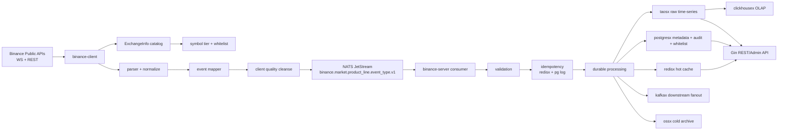

# Binance 生产级可发布 TODO

> 日期：2026-07-10
> 详细报告：[`report/binance/PRODUCTION-READINESS-DEEP-ANALYSIS-20260709.md`](../../report/binance/PRODUCTION-READINESS-DEEP-ANALYSIS-20260709.md)
> 当前结论：`release_closeable_spec=YES; release_closeable_runtime=NO`；本轮本地实现与治理投影已完成，真实外部发布门禁仍 BLOCKED。[COMPUTED, HIGH]
> 范围：`module/binance/` 规格治理与 `/home/workspace/binance` runtime 发布阻断项。[COMPUTED, HIGH]
> runtime implementation commit：`3f6366728b635c32d73565874965d40c20a92caf`（本轮 canonical market event closure）。[COMPUTED, HIGH]
> runtime evidence commit：`660a3701589cc15fa95c7859fae02fad4863e1ad`（dated external-gates ledger；ledger runner 绑定 implementation commit）。[COMPUTED, HIGH]
> last published runtime tag：`v0.15.1` @ `fc967053d7d8c21dba3c4e93962effbbbba0a70c`；本轮未创建新 tag、未部署、未发布。[COMPUTED, HIGH]
> runtime release evidence bundle：`/home/workspace/binance/release/evidence/binance/20260710`；外部 ledger 由 implementation commit 生成。[COMPUTED, HIGH]
> Projection：read-only projection；not a closure SSOT。权威闭环状态以 `module/binance/matrix/TRACEABILITY.md`、runtime release evidence 和 GitHub Release 为准。[FRAME, HIGH]

## 0. 发布判断

[COMPUTED, HIGH] runtime implementation commit `3f6366728b635c32d73565874965d40c20a92caf` 已完成本轮 `ticker`、`open_interest`、`index_reference`、`contract_info` 的 canonical normalize → mapper → server allowlist/API → storage/driver/DDL → reconcile/retention 链路；`force_order` 保持显式 opt-in scaffold，不进入默认订阅，不冒充普通 trade。

[COMPUTED, HIGH] 本地代码、race、build、vet、boundary 15/15、spec/runtime drift、fixture/e2e、公开 Options depth capture 与本地 NATS JetStream PubAck/ManualAck 语义均已通过；证据命令与结果见 §1 及 `module/binance/evidence/2026-07-10/review/todo-closure-20260710.md`。

[COMPUTED, HIGH] `scripts/run-external-gates.sh` 返回 `PASS=0 BLOCKED=5 SKIP=0 ERROR=0`，阻断项为真实 NATS、Kafka、TDengine、Redis、部署 API 的凭证/目标环境缺失；`scripts/validate-release-packet.sh` 返回 11 个 BLOCKED，故不能诚实宣称 runtime 已 release-closeable。正式 tag、部署、回滚未执行。[COMPUTED, HIGH]

## 1. 当前验证结果

| 检查项 | 当前结果 | TODO 判断 |
| --- | --- | --- |
| `env GOROOT=/usr/local/go GOWORK=off go test ./... -count=1` | PASS | 全量单元/集成包测试闭合。[COMPUTED, HIGH] |
| `env GOROOT=/usr/local/go GOWORK=off go test ./... -race -count=1` | PASS | race evidence 闭合。[COMPUTED, HIGH] |
| `env GOROOT=/usr/local/go GOWORK=off go build ./...` | PASS | runtime 构建闭合。[COMPUTED, HIGH] |
| `env GOROOT=/usr/local/go GOWORK=off go vet ./...` | PASS | 静态语义检查闭合。[COMPUTED, HIGH] |
| `./scripts/boundary-gates.sh` | 15 passed, 0 failed | C/S 边界与 runtime spec-artifact gate 通过。[COMPUTED, HIGH] |
| `./scripts/spec-runtime-drift-check.sh` | PASS | docs/runtime drift gate 通过。[COMPUTED, HIGH] |
| `go test -tags=e2e ./test/e2e -count=1` | PASS；未配置的 live gates 明确 SKIP | 本地 e2e、Options fixture 与策略边界通过。[COMPUTED, HIGH] |
| `BINANCE_OPTIONS_DEPTH_LIVE=1 ... TestOptionsDepthLiveCapture` | PASS | 公开 Options partial/diff depth 各捕获 3 条；单侧 diff 按设计拒绝 normalize。[COMPUTED, HIGH] |
| `BINANCE_NATSX_INTEGRATION=1 ... TestNATSXIntegrationJetStreamSemantics` | PASS | 本地 ephemeral NATS 的 PubAck/ManualAck/NAK 语义通过；不替代远端 gate。[COMPUTED, HIGH] |
| `bash -n` release scripts | PASS | release evidence、external gate、packet validator 脚本语法通过。[COMPUTED, HIGH] |
| `scripts/run-external-gates.sh` | BLOCKED：5，NOT_RUN | 真实外部环境变量/目标缺失；ledger：`release/evidence/binance/20260710/external-gates.tsv`。[COMPUTED, HIGH] |
| `scripts/validate-release-packet.sh --packet docs/release/release-packet.template.yaml` | BLOCKED：11 | 模板仍保留 tag/证据/回滚占位符，符合未发布状态。[COMPUTED, HIGH] |
| `bash scripts/check-binance-docs.sh` | PASS | module/binance 结构、事件类型、REST/storage anchors 通过。[COMPUTED, HIGH] |
| `bash .github/ci/binance-version-consistency-check.sh` | PASS | canonical `Spec-Version=v4.1.0`、`Runtime-Version=v0.15.1` 投影一致。[COMPUTED, HIGH] |
| `bash .github/ci/binance-reference-integrity-check.sh` | PASS | SPEC/TRACEABILITY 引用完整。[COMPUTED, HIGH] |
| `git diff --check` | PASS | runtime 与 Zone feature worktree 补丁检查通过。[COMPUTED, HIGH] |
| 20 轮重复检查 | PASS：20/20 | 每轮覆盖完整 `go test ./... -count=1`、build/vet、boundary、drift、e2e fixture、release ledger/packet、docs/version/reference/diff；日志：`/tmp/binance-final-20check-20260710-final2`。[COMPUTED, HIGH] |

## 2. 已执行修复

- [x] 修复 canonical event_type 数据流迁移。[COMPUTED, HIGH]
  - client normalize 输出改为 `book_ticker`、`kline`、`depth_update`、`mark_price_update`。[COMPUTED, HIGH]
  - `BuildIngestRequest`、幂等键、Cleanse schema、mapper、lifecycle、history backfill、runtime order book 派生事件均使用 `internal/eventtypes.Canonical`。[COMPUTED, HIGH]
  - NATS subject 与 Kafka topic/header 统一 canonical event_type。[COMPUTED, HIGH]
  - TDengine writer、history reader、retention config、hot cache fixture/test 统一 canonical storage/key 语义。[COMPUTED, HIGH]

- [x] 完成 `ticker`、`open_interest`、`index_reference`、`contract_info` 的本地 canonical runtime 链路：normalize、mapper、allowlist、API kind、history/hot-cache、TDengine stable/driver、reconcile、retention、DDL 与测试均已对齐。[COMPUTED, HIGH]
  - 默认订阅覆盖 spot/UM/CM 的 ticker、mark/funding/composite/index reference 与 global `!contractInfo`；options open-interest 保留显式 expiry stream 选择。[COMPUTED, HIGH]
  - connector 采集路径会展开数组 payload，并校验 `force_order` 订阅 symbol 与嵌套订单 symbol 一致。[COMPUTED, HIGH]
- [x] `force_order` 已完成独立 opt-in parser/mapper/storage/API scaffold；不默认订阅、不映射为普通 trade，正式 release 仍 postponed。[COMPUTED, HIGH]
- [x] 建立 Options partial/diff depth 官方 payload fixtures、连续序列和单侧 diff 边界测试，并完成一次公开 endpoint opt-in capture；OrderBookManager 仍 excluded/postponed。[COMPUTED, HIGH]
- [x] 增加 release notes candidate、release packet template/validator、external gate runner 与不泄露凭证的 BLOCKED ledger。[COMPUTED, HIGH]

- [x] 修复 `ReconnectQueue` 停止竞态。[COMPUTED, HIGH]
  - `Stop()` 使用 `sync.Once`，支持重复调用。[COMPUTED, HIGH]
  - 停止后新 `Enqueue` 立即返回 `context.Canceled`。[COMPUTED, HIGH]
  - 等待 slot 或 backoff 中的 goroutine 可被停止释放。[COMPUTED, HIGH]

- [x] 修复 `spec-runtime-drift-check.sh` 失败项。[COMPUTED, HIGH]
  - `internal/ingestcodec/doc.go` 已明确 `internal/client/** 和 internal/server/** 均可 import internal/ingestcodec`。[COMPUTED, HIGH]

- [x] 同步 runtime 测试、golden fixture、API hot-cache fixture 与 canonical 命名。[COMPUTED, HIGH]
- [x] 完成当前 closure audit 的 20 轮重复检查；20/20 PASS，日志：`/tmp/binance-final-20check-20260710-final2`；旧目录 `/tmp/binance-final-20check-20260710-final` 与 `/tmp/binance-final-20check-20260709221859` 均属于前一轮证据，不继承为本轮结果。[COMPUTED, HIGH]
- [x] 生成并刷新本轮 runtime release evidence bundle：`/home/workspace/binance/release/evidence/binance/20260710`；ledger runner commit 为 `3f6366728b635c32d73565874965d40c20a92caf`。[COMPUTED, HIGH]
- [x] 完成本地 gated soak/chaos：`make test-gated` PASS；真实外部依赖 chaos 按环境缺失 SKIP。[COMPUTED, HIGH]
- [x] 单独执行 `-tags=soak` 的 `TestSoak_ServerStability`，`SOAK_DURATION=30s` PASS。[COMPUTED, HIGH]
- [x] 修复 runtime TDengine DDL 漂移：`migrations/taos_ddl.sql` 已从旧 `st_*` stable 改为 canonical stable，并新增 DDL stable name drift 测试。[COMPUTED, HIGH]
- [x] 增加 server ingress event_type allowlist：planned/unknown event_type 在 validation 阶段拒绝，legacy alias 仅作为输入兼容 canonical 化。[COMPUTED, HIGH]
- [x] 修复安全扫描阻断：`quic-go` 升级到无可达漏洞结果，CI/本地 Go 工具链对齐 `go1.26.5`；`vuln-scan.log` 记录可达漏洞 0。[COMPUTED, HIGH]
- [x] 修复 PR `Live E2E` workflow：无 `.env`/external secrets 时运行 CI-safe `-tags=e2e`，external infra live pipeline 仅在 `BINANCE_E2E_LIVE=1` 时执行。[COMPUTED, HIGH]
- [x] 修复 options mainnet WS endpoint：`OptionsStreamBaseURL` 更新为 `wss://fstream.binance.com/market`，live gate 使用稳定的 `btcusdt@optionMarkPrice`。[COMPUTED, HIGH]
- [x] 修复 benchmark gate：hot-cache benchmark fixture 改为 canonical `book_ticker` key；regression 脚本改为 release-critical baseline filter + 3 次采样。[COMPUTED, HIGH]

## 3. 目标数据流

目标架构保持 C/S 分离：client 只连接 Binance 并发布标准事件，server 负责消费、校验、幂等、持久化、查询和 fanout。[INFERRED, HIGH]

## 4. 业务类型覆盖

| 业务类型 | 当前覆盖判断 | 发布口径 |
| --- | --- | --- |
| 现货 Spot | 行情采集、book ticker、trade、kline、depth update 本地测试通过。[COMPUTED, HIGH] | 保持 market data scope，不宣称交易能力。[INFERRED, HIGH] |
| USD-M 合约 | mark price、funding、depth、history routing 本地测试通过。[COMPUTED, HIGH] | 仍需 live capture 证明生产端点链路。[FRAME, HIGH] |
| COIN-M 合约 | CM kline/depth/mark/funding 路径存在并通过本地测试。[COMPUTED, HIGH] | 交割合约 subtype 仍需 release evidence 复核。[INFERRED, MED] |
| Options | `option_tick` 与 options depth normalize 测试通过；options order book 仍按 Phase 2 处理。[COMPUTED, HIGH] | 不宣称 options order book 完成。[INFERRED, HIGH] |
| Order Book | spot/UM/CM order book 主路径、TopN/增量派生事件与 runtime 测试通过。[COMPUTED, HIGH] | 需要 live depth snapshot + stream 对齐证据。[FRAME, HIGH] |
| 交易/账户/私有流 | SPEC 明确排除。[COMPUTED, HIGH] | 发布说明必须继续排除。[INFERRED, HIGH] |

## 5. 剩余发布证据 TODO

- [x] 本地 full test、race、build、vet、boundary、drift、e2e fixture、Options depth capture 与 NATS 语义证据已生成。[COMPUTED, HIGH]
- [ ] 真实 NATS PubAck/ManualAck、Kafka fanout、TDengine write/read、Redis hot cache、部署 API latest/range E2E：当前 ledger 统一为 `BLOCKED/NOT_RUN`，缺少目标环境与凭证；不以本地 fake 替代。[COMPUTED, HIGH]
- [ ] 正式 release tag、正式 release notes URL、部署前检查和回滚执行：当前仅有候选 notes、packet template、validator 与 runbook 引用；无新 tag/部署/回滚授权。[COMPUTED, HIGH]
- [x] 明确 options order book Phase 2 为 `excluded/postponed`；公开 partial/diff capture 只证明 payload/normalize 边界，不代表 OrderBookManager 已纳入。[COMPUTED, HIGH]
- [x] 形成 TDengine child-table prefix 与 REST alias sunset 提案，见 [`COMPATIBILITY-SUNSET-PLAN.md`](design/COMPATIBILITY-SUNSET-PLAN.md)；删除动作仍需 owner 批准、usage metric 与迁移窗口。[COMPUTED, HIGH]
- [x] 增加 release notes candidate、packet template、external gate runner、validator 与 dated blocked ledger。[COMPUTED, HIGH]

## 6. 后续能力补齐

- [x] `ticker`：本地 canonical normalize → mapper → allowlist/API → storage/driver/DDL → reconcile/retention 链路完成；真实外部 storage/API gate 仍未闭合。[COMPUTED, HIGH]
- [x] `open_interest`：支持 `optionOpenInterest`/`openInterest` alias、options expiry 语义、server/storage/API 链路与测试；真实外部 gate 仍未闭合。[COMPUTED, HIGH]
- [x] `contract_info`：支持全局 `!contractInfo` stream、canonical event、server/storage/API 链路与测试；真实外部 gate 仍未闭合。[COMPUTED, HIGH]
- [x] `index_reference`：支持 composite/index reference payload、UM/CM 默认 stream、server/storage/API 链路与测试；真实外部 gate 仍未闭合。[COMPUTED, HIGH]
- [x] `force_order`：完成独立设计与 opt-in scaffold，见 [`FORCE-ORDER-EVENT-DESIGN.md`](design/FORCE-ORDER-EVENT-DESIGN.md)；默认订阅与生产 release activation 仍 postponed。[COMPUTED, HIGH]
- [x] Options depth：官方 partial/diff fixtures、连续序列、单侧 diff 边界和公开 opt-in capture 已建立；OrderBookManager admission 仍 excluded/postponed。[COMPUTED, HIGH]

## 7. 模块规则与标准状态

- [x] `module/binance/gate/STANDARD.md` 已覆盖业务边界、产品线矩阵、canonical event_type、合约身份、options、order book、Foundation 依赖、发布证据和 gate 职责边界。[COMPUTED, HIGH]
- [x] `module/binance/gate/RULES.md` 已同步 R1/R2/R13，禁止 docs gate 因旧根 SPEC 缺失而 SKIP。[COMPUTED, HIGH]
- [x] `scripts/check-binance-docs.sh` 已扫描 goal-driven 目录结构与 canonical event_type 文档锚点。[COMPUTED, HIGH]
- [x] `module/binance/ALIGNMENT.md`、SPEC、ACCEPTANCE、FEATURES、PLAN、PROMPT、GATE、TRACEABILITY、registry 与 runtime release evidence 已按“规格投影 / runtime 发布”双口径同步。[COMPUTED, HIGH]
- [x] `module/binance/design/COMPATIBILITY-SUNSET-PLAN.md` 与 `module/binance/design/FORCE-ORDER-EVENT-DESIGN.md` 已记录兼容窗口及 postponed 边界。[COMPUTED, HIGH]
- [ ] 在最终 release packet 中补入新 release tag 与正式 HTTPS evidence URL；当前 packet validator 的 11 项 BLOCKED 保持不变。[COMPUTED, HIGH]

## 8. 关联文档

- [`report/binance/PRODUCTION-READINESS-DEEP-ANALYSIS-20260709.md`](../../report/binance/PRODUCTION-READINESS-DEEP-ANALYSIS-20260709.md)
- [`module/binance/spec/SPEC.md`](spec/SPEC.md)
- [`module/binance/spec/NAMING.md`](spec/NAMING.md)
- [`module/binance/gate/RULES.md`](gate/RULES.md)
- [`module/binance/gate/STANDARD.md`](gate/STANDARD.md)
- [`module/binance/evidence/2026-07-09/test/runtime-gates-recovery.md`](evidence/2026-07-09/test/runtime-gates-recovery.md)
- [`module/binance/evidence/2026-07-10/review/todo-closure-20260710.md`](evidence/2026-07-10/review/todo-closure-20260710.md)
- [`module/binance/design/COMPATIBILITY-SUNSET-PLAN.md`](design/COMPATIBILITY-SUNSET-PLAN.md)
- [`module/binance/design/FORCE-ORDER-EVENT-DESIGN.md`](design/FORCE-ORDER-EVENT-DESIGN.md)

## 9. 本轮最终重复检查

| 项目 | 结果 |
| --- | --- |
| 执行脚本 | [`scripts/binance-final-20-check.sh`](../../scripts/binance-final-20-check.sh)；每轮执行完整 `go test ./... -count=1` 与结构/文档/发布检查。[COMPUTED, HIGH] |
| 轮次 | `round=01..20 PASS`，脚本 exit 0。[COMPUTED, HIGH] |
| 日志 | `/tmp/binance-final-20check-20260710-final2/SUMMARY.tsv` 与各 `round-XX/` 子目录。[COMPUTED, HIGH] |
| 外部 gate 口径 | 每轮均验证 5 项真实外部 gate 为 `BLOCKED/NOT_RUN`，未把缺凭证当成 PASS。[COMPUTED, HIGH] |
| 最终解释 | 本地实现与治理投影无遗漏；runtime formal release 仍被外部环境、tag/release notes、部署 preflight 与 rollback 阻断。[COMPUTED, HIGH] |

[RULES I BROKE]：无
