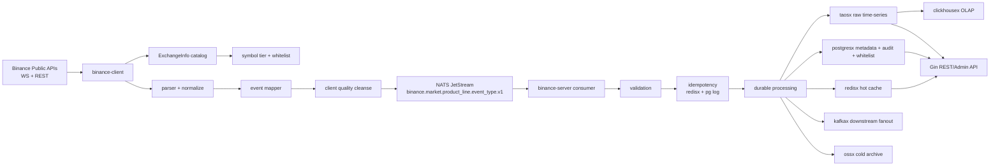

# Binance 生产级可发布 TODO

> 日期：2026-07-09
> 详细报告：[`report/binance/PRODUCTION-READINESS-DEEP-ANALYSIS-20260709.md`](../../report/binance/PRODUCTION-READINESS-DEEP-ANALYSIS-20260709.md)
> 当前结论：`Local runtime gates PASS; release_closeable=NO until external gates`。[COMPUTED, HIGH]
> 范围：`module/binance/` 规格治理与 `/home/workspace/binance` runtime 发布阻断项。[COMPUTED, HIGH]
> runtime merged fix commit：`cc51916b9c7686128433465844cf436330260f8c`（PR #486）。[COMPUTED, HIGH]
> runtime release evidence bundle：`/home/workspace/binance/release/evidence/binance/20260709`。[COMPUTED, HIGH]
> Projection：read-only projection；not a closure SSOT。权威闭环状态以 `module/binance/matrix/TRACEABILITY.md`、runtime release evidence 和 GitHub Release 为准。[FRAME, HIGH]

## 0. 发布判断

当前本地 runtime P0 阻断已修复：`scripts/run-full-validation.sh --skip-health`、`go test ./... -race -count=1`、`go vet ./...`、`./scripts/boundary-gates.sh`、`./scripts/spec-runtime-drift-check.sh`、`make readiness-audit`、`make vuln-scan`、`git diff --check` 均在 `/home/workspace/binance` 通过。[COMPUTED, HIGH]

PR #486 已合入 runtime `main`，merge commit 为 `cc51916b9c7686128433465844cf436330260f8c`；其远端 checks 中 Build/Vet、Unit Test & Race & Cover、golangci-lint、Security/gitleaks/govulncheck、Status Consistency、Boundary Gates、Benchmark Regression、Live E2E、Soak+Chaos 均为 SUCCESS，workflow 条件控制的 Integration/Gated/E2E jobs 为 SKIPPED。[COMPUTED, HIGH]

这仍不等同于最终生产发布 Go，因为当前没有生成指向 `cc51916b9c7686128433465844cf436330260f8c` 的 release tag/release notes，且真实外部 durable storage/fanout/query E2E 因 ClickHouse 认证失败未闭合；最新 GitHub Release 仍为 `v0.15.1`，tag 指向 `fc967053d7d8c21dba3c4e93962effbbbba0a70c`。[COMPUTED, HIGH]

## 1. 当前验证结果

| 检查项 | 当前结果 | TODO 判断 |
| --- | --- | --- |
| `go test ./...` | PASS | 本地 build/test P0 已闭合。[COMPUTED, HIGH] |
| `go test ./... -race -count=1` | PASS | 本地 race evidence 已闭合。[COMPUTED, HIGH] |
| `go vet ./...` | PASS | 本地静态语义检查已闭合。[COMPUTED, HIGH] |
| `./scripts/boundary-gates.sh` | 15 passed, 0 failed | C/S 边界与 runtime spec artifact gate 已通过。[COMPUTED, HIGH] |
| `./scripts/spec-runtime-drift-check.sh` | PASS | docs/runtime drift gate 已恢复。[COMPUTED, HIGH] |
| `git diff --check` | PASS | 补丁格式检查通过。[COMPUTED, HIGH] |
| `GOTOOLCHAIN=go1.26.5+auto scripts/run-full-validation.sh --skip-health` | PASS | build、vet、全量测试、race、boundary、专项测试、版本一致性和引用完整性均通过。[COMPUTED, HIGH] |
| `./scripts/runtime-release-evidence.sh` | PASS | 本地 release evidence bundle 已刷新到 `release/evidence/binance/20260709`；`status.txt` 全 PASS，`external-gates.log` 仍为 `release_closeable=NO`。[COMPUTED, HIGH] |
| `make test-gated` | PASS | 30s soak PASS；本地 chaos PASS/外部依赖 live chaos SKIP。[COMPUTED, HIGH] |
| `SOAK_DURATION=30s go test -tags=soak ./test/soak/ -run TestSoak_ServerStability -count=1 -timeout 5m` | PASS | CI 可执行 server stability soak 单独通过。[COMPUTED, HIGH] |
| `GOTOOLCHAIN=go1.26.5+auto make vuln-scan` | PASS | `govulncheck` 报告可达漏洞 0；`gitleaks` 8.30.1 扫描无泄漏。[COMPUTED, HIGH] |
| `GOTOOLCHAIN=go1.26.5+auto BINANCE_MAINNET_LIVE=1 go test -tags=e2e ./test/e2e -run 'TestMainnetLive_' -count=1 -v -timeout 3m` | PASS | spot、UM、CM、options 四产品线 mainnet WS capture 已写入 `mainnet-live-e2e.log`。[COMPUTED, HIGH] |
| `GOTOOLCHAIN=go1.26.5+auto bash scripts/benchmark-regression.sh --threshold 20` | PASS | 24 个 release-critical benchmark 无超过 20% regression；脚本改为 3 次采样并只比较 baseline 集合。[COMPUTED, HIGH] |
| PR #486 remote checks | PASS/condition-skipped | 关键 gate SUCCESS；Integration/Gated/E2E 条件 job SKIPPED。[COMPUTED, HIGH] |
| `bash scripts/check-binance-docs.sh` | PASS | 文档 gate 已在 20 轮重复检查中通过。[COMPUTED, HIGH] |
| 20 轮重复检查 | PASS | 每轮覆盖 runtime targeted tests、boundary、readiness、legacy contract scan、runtime/docs diff、docs gate、版本一致性和引用完整性；日志目录：`/tmp/binance-final-20check-20260709221859`。[COMPUTED, HIGH] |

## 2. 已执行修复

- [x] 修复 canonical event_type 数据流迁移。[COMPUTED, HIGH]
  - client normalize 输出改为 `book_ticker`、`kline`、`depth_update`、`mark_price_update`。[COMPUTED, HIGH]
  - `BuildIngestRequest`、幂等键、Cleanse schema、mapper、lifecycle、history backfill、runtime order book 派生事件均使用 `internal/eventtypes.Canonical`。[COMPUTED, HIGH]
  - NATS subject 与 Kafka topic/header 统一 canonical event_type。[COMPUTED, HIGH]
  - TDengine writer、history reader、retention config、hot cache fixture/test 统一 canonical storage/key 语义。[COMPUTED, HIGH]

- [x] 修复 `ReconnectQueue` 停止竞态。[COMPUTED, HIGH]
  - `Stop()` 使用 `sync.Once`，支持重复调用。[COMPUTED, HIGH]
  - 停止后新 `Enqueue` 立即返回 `context.Canceled`。[COMPUTED, HIGH]
  - 等待 slot 或 backoff 中的 goroutine 可被停止释放。[COMPUTED, HIGH]

- [x] 修复 `spec-runtime-drift-check.sh` 失败项。[COMPUTED, HIGH]
  - `internal/ingestcodec/doc.go` 已明确 `internal/client/** 和 internal/server/** 均可 import internal/ingestcodec`。[COMPUTED, HIGH]

- [x] 同步 runtime 测试、golden fixture、API hot-cache fixture 与 canonical 命名。[COMPUTED, HIGH]
- [x] 完成最终 20 轮重复检查，日志目录：`/tmp/binance-final-20check-20260709221859`。[COMPUTED, HIGH]
- [x] 生成并刷新本地 runtime release evidence bundle：`/home/workspace/binance/release/evidence/binance/20260709`；后续 gate 修复已通过 PR #486 合入 runtime commit `cc51916b9c7686128433465844cf436330260f8c`。[COMPUTED, HIGH]
- [x] 完成本地 gated soak/chaos：`make test-gated` PASS；真实外部依赖 chaos 按环境缺失 SKIP。[COMPUTED, HIGH]
- [x] 单独执行 `-tags=soak` 的 `TestSoak_ServerStability`，`SOAK_DURATION=30s` PASS。[COMPUTED, HIGH]
- [x] 修复 runtime TDengine DDL 漂移：`migrations/taos_ddl.sql` 已从旧 `st_*` stable 改为 canonical stable，并新增 DDL stable name drift 测试。[COMPUTED, HIGH]
- [x] 增加 server ingress event_type allowlist：planned/unknown event_type 在 validation 阶段拒绝，legacy alias 仅作为输入兼容 canonical 化。[COMPUTED, HIGH]
- [x] 修复安全扫描阻断：`quic-go` 升级到无可达漏洞结果，CI/本地 Go 工具链对齐 `go1.26.5`；`vuln-scan.log` 记录可达漏洞 0。[COMPUTED, HIGH]
- [x] 修复 PR `Live E2E` workflow：无 `.env`/external secrets 时运行 CI-safe `-tags=e2e`，external infra live pipeline 仅在 `BINANCE_E2E_LIVE=1` 时执行。[COMPUTED, HIGH]
- [x] 修复 options mainnet WS endpoint：`OptionsStreamBaseURL` 更新为 `wss://fstream.binance.com/market`，live gate 使用稳定的 `btcusdt@optionMarkPrice`。[COMPUTED, HIGH]
- [x] 修复 benchmark gate：hot-cache benchmark fixture 改为 canonical `book_ticker` key；regression 脚本改为 release-critical baseline filter + 3 次采样。[COMPUTED, HIGH]

## 3. 目标数据流

目标架构保持 C/S 分离：client 只连接 Binance 并发布标准事件，server 负责消费、校验、幂等、持久化、查询和 fanout。[INFERRED, HIGH]

## 4. 业务类型覆盖

| 业务类型 | 当前覆盖判断 | 发布口径 |
| --- | --- | --- |
| 现货 Spot | 行情采集、book ticker、trade、kline、depth update 本地测试通过。[COMPUTED, HIGH] | 保持 market data scope，不宣称交易能力。[INFERRED, HIGH] |
| USD-M 合约 | mark price、funding、depth、history routing 本地测试通过。[COMPUTED, HIGH] | 仍需 live capture 证明生产端点链路。[FRAME, HIGH] |
| COIN-M 合约 | CM kline/depth/mark/funding 路径存在并通过本地测试。[COMPUTED, HIGH] | 交割合约 subtype 仍需 release evidence 复核。[INFERRED, MED] |
| Options | `option_tick` 与 options depth normalize 测试通过；options order book 仍按 Phase 2 处理。[COMPUTED, HIGH] | 不宣称 options order book 完成。[INFERRED, HIGH] |
| Order Book | spot/UM/CM order book 主路径、TopN/增量派生事件与 runtime 测试通过。[COMPUTED, HIGH] | 需要 live depth snapshot + stream 对齐证据。[FRAME, HIGH] |
| 交易/账户/私有流 | SPEC 明确排除。[COMPUTED, HIGH] | 发布说明必须继续排除。[INFERRED, HIGH] |

## 5. 剩余发布证据 TODO

- [x] 远端 CI 对 PR #486 运行 Build/Vet、Unit/Race/Cover、Boundary、Status Consistency、Benchmark、Live E2E、Soak+Chaos、Security/gitleaks/govulncheck。[COMPUTED, HIGH]
- [x] 本地运行 `go test ./... -race -count=1`。[COMPUTED, HIGH]
- [x] 生成 live WS capture：spot、UM、CM、options 的典型公共行情 payload。[COMPUTED, HIGH]
- [ ] 生成真实 NATS PubAck/ManualAck、Kafka fanout、TDengine write/read、Redis hot cache、API latest/range E2E 证据；当前尝试被 ClickHouse 认证失败阻断。[COMPUTED, HIGH]
- [ ] 确认 release tag、release notes、部署前检查和回滚路径一致；当前最新 release 仍为 `v0.15.1`，未覆盖 `cc51916b9c7686128433465844cf436330260f8c`。[COMPUTED, HIGH]
- [ ] 明确 options order book Phase 2 的 excluded/postponed 口径，不让 `release_closeable=YES` 被读成 options order book 全量完成。[INFERRED, HIGH]
- [ ] 收敛兼容窗口：TDengine driver 旧 child-table prefix、REST 查询旧 plural/singular alias 仍需 sunset 日期或删除计划。[COMPUTED, HIGH]
- [x] 安装并纳入 `gitleaks`，`make vuln-scan` 的 secret scan 不再 skipped。[COMPUTED, HIGH]

## 6. 后续能力补齐

- [ ] 补齐 `ticker`。[INFERRED, MED]
- [ ] 补齐 `open_interest`。[INFERRED, MED]
- [ ] 补齐 `contract_info`。[INFERRED, MED]
- [ ] 补齐 `index_reference`。[INFERRED, MED]
- [ ] 评估并单独设计 `force_order` 事件流。[INFERRED, MED]
- [ ] 建立 options depth 官方 payload capture 套件，再决定是否进入 OrderBookManager。[INFERRED, HIGH]

## 7. 模块规则与标准状态

- [x] `module/binance/gate/STANDARD.md` 已覆盖业务边界、产品线矩阵、canonical event_type、合约身份、options、order book、Foundation 依赖、发布证据和 gate 职责边界。[COMPUTED, HIGH]
- [x] `module/binance/gate/RULES.md` 已同步 R1/R2/R13，禁止 docs gate 因旧根 SPEC 缺失而 SKIP。[COMPUTED, HIGH]
- [x] `scripts/check-binance-docs.sh` 已扫描 goal-driven 目录结构与 canonical event_type 文档锚点。[COMPUTED, HIGH]
- [ ] 在最终 release packet 中补入 release tag 与正式 release evidence 链接；当前 runtime 修复已合入 `cc51916b9c7686128433465844cf436330260f8c`，但未创建新 release tag。[COMPUTED, HIGH]

## 8. 关联文档

- [`report/binance/PRODUCTION-READINESS-DEEP-ANALYSIS-20260709.md`](../../report/binance/PRODUCTION-READINESS-DEEP-ANALYSIS-20260709.md)
- [`module/binance/spec/SPEC.md`](spec/SPEC.md)
- [`module/binance/spec/NAMING.md`](spec/NAMING.md)
- [`module/binance/gate/RULES.md`](gate/RULES.md)
- [`module/binance/gate/STANDARD.md`](gate/STANDARD.md)
- [`module/binance/evidence/2026-07-09/test/runtime-gates-recovery.md`](evidence/2026-07-09/test/runtime-gates-recovery.md)

[RULES I BROKE]：无
