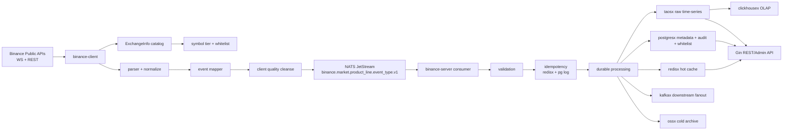

# Binance 生产级可发布 TODO

> 日期：2026-07-09
> 详细报告：[`report/binance/PRODUCTION-READINESS-DEEP-ANALYSIS-20260709.md`](../../report/binance/PRODUCTION-READINESS-DEEP-ANALYSIS-20260709.md)
> 当前结论：`Local runtime gates PASS; release Go 仍需远端 CI/tag/live evidence`。[COMPUTED, HIGH]
> 范围：`module/binance/` 规格治理与 `/home/workspace/binance` runtime 发布阻断项。[COMPUTED, HIGH]

## 0. 发布判断

当前本地 runtime P0 阻断已修复：`go test ./...`、`go vet ./...`、`./scripts/boundary-gates.sh`、`./scripts/spec-runtime-drift-check.sh`、`git diff --check` 均在 `/home/workspace/binance` 通过。[COMPUTED, HIGH]

这不等同于最终生产发布 Go，因为本轮没有证明远端 CI、release tag、release notes、部署回滚、live WS capture、NATS/TDengine/Kafka/Redis 实盘链路、长时 soak 和真实外部依赖 chaos 证据。[COMPUTED, HIGH]

## 1. 当前验证结果

| 检查项 | 当前结果 | TODO 判断 |
| --- | --- | --- |
| `go test ./...` | PASS | 本地 build/test P0 已闭合。[COMPUTED, HIGH] |
| `go test ./... -race -count=1` | PASS | 本地 race evidence 已闭合。[COMPUTED, HIGH] |
| `go vet ./...` | PASS | 本地静态语义检查已闭合。[COMPUTED, HIGH] |
| `./scripts/boundary-gates.sh` | 15 passed, 0 failed | C/S 边界与 runtime spec artifact gate 已通过。[COMPUTED, HIGH] |
| `./scripts/spec-runtime-drift-check.sh` | PASS | docs/runtime drift gate 已恢复。[COMPUTED, HIGH] |
| `git diff --check` | PASS | 补丁格式检查通过。[COMPUTED, HIGH] |
| `EVIDENCE_DIR=release/evidence/binance/20260709-canonical-recovery ./scripts/runtime-release-evidence.sh` | PASS | 本地 release evidence bundle 已生成；外部 gates 仍记录为 `NOT_CAPTURED`。[COMPUTED, HIGH] |
| `make test-gated` | PASS | 30s soak PASS；本地 chaos PASS/外部依赖 live chaos SKIP。[COMPUTED, HIGH] |
| `bash scripts/check-binance-docs.sh` | PASS | 文档 gate 已在 20 轮重复检查中通过。[COMPUTED, HIGH] |
| 20 轮重复检查 | PASS | 每轮覆盖 runtime 编译测试、vet、boundary、drift、diff、event_type 扫描与 docs gate。[COMPUTED, HIGH] |

## 2. 已执行修复

- [x] 修复 canonical event_type 数据流迁移。[COMPUTED, HIGH]
  - client normalize 输出改为 `book_ticker`、`kline`、`depth_update`、`mark_price_update`。[COMPUTED, HIGH]
  - `BuildIngestRequest`、幂等键、Cleanse schema、mapper、lifecycle、history backfill、runtime order book 派生事件均使用 `internal/eventtypes.Canonical`。[COMPUTED, HIGH]
  - NATS subject 与 Kafka topic/header 统一 canonical event_type。[COMPUTED, HIGH]
  - TDengine writer、history reader、retention config、hot cache fixture/test 统一 canonical storage/key 语义。[COMPUTED, HIGH]

- [x] 修复 `ReconnectQueue` 停止竞态。[COMPUTED, HIGH]
  - `Stop()` 使用 `sync.Once`，支持重复调用。[COMPUTED, HIGH]
  - 停止后新 `Enqueue` 立即返回 `context.Canceled`。[COMPUTED, HIGH]
  - 等待 slot 或 backoff 中的 goroutine 可被停止释放。[COMPUTED, HIGH]

- [x] 修复 `spec-runtime-drift-check.sh` 失败项。[COMPUTED, HIGH]
  - `internal/ingestcodec/doc.go` 已明确 `internal/client/** 和 internal/server/** 均可 import internal/ingestcodec`。[COMPUTED, HIGH]

- [x] 同步 runtime 测试、golden fixture、API hot-cache fixture 与 canonical 命名。[COMPUTED, HIGH]
- [x] 完成 20 轮重复检查，日志目录：`/tmp/binance-20check-20260709210216`。[COMPUTED, HIGH]
- [x] 生成本地 runtime release evidence bundle：`/home/workspace/binance/release/evidence/binance/20260709-canonical-recovery`。[COMPUTED, HIGH]
- [x] 完成本地 gated soak/chaos：`make test-gated` PASS；真实外部依赖 chaos 按环境缺失 SKIP。[COMPUTED, HIGH]

## 3. 目标数据流

目标架构保持 C/S 分离：client 只连接 Binance 并发布标准事件，server 负责消费、校验、幂等、持久化、查询和 fanout。[INFERRED, HIGH]

## 4. 业务类型覆盖

| 业务类型 | 当前覆盖判断 | 发布口径 |
| --- | --- | --- |
| 现货 Spot | 行情采集、book ticker、trade、kline、depth update 本地测试通过。[COMPUTED, HIGH] | 保持 market data scope，不宣称交易能力。[INFERRED, HIGH] |
| USD-M 合约 | mark price、funding、depth、history routing 本地测试通过。[COMPUTED, HIGH] | 仍需 live capture 证明生产端点链路。[FRAME, HIGH] |
| COIN-M 合约 | CM kline/depth/mark/funding 路径存在并通过本地测试。[COMPUTED, HIGH] | 交割合约 subtype 仍需 release evidence 复核。[INFERRED, MED] |
| Options | optionTicker 与 options depth normalize 测试通过；options order book 仍按 Phase 2 处理。[COMPUTED, HIGH] | 不宣称 options order book 完成。[INFERRED, HIGH] |
| Order Book | spot/UM/CM order book 主路径、TopN/增量派生事件与 runtime 测试通过。[COMPUTED, HIGH] | 需要 live depth snapshot + stream 对齐证据。[FRAME, HIGH] |
| 交易/账户/私有流 | SPEC 明确排除。[COMPUTED, HIGH] | 发布说明必须继续排除。[INFERRED, HIGH] |

## 5. 剩余发布证据 TODO

- [ ] 远端 CI 对同一 commit 运行 `go test ./...`、`go vet ./...`、boundary gates、drift gates。[FRAME, HIGH]
- [x] 本地运行 `go test ./... -race -count=1`。[COMPUTED, HIGH]
- [ ] 生成 live WS capture：spot、UM、CM、options 的典型公共行情 payload。[FRAME, HIGH]
- [ ] 生成真实 NATS PubAck/ManualAck、Kafka fanout、TDengine write/read、Redis hot cache、API latest/range E2E 证据。[FRAME, HIGH]
- [ ] 确认 release tag、release notes、部署前检查和回滚路径一致。[FRAME, HIGH]
- [ ] 明确 options order book Phase 2 的 excluded/postponed 口径，不让 `release_closeable=YES` 被读成 options order book 全量完成。[INFERRED, HIGH]

## 6. 后续能力补齐

- [ ] 补齐 `ticker`。[INFERRED, MED]
- [ ] 补齐 `open_interest`。[INFERRED, MED]
- [ ] 补齐 `contract_info`。[INFERRED, MED]
- [ ] 补齐 `index_reference`。[INFERRED, MED]
- [ ] 评估并单独设计 `force_order` 事件流。[INFERRED, MED]
- [ ] 建立 options depth 官方 payload capture 套件，再决定是否进入 OrderBookManager。[INFERRED, HIGH]

## 7. 模块规则与标准状态

- [x] `module/binance/gate/STANDARD.md` 已覆盖业务边界、产品线矩阵、canonical event_type、合约身份、options、order book、Foundation 依赖、发布证据和 gate 职责边界。[COMPUTED, HIGH]
- [x] `module/binance/gate/RULES.md` 已同步 R1/R2/R13，禁止 docs gate 因旧根 SPEC 缺失而 SKIP。[COMPUTED, HIGH]
- [x] `scripts/check-binance-docs.sh` 已扫描 goal-driven 目录结构与 canonical event_type 文档锚点。[COMPUTED, HIGH]
- [ ] 在最终 release packet 中补入 runtime commit、CI run、release tag 与 evidence bundle 链接。[FRAME, HIGH]

## 8. 关联文档

- [`report/binance/PRODUCTION-READINESS-DEEP-ANALYSIS-20260709.md`](../../report/binance/PRODUCTION-READINESS-DEEP-ANALYSIS-20260709.md)
- [`module/binance/spec/SPEC.md`](spec/SPEC.md)
- [`module/binance/spec/NAMING.md`](spec/NAMING.md)
- [`module/binance/gate/RULES.md`](gate/RULES.md)
- [`module/binance/gate/STANDARD.md`](gate/STANDARD.md)
- [`module/binance/evidence/2026-07-09/test/runtime-gates-recovery.md`](evidence/2026-07-09/test/runtime-gates-recovery.md)

[RULES I BROKE]：无
