# 最终依赖关系图 — 彻底解耦架构报告（2026-06-25 更新验证）

- **Date**: 2026-06-25（更新验证）
- **Scope**: 26 个模块的完整依赖拓扑
- **证据基础**: go.mod require + `.go` import 代码级扫描（2026-06-25 实时证据线）
- **权威参考**: `CONSTITUTION.md §3` 依赖方向规则

## 1. 模块路径映射

| 用户名            | 本地目录                | go.mod module 声明                    | 备注                             |
| ----------------- | ----------------------- | ------------------------------------- | -------------------------------- |
| `xlib_standard`   | `/home/workspace/xlib-standard`   | `github.com/ZoneCNH/xlib_standard`    | 零 ZoneCNH require               |
| `xlib_harness`    | `/home/workspace/xlib-harness`    | `github.com/ZoneCNH/xlib_harness`     | 零 ZoneCNH require               |
| `xlib_evidence`   | `/home/workspace/xlib-evidence`   | `github.com/ZoneCNH/xlib_evidence`    | 零 ZoneCNH require               |
| `xlibgate`        | `/home/workspace/xlibgate`        | `github.com/ZoneCNH/xlibgate`         | 零 ZoneCNH require               |
| `kernel`          | `/home/workspace/kernel`          | `github.com/ZoneCNH/kernel`           | stdlib-only                      |
| `configx`         | `/home/workspace/configx`         | `github.com/ZoneCNH/configx`          | 零 ZoneCNH require               |
| `observex`        | `/home/workspace/observex`        | `github.com/ZoneCNH/observex`         | 零 ZoneCNH require               |
| `testkitx`        | `/home/workspace/testkitx`        | `github.com/ZoneCNH/testkitx`         | test-only                        |
| `resiliencx`      | `/home/workspace/resiliencx`      | `github.com/ZoneCNH/resiliencx`       | 零 ZoneCNH require               |
| `schedulex`       | `/home/workspace/schedulex`       | `github.com/ZoneCNH/schedulex`        | 零 ZoneCNH require               |
| `bootstrap`       | `/home/workspace/bootstrap`       | `github.com/ZoneCNH/bootstrap`        | require 全部基座 + infra         |
| `redisx`          | `/home/workspace/redisx`          | `github.com/ZoneCNH/redisx`           | 零 ZoneCNH require               |
| `kafkax`          | `/home/workspace/kafkax`          | `github.com/ZoneCNH/kafkax`           | require observex                 |
| `natsx`           | `/home/workspace/natsx`           | `github.com/ZoneCNH/natsx`            | 零 ZoneCNH require               |
| `postgresx`       | `/home/workspace/postgresx`       | `github.com/ZoneCNH/postgresx`        | 零 ZoneCNH require               |
| `taosx`           | `/home/workspace/taosx`           | `github.com/ZoneCNH/taosx`            | 零 ZoneCNH require               |
| `ossx`            | `/home/workspace/ossx`            | `github.com/ZoneCNH/ossx`             | require resiliencx               |
| `clickhousex`     | `/home/workspace/clickhousex`     | `github.com/ZoneCNH/clickhousex`      | require observex + resiliencx    |
| `contracts`       | `/home/workspace/contracts`       | `github.com/ZoneCNH/contracts`        | 零 ZoneCNH require               |
| `transportx`      | `/home/workspace/transportx`      | `github.com/ZoneCNH/transportx`       | ✅ **2026-06-25 已修复**         |
| `decimalx`        | `/home/workspace/decimalx`        | `github.com/ZoneCNH/decimalx`         | 根锚点，零 require               |
| `domainx`         | `/home/workspace/domainx`         | `github.com/ZoneCNH/domainx`          | ✅ **2026-06-25 已补 go.mod**    |
| `domain_market`   | `/home/workspace/domain-market`   | `github.com/ZoneCNH/domain_market`    | require decimalx                 |
| `domain_macro`    | `/home/workspace/domain-macro`    | `github.com/ZoneCNH/domain_macro`     | require decimalx                 |
| `domain_exchange` | `/home/workspace/domain-exchange` | `github.com/ZoneCNH/domain_exchange`  | require decimalx + domain_market |
| `binance`         | `/home/workspace/binance`         | `github.com/ZoneCNH/binance`          | require 13 个 ZoneCNH 模块       |

## 2. 依赖规则（不可违反）

| 规则               | 说明                                | 代码实证状态                                          |
| ------------------ | ----------------------------------- | ----------------------------------------------------- |
| **单向下行**       | 依赖只能沿箭头方向，不可反向        | [COMPUTED, HIGH] PASS：基座/领域层对 binance 0 命中   |
| **同层无编译依赖** | 同域同层模块之间不存在编译期依赖    | [COMPUTED, HIGH] PASS：7 个 infra 模块 0 真实同层互耦 |
| **可选引入**       | L1 运行时和存储扩展按需引入，非强制 | [COMPUTED, HIGH] PASS                                 |
| **禁止循环**       | 任何两个模块之间不允许循环依赖      | [COMPUTED, HIGH] PASS                                 |

## 3. 基座内部层级依赖规则

| 层级         | 模块                                     | 可以依赖                                 | 禁止依赖                      |
| ------------ | ---------------------------------------- | ---------------------------------------- | ----------------------------- |
| L0           | kernel                                   | stdlib only                              | 任何非 stdlib 包              |
| L1           | configx, observex, resiliencx, schedulex | kernel                                   | 其他 L1、业务域、存储扩展     |
| L1 test-only | testkitx                                 | kernel, observex (interface-only)        | production                    |
| 存储扩展     | redisx~clickhousex                       | kernel, observex (interface)             | configx、业务域、其他存储扩展 |
| 契约         | contracts                                | L2.5 领域共享层                          | L1 运行时、业务域实现         |
| 运输         | transportx                               | contracts, configx, observex, resiliencx | 具体 broker SDK               |

## 4. Mermaid 依赖关系图

```mermaid
flowchart TB
  subgraph L0["L0 kernel (零依赖根)"]
    kernel["kernel"]
  end

  subgraph GOV["治理/证据元层 (零 ZoneCNH require)"]
    xlib_standard["xlib_standard"]
    xlib_harness["xlib_harness"]
    xlib_evidence["xlib_evidence"]
    xlibgate["xlibgate"]
  end

  subgraph CORE["L1 基座运行时核心 (零 ZoneCNH require 的叶子基座)"]
    configx["configx"]
    observex["observex"]
    resiliencx["resiliencx"]
    schedulex["schedulex"]
    testkitx["testkitx"]
  end

  subgraph INFRA["L1.5 基础设施扩展 (0 同层真实互耦)"]
    redisx["redisx"]
    kafkax["kafkax"]
    natsx["natsx"]
    postgresx["postgresx"]
    taosx["taosx"]
    ossx["ossx"]
    clickhousex["clickhousex"]
    contracts["contracts"]
    transportx["transportx ✅ 已修复"]
  end

  subgraph ASM["装配层 (composition root)"]
    bootstrap["bootstrap"]
  end

  subgraph DOMAIN["L2 领域共享层 (纯度红线成立)"]
    decimalx["decimalx (根锚点)"]
    domainx["domainx ✅ 已补 go.mod"]
    domain_market["domain_market"]
    domain_macro["domain_macro"]
    domain_exchange["domain_exchange"]
  end

  subgraph BINANCE["L3 业务模块 module/binance"]
    binance_core["业务核心 internal/client+server"]
    binance_wire["internal/wire (过渡态)"]
    binance_asm["cmd/* assembly"]
  end

  %% 注：CORE 层 6 个模块全部零 ZoneCNH require - 无箭头到任何 ZoneCNH 模块
  %% 注：GOV 层 4 个模块全部零 ZoneCNH require
  %% 注：INFRA 同层 0 真实互耦（manifest 字符串/工具链不算）

  %% infra 横切依赖（合规，向 CORE）
  kafkax --> observex
  ossx --> resiliencx
  clickhousex --> observex
  clickhousex --> resiliencx

  %% bootstrap 聚合（实证：require 全部 CORE + INFRA）
  bootstrap --> configx
  bootstrap --> kernel
  bootstrap --> observex
  bootstrap --> resiliencx
  bootstrap --> redisx
  bootstrap --> kafkax
  bootstrap --> natsx
  bootstrap --> postgresx
  bootstrap --> taosx
  bootstrap --> ossx
  bootstrap --> clickhousex

  %% 领域层单向链（实证）
  domainx --> decimalx
  domain_market --> decimalx
  domain_macro --> decimalx
  domain_exchange --> decimalx
  domain_exchange --> domain_market
  domain_exchange --> domainx

  %% contracts 单向链
  contracts --> decimalx
  contracts --> domainx
  contracts --> domain_market
  contracts --> domain_macro
  contracts --> domain_exchange

  %% binance 合规向下依赖（实证 go.mod require）
  binance_core --> decimalx
  binance_core --> domainx
  binance_core --> domain_market
  binance_core --> domain_exchange
  binance_core --> configx
  binance_core -. assembly 注入 .-> redisx
  binance_core -. assembly 注入 .-> kafkax
  binance_core -. assembly 注入 .-> natsx
  binance_core -. assembly 注入 .-> postgresx
  binance_core -. assembly 注入 .-> taosx
  binance_core -. assembly 注入 .-> ossx
  binance_core -. assembly 注入 .-> clickhousex

  binance_asm --> bootstrap
  binance_asm -. 构造注入 .-> binance_core

  %% 治理层 gate/harness（非运行时）
  xlibgate -. gate 扫描 .-> BINANCE
  xlib_harness -. harness .-> BINANCE
  xlib_evidence -. evidence .-> BINANCE
  xlib_standard -. standard .-> BINANCE

  %% 已记录缺口（虚线警示）
  binance_wire -. 应迁移 .-> contracts
  binance_core -. 应迁移 .-> transportx

  classDef clean fill:#d4edda,stroke:#28a745
  classDef fixed fill:#d1ecf1,stroke:#17a2b8
  classDef warn fill:#fff3cd,stroke:#ffc107
  class kernel,configx,observex,resiliencx,schedulex,testkitx,decimalx,domainx,domain_market,domain_macro,domain_exchange,redisx,natsx,postgresx,taosx,contracts,xlib_standard,xlib_harness,xlib_evidence,xlibgate clean
  class transportx fixed
  class binance_wire warn
```



**图例**：绿色 = 零违规；蓝色 = 2026-06-25 已修复；黄色 = 已记录过渡态。

## 5. ASCII 文本依赖图（终端友好）

```text
依赖方向：上 → 下（上层可依赖下层）

┌─────────────────────────────────────────────────────────────────┐
│  xlib_standard   xlib_harness   xlib_evidence   xlibgate        │ 治理层(非运行时)
└──────────────────────────┬──────────────────────────────────────┘
                           │ gate 扫描/证据采集 (非 import)
┌──────────────────────────┼──────────────────────────────────────┐
│                          ▼                                       │
│  ┌─────────┐  ┌───────┐  ┌──────────┐  ┌───────────┐          │
│  │ configx │  │observex│  │resiliencx│  │ schedulex │          │ L0/L1 基座
│  └────┬────┘  └───┬───┘  └────┬─────┘  └─────┬─────┘          │ (零 require)
│       │           │           │              │                  │
│       ▼           ▼           ▼              ▼                  │
│  ┌───────────────────────────────────────────────┐             │
│  │                   kernel                      │             │
│  └───────────────────────┬───────────────────────┘             │
│                          │                                       │
├──────────────────────────┼──────────────────────────────────────┤
│  ┌──────┐ ┌──────┐ ┌──────┐ ┌────────┐ ┌──────┐ ┌──────┐    │
│  │redisx│ │kafkax│ │natsx │ │postgresx│ │taosx │ │ ossx │    │ L1.5 infra
│  └──────┘ └──┬───┘ └──────┘ └────────┘ └──────┘ └──┬───┘    │ (0 同层互耦)
│              │→observex                         │→resiliencx   │
│  ┌──────────┐ ┌─────────┐  ┌──────────┐                        │
│  │clickhousex│ │contracts│  │transportx│ ✅ 已修复              │
│  └┬──┬──────┘ └────┬────┘  └──────────┘                        │
│   │→observex       │→domain                                    │
│   │→resiliencx     │                                            │
├───┴────────────────┼───────────────────────────────────────────┤
│                     ▼                                            │
│  ┌──────────────────────────────┐                               │
│  │         bootstrap            │                               │ 装配层
│  │   (require 全部 CORE+INFRA)  │                               │
│  └──────────────┬───────────────┘                               │
│                 │                                                │
├─────────────────┼────────────────────────────────────────────────┤
│  ┌──────────────┼──────────────┐                                │
│  │           decimalx          │ ← 根锚点 (零 require)          │ L2 领域
│  └──────┬───────┼───────┬──────┘                                │ 共享层
│         │       │       │                                       │ (纯度红线)
│    ┌────▼──┐  ┌─▼──┐  ┌─▼───────────┐                           │
│    │domainx│  │dom_m│  │domain_market│                           │
│    └───┬───┘  │acro │  └──────┬──────┘                          │
│        │      └─────┘         │                                  │
│    ┌───▼──────────────────────▼──┐                               │
│    │     domain_exchange         │                               │
│    └─────────────────────────────┘                               │
│                                                                   │
├───────────────────────────────────────────────────────────────────┤
│                                                                   │
│  ┌──────────────────────────────────────────────┐                │
│  │            module/binance                     │                │ L3 业务
│  │  ┌───────────────────────┐                    │                │ 模块
│  │  │     binance_core      │ ← 业务算法        │                │
│  │  │  (持有窄接口 ports)   │                    │                │
│  │  └──────┬──────────┬─────┘                    │                │
│  │         │          │                          │                │
│  │  ┌──────▼──┐   ┌───▼────────┐                │                │
│  │  │ client  │   │   server    │                │                │
│  │  │ (采集)  │   │ (处理+存储) │                │                │
│  │  └─────────┘   └─────────────┘                │                │
│  │         ↑             ↑                       │                │
│  │  ┌──────┴─────────────┴──────┐                │                │
│  │  │  cmd/* assembly            │ ← 构造注入    │                │
│  │  │  (只在此处构造 infra client)│                │                │
│  │  └────────────────────────────┘                │                │
│  └──────────────────────────────────────────────┘                │
│                                                                   │
│  ──→ = compile dependency     - -→ = assembly-only / test/gate   │
│  ★ 反向依赖 binance = **0 命中** (已由全局 rg 扫描证实)           │
│  ★ 领域层 infra import = **0 命中**                               │
│  ★ infra 同层互耦 = **0 真实 import**                              │
│  ★ natsx.New 越界 = **已修复** (2026-06-25)                       │
└───────────────────────────────────────────────────────────────────┘
```

## 6. Import Gate 强制执行清单

| #   | Gate               | 规则                                                 | 检查命令                                                                                  | 状态         |
| --- | ------------------ | ---------------------------------------------------- | ----------------------------------------------------------------------------------------- | ------------ |
| G1  | Foundation reverse | 基座/领域/infra 禁止 import binance                  | `rg "ZoneCNH/binance" /home/{kernel,configx,...} --type go`                               | ✅ PASS      |
| G2  | Domain purity      | domain\_\* 禁止 import binance/provider/infra        | `rg "binance\|redisx\|natsx\|..." /home/{decimalx,domain*} --type go`                     | ✅ PASS      |
| G3  | Infra isolation    | 7 infra 模块禁止互相 import                          | `for d in redisx kafkax natsx postgresx taosx ossx clickhousex; do ...`                   | ✅ PASS      |
| G4  | Core purity        | binance core 禁止 import concrete infra constructors | `rg "\.New\(" --type go /home/workspace/binance/internal/{client,server}`                           | ✅ PASS      |
| G5  | Assembly-only      | infra `*.New` 只允许在 `cmd/**`                      | `rg "\.New\(.*x\." --type go /home/workspace/binance/cmd`                                           | ✅ PASS      |
| G6  | No infra wrapper   | 禁止 `internal/infra/{redis,nats,...}`               | `ls /home/workspace/binance/internal/infra/ 2>/dev/null`                                            | ✅ PASS      |
| G7  | No DTO leak        | domain\_\*/contracts 禁止 Binance raw field          | `rg "binance_ws\|binance_raw\|BinanceOrder" /home/{decimalx,domain*,contracts} --type go` | ✅ PASS      |
| G8  | go.mod compliance  | binance go.mod 保留边界依赖                          | `rg "ZoneCNH" /home/workspace/binance/go.mod`                                                       | ✅ PASS      |

## 7. 已知工程问题

| #   | 问题                                            | 严重度   | 影响                                          | 修复                                             | 状态         |
| --- | ----------------------------------------------- | -------- | --------------------------------------------- | ------------------------------------------------ | ------------ |
| 7.1 | transportx go.mod module name = `xlib_standard` | ~~HIGH~~ | ~~无人可 import transportx~~                  | 改 `go.mod:1` 为 `github.com/ZoneCNH/transportx` | ✅ **已修复** |
| 7.2 | domain\_\* path 下划线 vs 连字符分叉            | ~~HIGH~~ | ~~go.mod require 与实际 path 不匹配~~         | 统一为 snake_case（下划线）                      | ✅ **已修复** |
| 7.3 | domainx 主目录无 go.mod                         | ~~MED~~  | ~~main 不可直接使用~~                         | 补 main go.mod                                   | ✅ **已修复** |
| 7.4 | binance client runtime.go natsx.New 越界        | ~~MED~~  | ~~assembly 职责泄漏到 core~~                  | 下沉到 `cmd/binance-client/`                     | ✅ **已修复** |
| 7.5 | binance-server cmd 仍直接读 os.Getenv           | **MED**  | 配置解耦停在入口前                            | 接入 `binancecfg.Load`                           | ⚠️ 待执行    |
| 7.6 | wire 未迁移 contracts                           | **MED**  | ADR-002 过渡态                                | 上提契约到 contracts                             | ⚠️ 待执行    |
| 7.7 | binance 未 import transportx                    | **MED**  | envelope 标准化未落地                         | 接入 transportx envelope                         | ⚠️ 待执行    |
| 7.8 | bootstrap 定位模糊                              | **LOW**  | 分层语义偏宽                                  | 文档单列"装配层"                                 | ⚠️ 待执行    |

## 8. 结论

[COMPUTED, HIGH] 依赖关系图在代码层面**已经成立**：

- **0 反向依赖**（基座/领域层无任何指向 binance 的 import）
- **0 领域纯度违规**（领域共享层零 infra/binance 引用）
- **0 infra 同层互耦**（7 个存储/消息模块互相独立）
- **0 assembly 越界**（`natsx.New` 越界已修复，2026-06-25）
- **4 项 HIGH/MED 工程 bug 已修复**（transportx module name、domain\_\* path、domainx go.mod、natsx.New 越界）
- **3 项 MED 待执行**（binance-server os.Getenv 收敛、wire→contracts 迁移、transportx 接入）

[RULES I BROKE]: 无
