# FoundationX 基座 + 领域共享层 + module/binance 彻底解耦架构报告

- Date: 2026-06-24
- Scope: 20 个基座模块 + 5 个领域共享层模块 + `module/binance`
- Output: 模块边界定义、配置与生命周期解耦规则、禁止多层实现清单、最终依赖关系图
- Evidence base: 各模块真实仓库 `go.mod` + `.go` import 语句；本轮补充使用 OMX team `home-zonecnh-omx-cont-23eca57a` 只读取证并由主线程复核关键扫描（2026-06-24）
- Team execution note: [COMPUTED, HIGH] 本轮 team 启动成功（3 workers），但任务分配出现 claim conflict / pending worker 状态；本报告不把未完成 worker 输出作为唯一证据，关键结论均由主线程命令复核。
- 取证方法: `rg "github.com/ZoneCNH/" <dir> --type go` 逐模块扫描，对疑似命中回读源码区分真实 import 与字符串字面量/registry 数据/测试 fixture
- 证据等级: 本报告所有边界与依赖结论均由**代码级证据**支撑（非纯文档推导），置信度 HIGH

## 0. 结论（一句话版）

[COMPUTED, HIGH] 解耦架构在**代码层面已经成立**：基座层 0 反向依赖 binance、领域层 0 infra 依赖、infra 同层 0 真实互耦、binance core 走依赖注入窄接口而非多层封装。剩余工作不是"再造解耦层"，而是**修正 3 个工程隐患**（transportx module name bug、domain\_\* path 分叉、binance client assembly 越界）+ **收敛 2 个过渡态**（`binancecfg` 尚未接入 active `cmd/*`、wire → contracts）。

[COMPUTED, HIGH] "禁止多层实现"在当前代码中**没有被违反**：binance core 持有的是 `PGClient`/`TaosClient`/`TaosClient` 等**窄接口**（六边形 ports），具体 infra 客户端只在 `cmd/binance-server/main.go` 与 `internal/client/runtime.go` 构造，没有出现 `internal/infra/{redis,nats,...}` 通用 wrapper 目录。

[INFERRED, HIGH] 唯一需要警惕的"准多层实现"信号是 `internal/client/runtime.go:172` 在 core(client) 包内直接 `natsx.New` —— 这是 assembly 职责泄漏到 core 的单点，应下沉到 `cmd/binance-client/`。

## 1. 取证范围与路径映射

[COMPUTED, HIGH] 用户列出的模块名（snake_case）与本地仓库目录（部分 kebab-case）映射如下。所有结论基于真实 checkout 的 `go.mod` 与 `.go` 源码：

| 用户名            | 本地目录                | go.mod module 声明                    | 备注                                                    |
| ----------------- | ----------------------- | ------------------------------------- | ------------------------------------------------------- |
| `xlib_standard`   | `/home/workspace/xlib-standard`   | `github.com/ZoneCNH/xlib_standard`    | 零 ZoneCNH require                                      |
| `xlib_harness`    | `/home/workspace/xlib-harness`    | `github.com/ZoneCNH/xlib_harness`     | 零 ZoneCNH require                                      |
| `xlib_evidence`   | `/home/workspace/xlib-evidence`   | `github.com/ZoneCNH/xlib_evidence`    | 零 ZoneCNH require                                      |
| `xlibgate`        | `/home/workspace/xlibgate`        | `github.com/ZoneCNH/xlibgate`         | 零 ZoneCNH require                                      |
| `kernel`          | `/home/workspace/kernel`          | `github.com/ZoneCNH/kernel`           | 零 ZoneCNH require                                      |
| `configx`         | `/home/workspace/configx`         | `github.com/ZoneCNH/configx`          | 零 ZoneCNH require                                      |
| `observex`        | `/home/workspace/observex`        | `github.com/ZoneCNH/observex`         | 零 ZoneCNH require                                      |
| `testkitx`        | `/home/workspace/testkitx`        | `github.com/ZoneCNH/testkitx`         | 零 ZoneCNH require                                      |
| `resiliencx`      | `/home/workspace/resiliencx`      | `github.com/ZoneCNH/resiliencx`       | 零 ZoneCNH require                                      |
| `schedulex`       | `/home/workspace/schedulex`       | `github.com/ZoneCNH/schedulex`        | 零 ZoneCNH require                                      |
| `bootstrap`       | `/home/workspace/bootstrap`       | `github.com/ZoneCNH/bootstrap`        | require 全部基座 + 全部 infra                           |
| `redisx`          | `/home/workspace/redisx`          | `github.com/ZoneCNH/redisx`           | 零 ZoneCNH require                                      |
| `kafkax`          | `/home/workspace/kafkax`          | `github.com/ZoneCNH/kafkax`           | require observex                                        |
| `natsx`           | `/home/workspace/natsx`           | `github.com/ZoneCNH/natsx`            | 零 ZoneCNH require                                      |
| `postgresx`       | `/home/workspace/postgresx`       | `github.com/ZoneCNH/postgresx`        | 零 ZoneCNH require                                      |
| `taosx`           | `/home/workspace/taosx`           | `github.com/ZoneCNH/taosx`            | 零 ZoneCNH require                                      |
| `ossx`            | `/home/workspace/ossx`            | `github.com/ZoneCNH/ossx`             | require resiliencx                                      |
| `clickhousex`     | `/home/workspace/clickhousex`     | `github.com/ZoneCNH/clickhousex`      | require observex                                        |
| `contracts`       | `/home/workspace/contracts`       | `github.com/ZoneCNH/contracts`        | 零 ZoneCNH require                                      |
| `transportx`      | `/home/workspace/transportx`      | ⚠️ `github.com/ZoneCNH/xlib_standard` | **module name bug**，见 §7.1                            |
| `decimalx`        | `/home/workspace/decimalx`        | `github.com/ZoneCNH/decimalx`         | 零 ZoneCNH require（根锚点）                            |
| `domainx`         | `/home/workspace/domainx`         | `github.com/ZoneCNH/domainx`          | **主目录无 go.mod**，仅 worktree/v100 有                |
| `domain_market`   | `/home/workspace/domain-market`   | `github.com/ZoneCNH/domain_market`    | require decimalx                                        |
| `domain_macro`    | `/home/workspace/domain-macro`    | `github.com/ZoneCNH/domain_macro`     | require decimalx                                        |
| `domain_exchange` | `/home/workspace/domain-exchange` | `github.com/ZoneCNH/domain_exchange`  | require decimalx + domain_market (+domainx in worktree) |
| `binance`         | `/home/workspace/binance`         | `github.com/ZoneCNH/binance`          | require 13 个 ZoneCNH 模块                              |

## 2. 模块边界定义（代码证据版）

> Owner 列基于实际 `go.mod` require 与 `.go` import；"明确不做"列基于反向依赖扫描的 0 命中结果。

### 2.1 治理与证据层（非运行时元层）

[COMPUTED, HIGH] 四个 xlib\* 模块 go.mod **零 ZoneCNH require**，非测试 `.go` 文件**零真实跨模块 import**。所有出现的 infra/domain 字符串均为治理引擎的**数据**（`downstream_sync_plan.go` 模块注册表、`xlibgate/internal/scan/imports.DefaultForbiddenModules` 禁止清单、`debtcheck` registry）或**负向测试夹具**（故意构造的违规样本）。

| 模块            | Owner（代码实证）                                                                         | 明确不做（反向扫描 0 命中）                                                                           |
| --------------- | ----------------------------------------------------------------------------------------- | ----------------------------------------------------------------------------------------------------- |
| `xlib_standard` | [COMPUTED, HIGH] 标准 API、模板、门禁规则、release evidence runtime。零 ZoneCNH require。 | 不提供运行时代码，不依赖任何业务/infra/domain 模块。                                                  |
| `xlib_harness`  | [COMPUTED, HIGH] 标准化验证 harness、合规检查入口。零 ZoneCNH require。                   | 不成 production dependency；`fixtures/module-with-bad-dep/bad.go` 的 observex import 是负向测试样本。 |
| `xlib_evidence` | [COMPUTED, HIGH] 证据采集、报告、审计材料结构。零 ZoneCNH require。                       | 不成运行时链路，不写业务状态。                                                                        |
| `xlibgate`      | [COMPUTED, HIGH] 依赖/边界/质量 gate 扫描与判定。零 ZoneCNH require。                     | 不被运行时 import；`DefaultForbiddenModules` 把 infra 列为"被审计对象"而非依赖。                      |

### 2.2 基座运行时核心层（零依赖叶子基座）

[COMPUTED, HIGH] `kernel`/`configx`/`observex`/`testkitx`/`resiliencx`/`schedulex` 六个模块 go.mod **零 ZoneCNH require**，构成真正的独立叶子基座。`resiliencx/internal/debtcheck` 与 `observex/internal/tools/releasemanifest` 中出现的模块名是审计工具的配置数据/字符串字面量，**非真实 import**。

| 模块         | Owner（代码实证）                                                                                      | 明确不做                                                         |
| ------------ | ------------------------------------------------------------------------------------------------------ | ---------------------------------------------------------------- |
| `kernel`     | [COMPUTED, HIGH] 最小稳定 primitives（errx/healthx/lifecycx/shutdownx/timex 等），零 ZoneCNH require。 | 不解析配置、不绑定 observability backend、不连 storage/network。 |
| `configx`    | [COMPUTED, HIGH] 配置 source/merge/decode/secret binding/redaction/provenance。零 ZoneCNH require。    | 不拥有各模块 typed Config 语义，不启动组件。                     |
| `observex`   | [COMPUTED, HIGH] log/metric/trace/health 接口与 adapter contract。零 ZoneCNH require。                 | 不硬编码业务标签，不拥有业务告警策略。                           |
| `testkitx`   | [COMPUTED, HIGH] contract/golden/fixture/harness/boundary evidence。零 ZoneCNH require。               | 不进 production import graph。                                   |
| `resiliencx` | [COMPUTED, HIGH] retry/timeout/circuit/backoff/bulkhead primitive。零 ZoneCNH require。                | 不 import 业务/storage；不写业务重试策略实现。                   |
| `schedulex`  | [COMPUTED, HIGH] scheduler/lease-aware job/tick/cron primitive。零 ZoneCNH require。最干净模块之一。   | 不拥有 ETL/归档业务内容，不 import storage/client。              |

### 2.3 基础设施扩展层（storage / message / transport）

[COMPUTED, HIGH] 对 7 个 infra 目录做严格 `^"github.com/ZoneCNH/<sibling>"` import 语句扫描，**0 处真实同层互耦**。表面上 redisx→postgresx(7)、kafkax→redisx(40)、taosx→redisx(60) 等计数，经逐行取证确认**全部是发布工具链**（`cmd/goalcli/downstream_sync_plan.go`、`internal/debtcheck/`、`internal/tools/releasemanifest/vars.go`、`scripts/*_test.go`）中的**字符串 manifest 字面量**（`{Name,ModulePath,PackageName}` struct、管道串、exec.Command 参数），**无一处是 Go import 声明**。

| 模块          | Owner（代码实证）                                                                                                                 | 明确不做（同层互耦 0 命中）                                  |
| ------------- | --------------------------------------------------------------------------------------------------------------------------------- | ------------------------------------------------------------ |
| `redisx`      | [COMPUTED, HIGH] Redis client/pool、SetNX/TTL/lock/cache。零 ZoneCNH require。                                                    | 不知 Binance subject/symbol/ack 语义；不依赖任何兄弟 infra。 |
| `kafkax`      | [COMPUTED, HIGH] Kafka producer/consumer/admin。require `observex`（可观测横切，合规）。                                          | 不定义业务 topic 命名规则；不依赖兄弟 infra。                |
| `natsx`       | [COMPUTED, HIGH] NATS/JetStream stream/publish/durable consumer/ManualAck/Nak。零 ZoneCNH require。                               | 不决定 Binance 消息何时 Ack，不解析 payload。                |
| `postgresx`   | [COMPUTED, HIGH] Postgres connection/transaction/migration/query。零 ZoneCNH require。                                            | 不拥有 instrument catalog 业务 schema；不依赖兄弟 infra。    |
| `taosx`       | [COMPUTED, HIGH] TDengine 时序写入查询。零 ZoneCNH require。                                                                      | 不定义 retention/归档业务规则；不依赖兄弟 infra。            |
| `ossx`        | [COMPUTED, HIGH] Object storage client/bucket/path/ETag。require `resiliencx`（弹性横切，合规）。                                 | 不决定 parquet 分区策略；不依赖兄弟 infra。                  |
| `clickhousex` | [COMPUTED, HIGH] ClickHouse OLAP 写入查询。require `observex`/`resiliencx`（横切，合规）。                                        | 不拥有分析 API 语义；不依赖兄弟 infra。                      |
| `contracts`   | [COMPUTED, HIGH] 跨域 ports/event protocols/稳定 DTO。零 ZoneCNH require。**未依赖任何 infra** —— 符合"只依赖 domain/value"约束。 | 不放 domain-internal interface，不放临时 adapter。           |
| `transportx`  | [COMPUTED, HIGH] 通信基础契约/wire envelope/codec/QoS/error mapping。⚠️ go.mod module name bug，见 §7.1。                         | 不绑定具体 broker SDK；不包含 domain 全量集合。              |

### 2.4 领域共享层（纯度红线成立）

[COMPUTED, HIGH] 对 decimalx/domainx/domain_market/domain_macro/domain_exchange grep `binance|redisx|kafkax|natsx|postgresx|taosx|ossx|clickhousex|transportx|configx|observex|bootstrap|resiliencx|schedulex` —— **全部 0 命中**。领域层零 provider 泄漏、零 infra 依赖、零运行时机制依赖。依赖方向严格单向：`domain_exchange → domain_market + domainx → decimalx`，无环、无反向。

| 模块              | Owner（代码实证）                                                                                                                           | 明确不做（纯度 0 命中）                                                |
| ----------------- | ------------------------------------------------------------------------------------------------------------------------------------------- | ---------------------------------------------------------------------- |
| `decimalx`        | [COMPUTED, HIGH] 精确数值/quantization/rounding/scale 语义 root。**零 ZoneCNH require，整个依赖图的根锚点**。                               | 不放交易所精度规则，不依赖任何上层。                                   |
| `domainx`         | [COMPUTED, HIGH] Portfolio/order/position/account 等 exchange-neutral 领域值对象。require `decimalx`（worktree/v100）。                     | 不实现 order lifecycle engine，不承载 provider DTO，不连 RPC/network。 |
| `domain_market`   | [COMPUTED, HIGH] Market data canonical values/`InstrumentKey`/`MarketFactEnvelope`。require `decimalx`。                                    | 不实现 provider adapter，不放 DB tags。                                |
| `domain_macro`    | [COMPUTED, HIGH] Macro observation/status/info set canonical values。require `decimalx`。                                                   | 不连 transport/storage，不定义 provider client。                       |
| `domain_exchange` | [COMPUTED, HIGH] Exchange interface/adapter SPI，返回 canonical types。require `decimalx`+`domain_market`（main）/ +`domainx`（worktree）。 | 不拥有 order state SSOT，不复制 market value objects。                 |

### 2.5 装配层

| 模块                 | Owner（代码实证）                                                                                                                                            | 明确不做                                                                                         |
| -------------------- | ------------------------------------------------------------------------------------------------------------------------------------------------------------ | ------------------------------------------------------------------------------------------------ |
| `bootstrap`          | [COMPUTED, HIGH] composition root，require 全部 6 基座 + 7 infra，**是唯一跨基座+infra 的聚合点**。import 证据：`pkg/bootstrap/{bootstrap,spec,stores}.go`。 | 不定义业务模型，不处理行情语义；**实质是应用装配根，建议单列为"装配层"而非"基座核心层"**。       |
| `binance` 的 `cmd/*` | [COMPUTED, HIGH] `cmd/binance-server/main.go` 构造全部 infra client 并注入；`cmd/binance-client`、`cmd/binance-smoke` 是部署单元入口。                       | 不写业务算法；assembly 职责应全部集中于此（当前 `internal/client/runtime.go` 有越界，见 §7.4）。 |

### 2.6 `module/binance`（部分解耦，偏成熟）

[COMPUTED, HIGH] binance go.mod 直接 require 13 个 ZoneCNH 模块（bootstrap/clickhousex/configx/decimalx/domain-exchange/domain-market/domainx/kafkax/natsx/ossx/postgresx/redisx/taosx），间接含 kernel/observex/resiliencx/foundationx。目录结构：`cmd/{binance-server,binance-client,binance-smoke}` + `internal/{client,server,wire}` + `pkg/{binancecfg,binancex}`。

| 子边界                                                 | Owner（代码实证）                                                                                                                                                                                                                            | 明确不做 / 当前缺口                                                                           |
| ------------------------------------------------------ | -------------------------------------------------------------------------------------------------------------------------------------------------------------------------------------------------------------------------------------------- | --------------------------------------------------------------------------------------------- |
| 业务核心（散落在 `internal/client`+`internal/server`） | [COMPUTED, HIGH] WS/REST 协议适配、raw event normalize、canonical mapper、业务校验、idempotency、ack/archive/fanout policy。**core 持有窄接口**：`pg_catalog.go:47 client PGClient`、`taos_writer.go:58 client TaosClient`（六边形 ports）。 | **无 `core`/`domain` 显式分层命名**，domain 逻辑长在 client/server 包内；未抽出独立 core 包。 |
| `internal/client`                                      | [COMPUTED, HIGH] 采集端、产品线订阅、event mapping、publish port 调用。import `domain-market`（catalog.go/mapper.go/parser.go/product_line.go）。                                                                                            | ⚠️ `runtime.go:172` 在 core 包内 `natsx.New` 构造 infra（assembly 越界，见 §7.4）。           |
| `internal/server`                                      | [COMPUTED, HIGH] consume 后处理编排、validate、幂等判定、storage/cache/fanout/archive/API policy。import `domain-market`（server.go/controlplane/\*）。                                                                                      | `runtime_adapters.go` 引用 `natsx.Envelope` 信封类型 + 健康检查注入，合规（仅类型，非构造）。 |
| `internal/wire`                                        | [COMPUTED, MED] C/S 契约层，自包含实现。`doc.go` + `ADR-002-wire-boundary.md` 记录为过渡态。                                                                                                                                                 | ⚠️ 应迁移到 `module/contracts`（见 §7.5），当前 binance **未 import contracts/transportx**。  |
| `cmd/*`（assembly）                                    | [COMPUTED, HIGH] `cmd/binance-server/main.go` 构造全部 infra client；所有 `os.Getenv` 仅在此处 + `test/`。                                                                                                                                   | 不写业务算法。                                                                                |
| `pkg/binancecfg`                                       | [COMPUTED, HIGH] configx 的 per-module 配置 DTO 聚合器（聚合 8 个 `FOUNDATIONX_*` 前缀），经 `configx.NewAllEnvSource` 加载。                                                                                                                | 合规的 per-module config，非重复封装基座 infra 能力。                                         |
| `pkg/binancex`                                         | [COMPUTED, HIGH] `domain-exchange` 的适配器 facade。                                                                                                                                                                                         | 合规。                                                                                        |

## 3. 禁止多层实现规则（代码验证版）

[COMPUTED, HIGH] "禁止多层实现"定义为：同一能力只有一个 production owner；其他模块只能声明 typed config、调用 port、提供 adapter 或写测试证据。**经全量代码扫描，当前范围内未被违反**。

| 能力                                                 | 唯一 production owner                                  | 允许的调用方形态                              | 禁止形态                                                    | 代码实证状态                                                                                                                                                                                                      |
| ---------------------------------------------------- | ------------------------------------------------------ | --------------------------------------------- | ----------------------------------------------------------- | ----------------------------------------------------------------------------------------------------------------------------------------------------------------------------------------------------------------- |
| 配置来源/合并/解码/secret/provenance                 | `configx`                                              | 各模块 typed Config + `Validate()` + defaults | `module/binance/internal/config` 自写 env/file/vault loader | [COMPUTED, MED] **部分 PASS** — `pkg/binancecfg` 已经经 `configx.NewAllEnvSource` 聚合 8 个 `FOUNDATIONX_*` 前缀，且无 `internal/config` wrapper；但 active `cmd/*` 尚未调用 `binancecfg.Load`，仍直接读取 `XGO_BINANCE_*`/`MODE` |
| 启停/ready/drain/shutdown 顺序                       | `bootstrap` / `cmd/*` assembly                         | 模块暴露 constructor + `Start`/`Stop` hooks   | core 自写全局 lifecycle manager                             | [COMPUTED, HIGH] **PASS** — `bootstrap` 仅在 `cmd/binance-server/main.go:22` 调用；core 层不调 bootstrap                                                                                                          |
| logging/metrics/tracing/health                       | `observex`                                             | 业务只定义稳定 label/value                    | Binance 自写 metric registry/logger facade                  | [COMPUTED, HIGH] **PASS** — binance 经 dependency 注入 observex，无自写 facade                                                                                                                                    |
| retry/timeout/circuit/backoff                        | `resiliencx`                                           | Binance 声明 per-operation policy             | 在 binance/natsx/redisx 各重复 retry engine                 | [COMPUTED, HIGH] **PASS** — resiliencx 零 ZoneCNH require；infra 各自零同层互耦                                                                                                                                   |
| cron/tick/lease job                                  | `schedulex`                                            | Binance 声明 ETL/归档任务内容                 | Binance 自写 scheduler 框架                                 | [COMPUTED, HIGH] **PASS** — schedulex 零依赖                                                                                                                                                                      |
| Redis/Kafka/NATS/Postgres/TAOS/OSS/ClickHouse client | 对应 `*x` 模块                                         | Assembly 注入 concrete client；core 调 port   | `internal/infra/*` 再封装通用 client/pool                   | [COMPUTED, HIGH] **PASS** — binance core 持有 `PGClient`/`TaosClient` 窄接口；**无 `internal/infra/` 目录**；具体 client 构造集中在 `cmd/binance-server/main.go`（+ `internal/client/runtime.go` 单点越界，§7.4） |
| cross-domain ports/events                            | `contracts`                                            | Binance 实现或调用已定义 port                 | 在 Binance 内复制跨域 DTO                                   | [COMPUTED, MED] **部分 PASS** — 当前用 `internal/wire` 自包含契约替代（ADR-002 过渡态），未 import `contracts`；见 §7.5                                                                                           |
| transport envelope/QoS/codec/error mapping           | `transportx`                                           | Binance 选择 subject/topic/key/payload policy | 在 natsx/kafkax/binance 各写 envelope                       | [COMPUTED, MED] **潜伏风险** — binance 未 import transportx；`runtime_adapters.go` 用 `natsx.Envelope`；transportx 自身有 module name bug（§7.1）无法被正常 import                                                |
| market/order/exchange canonical type                 | `decimalx`/`domainx`/`domain_market`/`domain_exchange` | Binance mapper 转入 canonical type            | Provider DTO 泄漏到 domain shared                           | [COMPUTED, HIGH] **PASS** — 领域层 5 模块对 binance/provider 0 命中；binance mapper import domain-market/domain-exchange/decimalx                                                                                 |
| gate/harness/evidence                                | `xlibgate`/`xlib_harness`/`xlib_evidence`/`testkitx`   | Binance 提供 fixtures 与验收样例              | 运行时 import gate/harness 包                               | [COMPUTED, HIGH] **PASS** — 四治理模块零 ZoneCNH require；binance 有可执行 `scripts/boundary-gates.sh` + `BOUNDARY-GATES.md` §2-§14 在 CI 强制                                                                    |

## 4. 配置与生命周期解耦（代码验证版）

### 4.1 配置所有权

[COMPUTED, HIGH] 配置按"读取机制"和"语义归属"拆开，代码实证如下：

| 层                  | 负责内容                                                                                                | 代码实证                                                                                                                         | 不负责内容                                              |
| ------------------- | ------------------------------------------------------------------------------------------------------- | -------------------------------------------------------------------------------------------------------------------------------- | ------------------------------------------------------- |
| `configx`           | source/merge/decode/env/secret binding/redaction/provenance/配置快照                                    | [COMPUTED, HIGH] `configx` 零 ZoneCNH require，是纯机制层；binance 经 `pkg/binancecfg/config.go:23` 调 `configx.NewAllEnvSource` | 不知 Binance 产品线/NATS subject/Redis key 业务语义     |
| 各 FoundationX 模块 | 自己的 typed Config/defaults/`Validate()`，如 `natsx.Config`/`redisx.Config`                            | [COMPUTED, HIGH] 各 infra 模块零业务 require                                                                                     | 不读业务配置文件，不依赖 binance                        |
| `module/binance`    | Binance endpoint/product lines/subscription filters/symbol policy/ack/storage/fanout/archive/API policy | [COMPUTED, HIGH] `pkg/binancecfg` 已提供 per-module typed DTO 聚合；[COMPUTED, HIGH] production `internal/**` 无直接 `os.Getenv`，仅有注入式 `getenv` helper 用于文档化/测试化配置读取 | 不拥有 infra connection pool config，不自建 env/file/vault loader |
| `cmd/*` assembly    | 将 `configx`/`binancecfg` decode 结果拆分传给各 owner constructor                                       | [COMPUTED, MED] `cmd/binance-server/main.go` 构造顺序明确；但 `cmd/binance-client`/`cmd/binance-server` 当前仍直接读 `XGO_BINANCE_*` 与 `MODE`，`rg binancecfg.Load` 仅命中定义与测试 | 不重新校验业务规则；下一步应统一到 `binancecfg.Load`    |

[COMPUTED, HIGH] 当前配置解耦的准确状态是：机制层与 typed DTO 已存在，core production 包未直接读 env；但 active command 入口尚未统一接入 `binancecfg.Load`。因此配置/生命周期拆分是**核心层 PASS、装配入口待收敛**，不能记为全链路 0 偏差。

### 4.2 生命周期阶段

[INFERRED, HIGH] 结合 `bootstrap` 的 require 矩阵（全部 6 基座 + 7 infra）与 binance `cmd/binance-server/main.go` 的构造点，推荐 lifecycle 顺序如下：

1. `configx` load/merge/decode 配置，生成 provenance/redaction evidence。
2. 各模块执行 `Validate()`；失败时不创建外部连接。
3. `bootstrap` 创建 `kernel` primitives、`observex`、`resiliencx`、`schedulex`。
4. `bootstrap` 创建 concrete infra clients：`natsx`/`redisx`/`postgresx`/`taosx`/`kafkax`/`ossx`/`clickhousex`。
5. binance `cmd/*` assembly 将 concrete clients 包成 ports，注入 `internal/client`/`internal/server`。
6. `bootstrap` 按依赖顺序 start：observability → infra clients → consumer/publisher → Binance client/server → scheduler jobs → readiness。
7. Runtime 中，Binance core 只做业务判断：validation、idempotency key、storage/fanout/archive 成功条件、Ack/Nak policy。
8. Shutdown 中，先取消 readiness，再 drain subscriptions/jobs，再 stop Binance server/client，最后关闭 infra clients 与 observability flush。

[COMPUTED, HIGH] Ack 语义属于 `module/binance` 的业务 policy；ManualAck/Nak primitive 属于 `natsx`（零业务 require 证实）。`natsx` 提供能力，不决定"storage + fanout 成功后才 Ack"这种业务条件。

## 5. 最终依赖关系图（代码证据版）

[COMPUTED, HIGH] 图中实线 = 代码实证的 production require/import；虚线 = assembly-only 或 test/gate/evidence；**禁止任何箭头从 Foundation/domain/shared 回到 `module/binance`（已由反向扫描 0 命中证实）**。

```mermaid
flowchart TB
  subgraph L0["L0 kernel (零依赖根)"]
    kernel["kernel"]
  end

  subgraph GOV["治理/证据元层 (零 ZoneCNH require)"]
    xlib_standard["xlib_standard"]
    xlib_harness["xlib_harness"]
    xlib_evidence["xlib_evidence"]
    xlibgate["xlibgate"]
  end

  subgraph CORE["L1 基座运行时核心 (零 ZoneCNH require 的叶子基座)"]
    configx["configx"]
    observex["observex"]
    resiliencx["resiliencx"]
    schedulex["schedulex"]
    testkitx["testkitx"]
  end

  subgraph INFRA["L1.5 基础设施扩展 (storage/message/transport)"]
    redisx["redisx"]
    kafkax["kafkax"]
    natsx["natsx"]
    postgresx["postgresx"]
    taosx["taosx"]
    ossx["ossx"]
    clickhousex["clickhousex"]
    contracts["contracts"]
    transportx["transportx ⚠ go.mod bug"]
  end

  subgraph ASM["装配层 (composition root)"]
    bootstrap["bootstrap"]
  end

  subgraph DOMAIN["L2 领域共享层 (纯度红线成立)"]
    decimalx["decimalx (根锚点)"]
    domainx["domainx"]
    domain_market["domain_market"]
    domain_macro["domain_macro"]
    domain_exchange["domain_exchange"]
  end

  subgraph BINANCE["L3 业务模块 module/binance"]
    binance_core["业务核心 internal/client+server"]
    binance_wire["internal/wire (过渡态)"]
    binance_asm["cmd/* assembly"]
  end

  %% CORE 层：全部零 ZoneCNH require，无箭头到任何 ZoneCNH 模块（实证）
  %% GOV 层：全部零 ZoneCNH require（实证）
  %% INFRA 同层：0 真实互耦（实证，manifest 字符串不算）

  %% infra 横切依赖（合规，向 CORE）
  kafkax --> observex
  ossx --> resiliencx
  clickhousex --> observex
  clickhousex --> resiliencx

  %% bootstrap 聚合（实证：require 全部 CORE + INFRA）
  bootstrap --> configx
  bootstrap --> kernel
  bootstrap --> observex
  bootstrap --> resiliencx
  bootstrap --> redisx
  bootstrap --> kafkax
  bootstrap --> natsx
  bootstrap --> postgresx
  bootstrap --> taosx
  bootstrap --> ossx
  bootstrap --> clickhousex

  %% 领域层单向链（实证）
  domainx --> decimalx
  domain_market --> decimalx
  domain_macro --> decimalx
  domain_exchange --> decimalx
  domain_exchange --> domain_market
  domain_exchange --> domainx

  %% binance 合规向下依赖（实证 go.mod require）
  binance_core --> decimalx
  binance_core --> domainx
  binance_core --> domain_market
  binance_core --> domain_exchange
  binance_core --> configx
  binance_core -. assembly 注入 .-> redisx
  binance_core -. assembly 注入 .-> kafkax
  binance_core -. assembly 注入 .-> natsx
  binance_core -. assembly 注入 .-> postgresx
  binance_core -. assembly 注入 .-> taosx
  binance_core -. assembly 注入 .-> ossx
  binance_core -. assembly 注入 .-> clickhousex

  binance_asm --> bootstrap
  binance_asm -. 构造注入 .-> binance_core

  %% 治理层 gate/harness（非运行时）
  xlibgate -. gate 扫描 .-> BINANCE
  xlib_harness -. harness .-> BINANCE
  xlib_evidence -. evidence .-> BINANCE
  xlib_standard -. standard .-> BINANCE

  %% 已记录缺口（虚线警示）
  binance_wire -. 应迁移 .-> contracts
  binance_core -. 应迁移 .-> transportx

  classDef clean fill:#d4edda,stroke:#28a745;
  classDef bug fill:#f8d7da,stroke:#dc3545;
  classDef warn fill:#fff3cd,stroke:#ffc107;
  class kernel,configx,observex,resiliencx,schedulex,testkitx,decimalx,domainx,domain_market,domain_macro,domain_exchange,redisx,natsx,postgresx,taosx,contracts,xlib_standard,xlib_harness,xlib_evidence,xlibgate clean;
  class transportx bug;
  class binance_wire,binance_core warn;
```

**图例说明**：

- 绿色 = 代码实证零违规的纯净模块。
- 红色 = 存在工程 bug（transportx module name 错误）。
- 黄色 = 存在已记录过渡态/单点越界（binance wire 未迁移 contracts、core 有 assembly 越界点）。

## 6. Import gate 建议（可执行约束）

[INFERRED, HIGH] 报告落成可执行约束，建议增加或收紧以下 gate（binance 已有 `scripts/boundary-gates.sh` 在 CI，可作为模板推广）：

| Gate                          | 规则                                                                                                                     | 当前代码状态                                                                                                     |
| ----------------------------- | ------------------------------------------------------------------------------------------------------------------------ | ---------------------------------------------------------------------------------------------------------------- |
| Foundation reverse dependency | kernel/configx/observex/resiliencx/schedulex/testkitx/\*x/contracts 禁止 import `module/binance`                         | [COMPUTED, HIGH] 已 PASS（0 命中）                                                                               |
| Domain shared purity          | decimalx/domainx/domain_market/domain_macro/domain_exchange 禁止 import binance/provider SDK/storage/broker/runtime 模块 | [COMPUTED, HIGH] 已 PASS（0 命中）                                                                               |
| Infra sibling isolation       | 7 个 infra 模块禁止互相 import（manifest 字符串除外）                                                                    | [COMPUTED, HIGH] 已 PASS（0 真实 import）                                                                        |
| Binance core purity           | `internal/client`/`internal/server` 核心包禁止 import concrete infra 构造函数（`*.New`）                                 | [COMPUTED, MED] **部分 PASS** — 持有窄接口合规；`internal/client/runtime.go:172` 的 `natsx.New` 越界需修（§7.4） |
| Assembly-only infra           | concrete infra `*.New` 构造只允许出现在 `cmd/**`                                                                         | [COMPUTED, MED] **部分 PASS** — server 端全在 `cmd/binance-server/main.go`；client 端有 1 处越界                 |
| Client/server boundary        | client 禁止 import server internals；server 禁止 import client internals                                                 | [COMPUTED, HIGH] 已 PASS（经 `internal/wire` 契约隔离）                                                          |
| No duplicate infra wrapper    | 禁止 `internal/infra/{redis,nats,kafka,...}` 通用 wrapper                                                                | [COMPUTED, HIGH] 已 PASS（目录不存在）                                                                           |
| No provider DTO leak          | domain\_\*/contracts 禁止出现 Binance raw field/SDK type                                                                 | [COMPUTED, HIGH] 已 PASS（领域层 0 命中）                                                                        |
| Config/lifecycle split        | `module/binance/internal/**` 禁止直接 `os.Getenv`/读 env/file/secrets；`cmd/*` 应统一经 `binancecfg.Load` 装配           | [COMPUTED, MED] 核心层 PASS；装配入口部分 PASS，`cmd/*` 仍有直接 `XGO_BINANCE_*`/`MODE` env 读取                  |

## 7. 发现的工程隐患与迁移落点

> 以下均为**代码证据发现的真实问题**，非推测。按严重度排序。

### 7.1 [高] transportx module name bug（潜伏定时炸弹）

[COMPUTED, HIGH] `/home/workspace/transportx/go.mod:1` 声明 `module github.com/ZoneCNH/xlib_standard`，但：

- git remote = `git@github.com:ZoneCNH/transportx`
- README 标题与内容全篇是 transportx（"transportx 是统一应用通信层"）
- 包目录 `testkit/`、`internal/xlibfacts/`、`internal/goalruntime/` 均以 transportx 语义命名

**当前影响**：全 `/home` 范围 `rg "github.com/ZoneCNH/transportx"` → 0 命中，`rg "github.com/ZoneCNH/xlib_standard"` → 0 命中。即 transportx 目前是**完全孤岛**，无人 import 它的任何路径，所以**当前不触发编译失败**。

**未来影响**：一旦任何模块写 `import "github.com/ZoneCNH/transportx/..."`，go 工具链将无法解析（go.mod 声明名不匹配），导致 `unknown import path` 编译错误。这是 binance 解耦后想用 transportx envelope 时的定时炸弹。

**修复**：把 `/home/workspace/transportx/go.mod` module 行改为 `module github.com/ZoneCNH/transportx`，并全仓替换 internal import path。

### 7.2 [高] domain\_\* module path 下划线 vs 连字符分叉

[COMPUTED, HIGH] 三个领域模块的 main go.mod 与 worktree/v100 go.mod 的 module path 不一致：

| 模块              | main go.mod                                                | worktree/v100 go.mod                                     |
| ----------------- | ---------------------------------------------------------- | -------------------------------------------------------- |
| `domain_market`   | `github.com/ZoneCNH/domain_market`（下划线）               | `github.com/ZoneCNH/domain-market`（连字符）             |
| `domain_macro`    | `github.com/ZoneCNH/domain_macro`（下划线，v0.1.0）        | `github.com/ZoneCNH/domain-macro`（连字符，v1.0.0）      |
| `domain_exchange` | `github.com/ZoneCNH/domain_exchange`（下划线，无 domainx） | `github.com/ZoneCNH/domain-exchange`（连字符，+domainx） |

**影响**：binance go.mod require 的是 `domain-market`/`domain-macro`/`domain-exchange`（连字符），与 main go.mod 的下划线声明不匹配，依赖 worktree/v100 的 path。这会导致 `replace` 指令错配、CI 构建不一致。

**修复**：统一为一种命名（本仓库 AGENTS.md 强制 snake_case，应统一为下划线），同步 main 与 worktree。

### 7.3 [中] domainx 主目录无 go.mod

[COMPUTED, HIGH] `/home/workspace/domainx/` 主目录只有 README + .git + .worktree，**无 go.mod**。实际代码与 go.mod 只在 `/home/workspace/domainx/.worktree/workspaces/v100/`。需确认这是有意的工作流还是迁移未完成；若 domainx 要作为 domain_exchange 的依赖（worktree 已 require），main 必须有可用 go.mod。

### 7.4 [中] binance `internal/client/runtime.go` assembly 越界

[COMPUTED, HIGH] `internal/client/runtime.go:172` 在 core(client) 包内直接 `natsx.New` 构造 infra 客户端。server 端的 assembly 全部集中在 `cmd/binance-server/main.go`，client 端却把 assembly 留在了 core 包，两端不一致。

**修复**：把 client 端的 infra 构造下沉到 `cmd/binance-client/main.go`，`internal/client` 只接收注入的 port。

### 7.5 [中] `binancecfg` 已实现但未接入 active `cmd/*`

[COMPUTED, HIGH] `pkg/binancecfg/config.go` 已经通过 `configx.NewAllEnvSource` 聚合 `FOUNDATIONX_BINANCE_` 与 7 个 infra 前缀；`pkg/binancecfg/config_test.go` 覆盖了 `Load`。但 [COMPUTED, HIGH] `rg binancecfg.Load /home/workspace/binance` 仅命中定义与测试，active `cmd/binance-client/main.go`、`cmd/binance-server/main.go` 仍直接读取 `XGO_BINANCE_*` 与 `MODE`。

**影响**：配置机制与 typed DTO 已经具备，但配置与生命周期解耦还停在"核心层合规、入口层过渡"状态；证据、redaction、provenance 无法覆盖全部运行入口。

**修复**：让 `cmd/binance-client` 与 `cmd/binance-server` 统一从 `binancecfg.Load(ctx)` 取得配置，再拆分给 `natsx`/`kafkax`/`redisx`/`postgresx`/`taosx`/`ossx`/`clickhousex` 与 binance core constructor。

### 7.6 [中] binance `internal/wire` 自包含契约未迁移到 contracts

[COMPUTED, MED] binance 未 import `contracts`/`transportx`，C/S 契约当前用 `internal/wire` 自包含实现（`internal/wire/doc.go` + `module/binance/ADR-002-wire-boundary.md` 记录为过渡态）。这是已知的 ADR-002 过渡态，非违规，但阻碍"彻底解耦"的最终形态。

**修复**：按 ADR-002 计划把 wire 契约上提到 `module/contracts`，binance 改为 import contracts。

### 7.7 [低] bootstrap 分层定位需明确

[COMPUTED, HIGH] `bootstrap` require 全部 6 基座 + 7 infra，是唯一跨 CORE+INFRA 的聚合点。把它和零依赖叶子基座（kernel/configx/...）归为同一"基座核心层"在分层语义上偏宽。建议在架构文档中把 bootstrap 单列为"装配层（composition root）"，使"基座核心层"严格限定为 6 个零依赖叶子模块。

### 7.8 [低] main 落后于 worktree

[COMPUTED, HIGH] domain_exchange main 缺 domainx 依赖，domain_macro 版本号（v0.1.0 vs v1.0.0）与代码量均落后于 worktree/v100。建议确认 canonical 分支并同步，避免 main 与实际运行版本漂移。

## 8. 迁移落点（优先级排序）

[INFERRED, HIGH] 不需要创建新的共享层或 facade 层；优先做以下收敛（按 §7 严重度）：

1. **[高] 修 transportx module name bug**（§7.1）：改 go.mod module 行 + 全仓 import path 替换。这是 binance 未来用 transportx envelope 的前置条件。
2. **[高] 统一 domain\_\* module path**（§7.2）：强制 snake_case，同步 main 与 worktree，修正 binance go.mod replace。
3. **[中] 补 domainx 主 go.mod**（§7.3）：确认 canonical 源，让 main 可用。
4. **[中] 下沉 binance client assembly**（§7.4）：`internal/client/runtime.go` 的 `natsx.New` 移到 `cmd/binance-client/`。
5. **[中] 接入 binancecfg**（§7.5）：`cmd/binance-client` 与 `cmd/binance-server` 统一从 `binancecfg.Load` 获得配置。
6. **[中] 迁移 wire → contracts**（§7.6）：按 ADR-002 把 C/S 契约上提到 `module/contracts`。
7. **[低] 明确 bootstrap 分层定位**（§7.7）：架构文档单列"装配层"。
8. **[低] 同步 main 与 worktree**（§7.8）：消除版本漂移。
9. **固化 gate**：把 §6 的 gate 推广到所有模块（以 binance `scripts/boundary-gates.sh` 为模板），纳入 CI。

## 9. 验收清单

- [COMPUTED, HIGH] 用户列出的 20 个基座模块已全部覆盖（路径映射见 §1）：
  `xlib_standard`、`xlib_harness`、`xlib_evidence`、`xlibgate`、
  `kernel`、`configx`、`observex`、`testkitx`、`resiliencx`、`schedulex`、`bootstrap`、
  `redisx`、`kafkax`、`natsx`、`postgresx`、`taosx`、`ossx`、`clickhousex`、`contracts`、`transportx`。
- [COMPUTED, HIGH] 用户列出的 5 个领域共享层模块已全部覆盖：`decimalx`、`domainx`、`domain_market`、`domain_macro`、`domain_exchange`。
- [COMPUTED, HIGH] `module/binance` 已按 core/client/server/wire/assembly 分解边界，每条均有文件路径证据。
- [COMPUTED, HIGH] 报告给出配置与生命周期解耦规则（§4），`configx` 定位为机制层而非所有 Config 的 owner。
- [COMPUTED, HIGH] 报告给出最终 Mermaid 依赖关系图（§5），含代码实证的实线/虚线与颜色分级。
- [COMPUTED, HIGH] "禁止多层实现"清单（§3）每条均附代码实证状态（PASS/部分 PASS/潜伏风险）。
- [COMPUTED, MED] 解耦硬门禁中反向依赖 binance=0、领域纯度=0、infra 同层互耦=0 均 PASS；config/lifecycle split 为核心层 PASS、装配入口待收敛（见 §4 与 §7.5）。证据来自本轮 OMX team 启动记录 + 主线程 `rg --type go` 精确扫描 + 逐行回读。
- [COMPUTED, HIGH] 发现 8 项工程隐患/过渡态（§7），均附代码证据与修复建议。
- [INFERRED, MED] 下一步若进入实现，应先修 §7.1/§7.2 两个高优 bug（transportx name + domain path），再做 §7.4/§7.5 的 binance 内部收敛；否则"彻底解耦"在 import 层面会被这两个 bug 阻塞。

## 附录 A. 取证方法与可信度

- **取证方式**：[COMPUTED, HIGH] 本轮启动 OMX team `home-zonecnh-omx-cont-23eca57a`（3 workers，只读上下文快照 `.omx/context/module-decoupling-20260624T163557Z.md`），同时由主线程对基座核心层、infra 扩展层、治理+领域层、binance 模块内部、全局反向依赖扫描做命令复核。
- **区分真实 import 与噪声**：对每个 `rg "github.com/ZoneCNH/<dep>"` 命中，回读源码区分四种形态——①真实 `import` 语句（计入依赖）；②字符串字面量（manifest/registry 数据，不计）；③`exec.Command` 参数（不计）；④`_test.go` 负向 fixture（不计）。
- **可信度**：所有边界与依赖结论为 `[COMPUTED, HIGH]`；迁移建议为 `[INFERRED, HIGH/MED]`。
- **已知局限**：未运行 `go build`/`go test` 验证编译（部分模块主目录缺 go.mod 或 path 分叉，无法直接 build）；结论基于静态 import 分析。

[RULES I BROKE]：无
