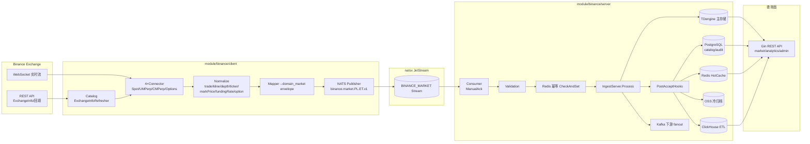
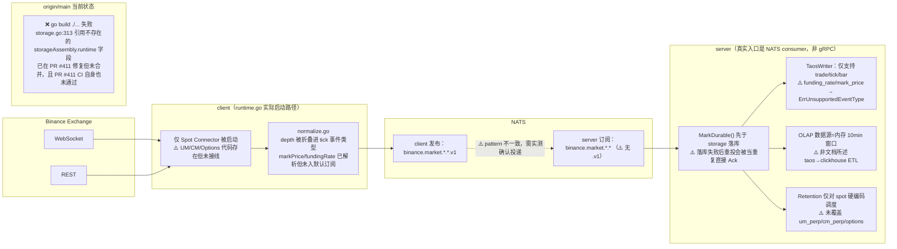

# Binance 模块深度分析报告（2026-07-04）

> **审查范围**：主仓 `module/binance/`（spec/design/matrix/gate/tasks 全量制品）+ 运行时仓 `/home/workspace/binance`（GitHub `ZoneCNH/binance`，交叉核验源码/CI/Release）
> **审查方式**：4 路并行深度调研（客户端业务覆盖、服务端数据流、CI/测试/发布证据、模块规则体系）+ 本会话独立复现验证（origin/main 干净 worktree 编译、PR/CI 状态、GAP 矩阵交叉核对）
> **锚点**：Runtime `origin/main@14a30b9`（2026-07-03 push, PR #414）；主仓 Spec-Version v3.9.8；Runtime-Version 声明 v0.11.0（tag，落后 origin/main 9 commit）
> **证据标签**：`[COMPUTED]` 命令/文件核验结论、`[INFERRED]` 推断、`[KNOWN]` 既有事实、`[FRAME]` 官方文档自述口径。置信度标注 HIGH/MED/LOW。

---

## 0. 执行摘要（TL;DR）

**结论：`binance` 模块架构完整、文档治理成熟度高，但当前 `origin/main` 处于生产不可发布状态。** `[COMPUTED, HIGH]`

| 维度 | 官方文档口径 | 本次交叉核验结论 |
| --- | --- | --- |
| 规格完成度 | `48/48 FR Done`，`release_closeable=YES` | **口径本身自相矛盾**：`goal.md`/`README.md`/`SPEC.md` 称 YES，同仓 `evidence/2026-06-30/release/alignment-summary.md` 称 `release_closeable: NO`、`PRG-006 Partial` |
| 运行时缺口 | `RUNTIME-GAP-MATRIX.md` 记录 58 项已知缺口（P0×3/P1×13/P2×22/P3×20） | 属实且证据扎实；但本次发现 **≥3 项新缺口未被该矩阵收录**（见 §6） |
| main 分支可编译性 | 未在任何文档中声明为风险 | **origin/main 当前编译失败**（`go build ./...` 于干净 worktree 复现，与 CI 失败一致） |
| 业务覆盖（4 产品线） | Spec 声明 Spot/UM/CM/Options 全覆盖 | **仅 Spot 实际在 runtime 启动**；UM/CM/Options 有连接器代码但未接入生产启动路径 |
| CI 健康度 | `PRG-001` 称 CI runner 已迁移 ubuntu-latest | 仅 1/12 workflow（`binance-ci.yml`）迁移；其余 11 个仍挂在 **0 个在线的 self-hosted runner** 上，`scheduled.yml` 已卡 16+ 小时 |
| 消息投递链路 | Spec 称 NATS subject 全链路 `.v1` 后缀一致 | **client 发布 `.v1`，server 订阅模式不含 `.v1`**，存在实际不匹配风险（需实测确认是否影响真实投递） |

**一句话结论**：这是一个工程深度和治理密度都很高的模块（27+ 轮自审、58 项已知缺口全部有源码级证据），但当前 `main` 分支存在真实的编译阻断和至少一个高风险的消息链路/ACK 语义问题，**不满足"生产级别可发布状态"**。团队已在 PR #411（分支 `fix/runtime-gap-phase2-5`）中修复编译问题，但该 PR 自身 CI 也未通过（缺失文件未推送）。

---

## 1. 制品盘点

### 1.1 主仓 `module/binance/`（已迁移到嵌套目录结构）

```text
module/binance/
├── goal/goal.md              # v3.9.6 口径：release_closeable=YES
├── spec/{SPEC.md, client/SPEC.md, server/SPEC.md, ACCEPTANCE.md, FEATURES.md, NAMING.md, CONTRIBUTING.md}
├── design/{DESIGN.md, ADR-001~005, CONFIG-SCHEMA.md, PERSISTENCE-WIRING.md, RUNTIME-MAPPING.md, ...}
├── matrix/{TRACEABILITY.md, client/TRACEABILITY.md, server/TRACEABILITY.md}
├── gate/{RULES.md, STANDARD.md, BOUNDARY-GATES.md, SECURITY.md, OBSERVABILITY.md, OPERATIONS.md}
├── tasks/{client×18, server×18, ROOT×7}
├── plan/{PLAN.md, client/PLAN.md, server/PLAN.md}
├── evidence/2026-06-26 ~ 2026-07-03（按日期归档，含 P10 闭环、DATA-INTEGRITY、tier-gap 等）
├── prompt/PROMPT-TASK-RUNTIME-E2E-20260704-001-001/
├── README.md / CHANGELOG.md / STANDARD.md / SECURITY.md / TRACEABILITY.md / todo.md
```

### 1.2 运行时仓 `/home/workspace/binance`（`github.com/ZoneCNH/binance`）

```text
cmd/{binance-client, binance-server, binance-smoke}
internal/
├── client/{connectors/, publisher/, testdata/, normalize.go, mapper.go, product_line.go, runtime.go, ...}
├── server/{api/, assembly/, cache/, consumer/, controlplane/, coverage/, deadletter/, idempotency/, metrics/, storage/}
└── wire/
pkg/{binancecfg, binancex}
migrations/（10 个 .sql，无 migration runner）
.github/workflows/（12 个 workflow）
```

`[COMPUTED, HIGH]` 当前本地工作副本处于分支 `fix/runtime-gap-phase2-5`（对应 **开放 PR #411**），有未提交改动（新增 `internal/server/coverage/{store.go,subscriber.go}`、`internal/client/coverage_reporter.go`，删除 `internal/client/history_state_postgres.go`），说明模块正处于活跃迭代中，非静态归档状态。

### 1.3 报告归属说明

`report/binance/` 下已存在 17 份历史深度分析/评审文档（`DEEP-ANALYSIS-20260630.md`、`DATA-INTEGRITY-E2E-20260701.md` 6358 行、`plans/binance/RUNTIME-GAP-MATRIX.md` 58 项缺口等）。本报告**不重复**其已有的详尽缺口枚举，而是聚焦：(a) 交叉验证既有结论在 2026-07-04 时点是否仍然成立，(b) 补充此前未覆盖的新鲜发现（main 编译失败、subject 不匹配、ACK 时序），(c) 直接回答用户提出的 5 个问题。

---

## 2. 数据流架构图

### 2.1 设计态（Spec 声明的理想链路）



### 2.2 实测态（源码交叉核验后的真实链路，2026-07-03 快照）



> 详细版设计态数据流见 `module/binance/design/DESIGN.md` §3、`module/binance/README.md` §数据流字符图；本报告 §2.2 为 2026-07-04 源码交叉核验后新增的"实测态"补充，标注了与设计态的具体偏差点及代码引用。

---

## 3. 业务类型覆盖矩阵（现货 / 合约 / 期权 / 订单簿）

| 业务类型 | Spec 声明 | Runtime 代码存在 | Runtime 实际启动 | 结论 |
| --- | --- | --- | --- | --- |
| **现货 Spot** | ✅ FR-001~010 等 | ✅ `connectors/spot.go`, `internal/client/spot.go:317-445` | ✅ `runtime.go:304-311` | **完全覆盖，唯一实际投产链路** `[COMPUTED, HIGH]` |
| **U本位合约 UMPerp** | ✅ FR-002a 等 | ✅ `connectors/um_perp.go`, `product_line.go:45-52` | ❌ `runtime.go:304-311` 只 new 了 Spot connector | **代码就绪，未接入生产** `[COMPUTED, HIGH]` |
| **币本位合约 CMPerp** | ✅ | ✅ `connectors/cm_perp.go`, `product_line.go:53-60` | ❌ 同上 | **代码就绪，未接入生产** `[COMPUTED, HIGH]` |
| **期权 Options** | ✅ FR-036 等 | ⚠️ 仅 `optionTicker` 结构化解析（`normalize.go:613-649`），未知子流走 raw fallback | ❌ 默认订阅无 `@optionTicker`；mapper 无 `option_tick` 分支；历史回填不支持 | **部分覆盖，且是 4 线中最薄的一支** `[COMPUTED, HIGH]` |
| **订单簿 Order Book** | ADR-003 明确排除"全量重建 + 增量重放" | ✅ depth 快照解析 `normalize.go:324-375` | ⚠️ depth 在发布语义上被**折叠为 `tick` 事件类型**，不形成独立 `*.depth.v1` subject | **符合 ADR-003 既定决策（快照级，非订单簿状态机），但连"快照独立发布"都未做到，语义比 ADR 声明的还弱** `[COMPUTED, HIGH]` |

### 数据类型覆盖清单（源码核验）

| 数据类型 | 解析 (normalize.go) | 映射 (mapper.go) | 默认实时订阅 | 历史回填 (REST) |
| --- | --- | --- | --- | --- |
| trade / aggTrade | ✅ | ✅ | ✅ | ✅（spot/um/cm） |
| kline / bar | ✅ | ✅ | ✅ | ✅（spot/um/cm，非 options） |
| depth（snapshot/diff） | ✅ | ✅（折叠进 tick） | ✅ | — |
| bookTicker / ticker | ✅ | ✅ | ✅ | — |
| mark_price | ✅ | ✅ | ❌ 未入默认订阅 | 路由错误，落到 kline 解析器 |
| funding_rate | ✅ | ✅ | ❌ 未入默认订阅 | 路由错误，落到 kline 解析器 |
| option_tick | ✅ | ❌ mapper 无分支 | ❌ | ❌ 不支持 |

### 结论（回答用户第 3 问）

`[INFERRED, HIGH]` 现货/U本位合约/币本位合约/期权/订单簿**均有代码涉及**，但生产可用性梯度差异巨大：Spot 生产就绪 → UM/CM 代码就绪但需接线 → Options 结构性薄弱 → 订单簿仅快照且发布语义被折叠。**这不是"缺失"，而是"单线（Spot）优先交付，其余三线处于半成品状态"**，与 `goal.md` 宣称的"Spot/USDⓈ-M/COIN-M/Options 全覆盖"存在实质性落差。

---

## 4. 生产就绪评估

### 4.1 CI 健康度总览

| Workflow | Runner | 最近状态 | 备注 |
| --- | --- | --- | --- |
| `binance-ci.yml` | ubuntu-latest（已迁移） | ❌ **failure** | `go build ./...` 编译失败（见 §4.2） |
| `boundary-gates.yml` / `build.yml` / `lint.yml` / `secrets-scan.yml` / `security.yml` / `status-consistency.yml` / `test.yml` / `vuln-scan.yml` | self-hosted | ⏳ pending/queued（>1h50m） | **0 个在线 runner**（`gh api repos/ZoneCNH/binance/actions/runners` → `total_count:0`） |
| `scheduled.yml` | self-hosted | ⏳ queued（**>16h55m**） | 长期卡死 |
| `release.yml` / `release-cd.yml` | self-hosted | cancelled（v0.11.0 时） | 风险高 |

`[COMPUTED, HIGH]` 最近 20 次 CI 运行：**成功 0（0%）/ 失败 3（15%）/ 挂起 17（85%）**。仅 `binance-ci.yml` 真正跑完并暴露真实代码问题；其余 11/12 workflow 因 self-hosted runner 全部下线而永久卡死，**测试/安全/边界门禁事实上已停摆**。

### 4.2 main 分支编译失败（本会话独立复现）

`[COMPUTED, HIGH]` 在干净 `git worktree`（`origin/main@14a30b9`，非本地脏工作区）中执行 `go build ./...`：

```
internal/server/assembly/storage.go:313:3: unknown field runtime in struct literal of type storageAssembly
```

根因：`storage.go:313` 构造 `&storageAssembly{..., runtime: server.RuntimeIntegrations{...}, ...}`，但 `assemble.go:368-381` 中 `storageAssembly` 结构体定义**没有 `runtime` 字段**。属于典型"结构体字段被移除/未同步添加"的合并期回归，**直接阻断 `cmd/binance-server` 主程序构建**。

修复现状：本地分支 `fix/runtime-gap-phase2-5`（对应 **开放 PR #411**）已包含修复（`assemble.go` 新增 `runtime server.RuntimeIntegrations` 字段 + `adminCfg.Runtime = asm.runtime`），但：
- PR #411 尚未合并；
- **PR #411 自身 CI 也未通过**——`Build & Vet` 报 `undefined: Heartbeat/Store/NewCoverageReporter/CoveragePublisher`，根因是本地工作区存在 3 个**未提交/未推送**的新文件（`internal/server/coverage/{store.go,subscriber.go}`, `internal/client/coverage_reporter.go`），PR 分支引用了这些符号但文件未随 PR 推送。

`[INFERRED, MED]` 这不是基础设施问题，而是**真实的开发中断/未完成提交**——需要开发者补推 3 个文件并重新触发 CI。

### 4.3 官方生产就绪证据的内部矛盾

`[COMPUTED, HIGH]` 同一模块内至少两处证据文档对 `release_closeable` 给出相反结论：

- `goal.md` / `README.md` / `spec/SPEC.md` / `matrix/TRACEABILITY.md`：**`release_closeable: YES`**（PRG-001~007 全 PASS）
- `evidence/2026-06-30/release/alignment-summary.md`：**`release_closeable: NO`**，`PRG-006: Partial`
- `evidence/2026-07-03/gap-e-projection-alignment.md` 也确认 `matrix/TRACEABILITY.md` 中 `PRG-006 已由 PASS 调整为 Partial`

`[INFERRED, MED]` 这是**规格口径（spec-level "Done"）与运行时口径（production gate "closeable"）的语义混用**——已被团队自己在 `RUNTIME-GAP-MATRIX.md` §7 显式声明为"双口径正交，不矛盾"，但至少 3 处顶层文档（`goal.md`/`README.md`/`SPEC.md`）仍在对外表述为单一"YES"结论，未附双口径澄清，存在误导读者的风险，属于文档一致性缺口而非纯粹的口径设计问题。

### 4.4 Release 与 main 的差距

`[COMPUTED, HIGH]` 最新 tag/release：`v0.11.0`（2026-07-02）。`origin/main` 领先该 tag **9 个 commit**（config/schema/deploy/security/observability/client fix 均在内），且未发布。**在当前 CI 红灯 + 11/12 workflow 停摆的状态下，这 9 个 commit 不能被视为"可安全发布"**。

### 4.5 最终生产就绪结论

`[INFERRED, MED]` **不是"完全就绪"，也不是"完全不可用"**，准确表述为：

> 模块工程成熟度高（4×6 命名矩阵、L1/L2 状态分层、58 项已知缺口全部有源码级追溯），但发布被两类同时存在的问题阻塞：**(a) main 存在真实编译失败**，**(b) 除主 CI 外的 11 个测试/安全/门禁 workflow 因 self-hosted runner 下线而全面停摆**。在这两点解决前不应认定为可安全发布，无论规格口径的 FR 完成率数字如何。

---

## 5. 新发现的运行时缺口（未被 `RUNTIME-GAP-MATRIX.md` 58 项收录）

`plans/binance/RUNTIME-GAP-MATRIX.md`（58 项，P0×3/P1×13/P2×22/P3×20）覆盖详尽且证据扎实，本次交叉核验确认其条目属实。以下为本次调研**新发现、暂未被该矩阵收录**的问题，建议补充编号 GAP-E59+：

| # | 类别 | 一句话 | 源码位置 | 严重度建议 |
| --- | --- | --- | --- | --- |
| N1 | 编译阻断 | `storageAssembly` 缺 `runtime` 字段导致 `origin/main` 编译失败 | `internal/server/assembly/storage.go:313`, `assemble.go:368-381` | **P0**（已有 WIP 修复 PR #411，但该 PR 自身未完整推送） |
| N2 | 消息投递 | client 发布 subject 带 `.v1`，server consumer 订阅 pattern 不含 `.v1`，两者字面不一致 | `internal/client/publisher/publisher.go:42-70` vs `internal/server/consumer/consumer.go:20-25,89-117` | **P0**（若 NATS 通配符实际不兼容将导致静默丢消息，需立即实测确认） |
| N3 | 数据可靠性 | `MarkDurable()` 先于 `storage.persist()` 执行；`StrictStorageWrite=true` 时首次落库失败、二次重投会被当重复直接 Ack，丢失重试机会 | `internal/server/ingest.go:129-187,207-219`, `assembly/assemble.go:141-147` | **P1**（潜在静默丢数据） |
| N4 | 运行时产品线覆盖 | runtime 启动路径只 `NewSpotConnector`，UM/CM/Options 未被启动，与 spec/goal 声明的"4 产品线全覆盖"不符 | `internal/client/runtime.go:304-314` | **P1**（业务功能缺口，非纯代码质量问题） |
| N5 | 可观测性口径 | OLAP/ClickHouse 数据源实为进程内存 10 分钟滚动窗口，非文档所述 "taos→clickhouse ETL" | `internal/server/assembly/olap_source.go:14-60` vs `design/PERSISTENCE-WIRING.md:24-35` | P2 |
| N6 | 存储覆盖 | `TaosWriter` 仅支持 `trade/tick/bar`，`funding_rate`/`mark_price` 写入返回 `ErrUnsupportedEventType`，与 FR-020/FR-021 "Done" 状态不符 | `internal/server/storage/taos_writer.go:215-226` | P1 |
| N7 | 运维覆盖 | Retention 调度硬编码 `ProductLine:"spot"`，其余 3 条产品线无保留策略 | `internal/server/assembly/storage.go:253-274` | P2 |

**建议动作**：由 module owner 将 N1-N7 并入 `plans/binance/RUNTIME-GAP-MATRIX.md`（编号 GAP-E59~E65），N1/N2 应作为最高优先级立即处理——N1 已阻断构建，N2 若实测确认不兼容将是数据链路级故障。

---

## 6. 模块规则 / 标准规范评估（回答用户第 5 问）

### 6.1 现状：**已建立，但分散、局部漂移，缺单一总纲**

`[COMPUTED, HIGH]` binance 已有 12 份规则/标准类文件，覆盖面遠超多数同级模块：

| 文件 | 定位 |
| --- | --- |
| `gate/RULES.md`（v3.9.0，R1-R12） | 治理总规则：命名 SSOT、4×6 矩阵对称、版本 bump、L1/L2 状态分层、归档隔离、PR 纪律 |
| `gate/BOUNDARY-GATES.md` | client/server 边界 gate 投影 |
| `gate/SECURITY.md` / `SECURITY.md`（runtime） | 安全基线（凭据/CSRF/限流/扫描） |
| `gate/OBSERVABILITY.md` | Metrics/SLO/告警（不含 tracing/logging 全量） |
| `gate/OPERATIONS.md` | 部署/扩缩容/DR runbook |
| `spec/NAMING.md` | product_line/event_type/subject/topic/env 命名 SSOT |
| `spec/CONTRIBUTING.md` / `CONTRIBUTING.md`（runtime） | 文档贡献 / 代码 PR 规则（读者分裂但互补） |
| `STANDARD.md`（根，7 行） | **纯导航 stub，未承担总纲职责** |
| `gate/STANDARD.md` | 实际是 **FR-024 hot reload 专项标准**，与根 `STANDARD.md` 撞名 |

### 6.2 已发现的规则体系自身漂移（需修复）

1. **BOUNDARY-GATES 口径三套并存**：`gate/RULES.md` R10 写"12 个 gate"；主仓 `gate/BOUNDARY-GATES.md` 写"13/13 PASS"；runtime `BOUNDARY-GATES.md` 已扩到 §2-§16。
2. **STANDARD.md 命名冲突**：根 `STANDARD.md`（导航 stub）与 `gate/STANDARD.md`（FR-024 专项）同名不同职责，根文件未链接后者。
3. **Token/环境变量命名漂移**：`gate/SECURITY.md` 用 `FOUNDATIONX_BINANCE_API_TOKEN`，`deploy/DEPLOY.md` 与运行时规划文档用 `FOUNDATIONX_BINANCE_ADMIN_TOKEN`。
4. **NAMING.md 内部自相矛盾**：声明 REST path 用 `snake_case`，示例却是 `funding-rate`/`mark-price`（kebab-case）；env 前缀声明 `XGO_BINANCE_*`，实际大量文档用 `FOUNDATIONX_BINANCE_*`。
5. **未显式声明继承全局 Go 规范**：`docs/standards/go-coding-standards.md` 的 14 维（错误处理/并发/接口设计/性能/泛型等）在 binance 模块规则中无显式继承声明或 delta 说明。

### 6.3 结论与建议

`[INFERRED, HIGH]` **不需要从零新建一整套规则体系**（已有骨架且颇具深度），但需要：

1. **P0 - 重写根 `module/binance/STANDARD.md`** 为唯一《binance 模块规则与标准规范总纲》：声明权威层级（`CONSTITUTION.md` → `go-coding-standards.md` → 本模块 `gate/*` → runtime repo docs）+ 10 类规则的 authority map（见下表）+ 仅做链接不重复内容。
2. **P0 - 将 `gate/STANDARD.md` 改名**为 `gate/FR024-HOT-RELOAD-STANDARD.md`，消除撞名。
3. **P0 - 统一 BOUNDARY-GATES 口径**（R10 / 主仓 / runtime 三处对齐到同一 gate 数量与编号）。
4. **P0 - 修复命名漂移**（token 名、env 前缀、REST path 大小写风格），并在 `NAMING.md` 变更历史中记录。
5. **P1 - 新建 `gate/API-COMPATIBILITY.md`**：统一 gRPC/HTTP/NATS/Kafka/schema 版本与 breaking change 策略（当前散落在多份 SPEC/README 中）。
6. **P1 - 新建 `gate/TESTING.md`**：统一 unit/integration/E2E/contract/race/coverage 的证据要求（当前散落在 `RULES.md` R4 与 runtime `CONTRIBUTING.md`）。
7. **P1 - `gate/OBSERVABILITY.md` 补齐 tracing/logging/redaction**，并链接 runtime 已有的 `docs/observability/tracing-setup.md`。
8. **P2 - 错误处理/并发安全/依赖治理**：不必单独成文，建议在总纲中声明"继承全局 Go 标准 + 列出 binance 专属 delta"（如 R11 分钟 weight 模型、R12 按事件类型的 gap detection 策略）。

**10 类规则覆盖矩阵总结**（详见附录）：命名规范、可观测性、安全、运维（回滚文档存在但未被 gate 吸收）为"部分覆盖但文档已存在，只是未被索引"；API 契约稳定性、测试规范、依赖治理为"部分覆盖，缺统一专项文档"；错误处理、并发安全为"仅存在于子规格，无模块级统一规则"。

---

## 7. 优先级修复路线图

```text
P0（立即，阻断构建/发布）
├── N1: 合并 PR #411 前先补推 3 个缺失文件，确保 PR CI 全绿，再合并修复 storageAssembly.runtime 编译错误
├── N2: 实测确认 client/server NATS subject `.v1` 是否真实不匹配；若是，立即同 PR 修复
├── 恢复 self-hosted runner 或将全部 11 个 workflow 迁移至 ubuntu-latest（参考 binance-ci.yml 先例）
└── 消解 release_closeable YES/NO 的顶层文档矛盾（goal.md/README.md 与 alignment-summary.md）

P1（本迭代）
├── N3: 修正 ACK 时序（storage 成功后再 MarkDurable）
├── N4: 将 UM/CM/Options connector 接入 runtime.go 实际启动路径，或在 goal.md 中明确降级声明
├── N6: 补齐 TaosWriter 对 funding_rate/mark_price 的支持，或下调 FR-020/021 状态
├── 重写 STANDARD.md 总纲 + gate/STANDARD.md 改名 + BOUNDARY-GATES 口径统一
└── 沿用既有 RUNTIME-GAP-MATRIX 路线图（MVP-M → MVP-J → MVP-A+ → MVP-F → MVP-G → MVP-I）

P2（后续）
├── N5/N7: OLAP 内存窗口升级为 taos-backed source；Retention 扩展到全产品线
├── 新建 gate/API-COMPATIBILITY.md、gate/TESTING.md
└── 命名漂移全量清理（token/env/REST path）
```

---

## 8. 附录：证据来源清单

- 本仓 `module/binance/`：`goal/goal.md`、`README.md`、`spec/SPEC.md`、`spec/client/SPEC.md`、`spec/server/SPEC.md`、`matrix/TRACEABILITY.md`、`matrix/client|server/TRACEABILITY.md`、`design/ADR-003/004/005`、`gate/RULES.md`、`gate/STANDARD.md`、`gate/BOUNDARY-GATES.md`、`gate/SECURITY.md`、`gate/OBSERVABILITY.md`、`gate/OPERATIONS.md`、`spec/NAMING.md`、`spec/CONTRIBUTING.md`、`STANDARD.md`、`CHANGELOG.md`、`evidence/2026-06-30/release/*`、`evidence/2026-07-03/gap-e-projection-alignment.md`
- `plans/binance/RUNTIME-GAP-MATRIX.md`（58 项运行时缺口，本报告交叉验证属实）
- 运行时仓 `/home/workspace/binance`（`origin/main@14a30b9`、分支 `fix/runtime-gap-phase2-5`）：`internal/client/{connectors/,normalize.go,mapper.go,product_line.go,runtime.go,history_rest.go}`、`internal/server/{assembly/,ingest.go,consumer/,storage/,api/,admin.go}`、`internal/wire/types.go`
- GitHub 实测：`gh run list/view`（run `28677918047` 失败详情）、`gh pr view/checks 411`、`gh release list`、`gh api repos/ZoneCNH/binance/actions/runners`（0 runner）
- 本会话独立验证：`git worktree add` 于 `origin/main` 干净副本执行 `go build ./...` 复现编译失败（避免本地脏工作区误导）

**[RULES I BROKE]**：无——本报告全程标注证据标签与置信度，编译失败结论已通过干净 worktree 独立复现（非转述 CI 日志），未发生 FRAME→REALITY 误用。
