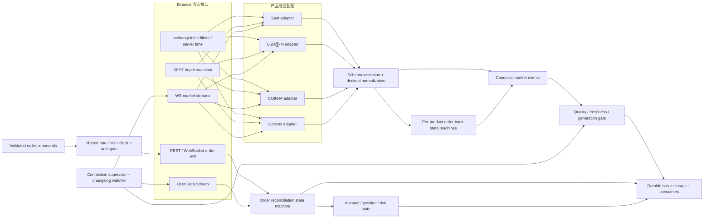

# Binance 官方能力与生产级基线

> 调研日期：2026-07-10（Asia/Shanghai）。[COMPUTED, HIGH]
> 调研范围：Binance Spot、USDⓈ-M Futures、COIN-M Futures、Options，以及四类产品的 REST、WebSocket、用户数据流、交易能力和订单簿一致性要求。[COMPUTED, HIGH]
> 来源边界：仅使用 Binance Developers 官方文档、Binance 官方 GitHub 仓库和官方变更说明。[COMPUTED, HIGH]
> 结论边界：本文是“官方能力基线与生产要求”，不是对本地 `module/binance/` 或 `/home/workspace/binance` 的实现符合性裁决。[COMPUTED, HIGH]

## 0. 证据标签与方法

- `[COMPUTED, HIGH]`：从本次打开并核对的 Binance 官方页面或官方 GitHub 文档直接归纳，置信度不低于 80%。[COMPUTED, HIGH]
- `[INFERRED, HIGH|MED]`：由官方协议约束推导出的工程要求；不是 Binance 对某个本地实现的认证结论。[COMPUTED, HIGH]
- 新 API Reference 已存在时优先引用新站点；少量 WebSocket 细节页仍由 Binance 新站点链接或重定向至其官方 `legacy-docs` 命名空间，本文将其视为官方当前公开资料，但把变更监测列为生产门禁。[COMPUTED, HIGH]
- 时效核验以 2026-07-10 页面状态为准；官方 Derivatives Change Log 的最新条目为 2026-07-09，COIN-M/UM 整合通知与两类 Futures 本地订单簿页也标示在 2026-07-09 更新。[COMPUTED, HIGH] [Derivatives Change Log](https://developers.binance.com/en/docs/products/derivatives-trading-usds-futures/change-log)、[COIN-M/UM Integration Notice](https://developers.binance.com/en/docs/products/derivatives-trading-coin-futures/Important-CM-UM-Integration-Notice)

## 1. 反结论先行

Binance 官方接口明确覆盖现货、USDⓈ-M 合约、COIN-M 永续与交割合约、期权；四类产品均有 REST 市场数据和 WebSocket 市场流，且均提供订单簿快照与增量深度流。[COMPUTED, HIGH] 官方产品目录分别将 Spot、USDⓈ-M、COIN-M 和 Options 列为核心交易产品，并说明 COIN-M 覆盖 perpetual 与 delivery futures；Options 覆盖市场数据、账户与交易。[官方产品目录](https://developers.binance.com/en/docs/catalog)

“支持 WebSocket”不等于“订单簿生产可用”。四类订单簿都要求先缓存增量、再取 REST 快照、完成序列对齐，并在检测到序列缺口时丢弃本地状态并重建；只消费 diff depth 而不执行快照对齐和 gap rebuild，不能形成可信本地订单簿。[COMPUTED, HIGH] [Spot 本地订单簿算法](https://github.com/binance/binance-spot-api-docs/blob/master/web-socket-streams.md#how-to-manage-a-local-order-book-correctly)、[USDⓈ-M 本地订单簿算法](https://developers.binance.com/en/docs/products/derivatives-trading-usds-futures/websocket-market-streams/How-to-manage-a-local-order-book-correctly)、[COIN-M 本地订单簿算法](https://developers.binance.com/en/docs/products/derivatives-trading-coin-futures/websocket-market-streams/How-to-manage-a-local-order-book-correctly)、[Options 本地订单簿算法](https://developers.binance.com/legacy-docs/derivatives/options-trading/websocket-market-streams/How-to-manage-a-local-order-book-correctly)

若模块的发布口径是“公共行情采集”，订单、账户、仓位和私有用户流可以明确排除；若发布口径是“完整 Binance 交易接入”，则下单、撤单、改单/条件单、订单查询、用户流、账户/仓位对账、未知执行状态消歧和密钥安全全部是 P0，不能以公共行情通过代替。[INFERRED, HIGH] 官方 API Reference 将市场数据、交易、账户和 User Data Streams 分为不同安全域与接口组。[Spot REST](https://github.com/binance/binance-spot-api-docs/blob/master/rest-api.md)、[USDⓈ-M REST API Reference](https://developers.binance.com/en/docs/catalog/core-trading-derivatives-trading-usd-s-m-futures/api/rest-api/market-data)、[COIN-M REST API Reference](https://developers.binance.com/en/docs/catalog/core-trading-derivatives-trading-coin-m-futures/api/rest-api/market-data)、[Options REST API Reference](https://developers.binance.com/en/docs/catalog/core-trading-derivatives-trading-options/api/rest-api/market-data)

截至本次调研，最容易造成“代码能连但生产失效”的时效变化有两项：USDⓈ-M 旧 WebSocket 根路径已于 2026-04-23 后退役其 `/market`、`/private` 推送能力；COIN-M/UM 架构整合已在 2026-06-24 起渐进发布并于 2026-06-30 前全面生效，UM/CM 共享限流池，且订单回包、条件单路由和部分流字段发生变化。[COMPUTED, HIGH] [USDⓈ-M WebSocket 迁移通知](https://developers.binance.com/legacy-docs/derivatives/usds-margined-futures/websocket-market-streams/Important-WebSocket-Change-Notice)、[COIN-M/UM 架构整合通知](https://developers.binance.com/en/docs/products/derivatives-trading-coin-futures/Important-CM-UM-Integration-Notice)

## 2. 官方业务能力矩阵

| 业务域         | 官方产品能力                                                                                                                                                                                               | 市场数据                                                                                                           | 交易与私有状态                                                                                                                                       | 生产边界判断                                                                                                                                            |
| -------------- | ---------------------------------------------------------------------------------------------------------------------------------------------------------------------------------------------------------- | ------------------------------------------------------------------------------------------------------------------ | ---------------------------------------------------------------------------------------------------------------------------------------------------- | ------------------------------------------------------------------------------------------------------------------------------------------------------- |
| Spot           | 现货交易；官方还提供 REST、WebSocket API、市场流、User Data Stream，Spot 官方仓库另列 FIX 与 SBE。[COMPUTED, HIGH]                                                                                         | 深度、逐笔/聚合成交、Kline、ticker、book ticker 等 REST/WS 数据。[COMPUTED, HIGH]                                  | 新单、撤单、cancel-replace、减量且保优先级的 amend、订单列表、订单/成交/账户查询；User Data Stream 推送余额和 `executionReport`。[COMPUTED, HIGH]    | 公共行情版可只实现公开数据；宣称 Spot trading 时必须覆盖订单生命周期与账户对账。[INFERRED, HIGH]                                                        |
| USDⓈ-M Futures | USDⓈ 保证金合约；官方 API 的 `contractType` 包括 `PERPETUAL`、`CURRENT_QUARTER`、`NEXT_QUARTER`，当前文档还列出 `TRADIFI_PERPETUAL`。[COMPUTED, HIGH]                                                      | 深度、成交、Kline、连续合约 Kline、标记价/指数价、资金费率、持仓量、强平、ADL 风险等。[COMPUTED, HIGH]             | REST 与 WebSocket API 均有下单、撤单、改单、订单查询、账户/仓位接口；条件单有独立 algo order 接口；用户流包含订单、账户/仓位等事件。[COMPUTED, HIGH] | “合约行情”至少应把 mark/index/funding 与普通成交/Kline 分开建模；“合约交易”还必须建模仓位方向、杠杆、保证金模式、reduce-only 与条件单。[INFERRED, HIGH] |
| COIN-M Futures | 币本位 perpetual 与 delivery futures。[COMPUTED, HIGH]                                                                                                                                                     | 深度、成交、Kline、连续/交割合约、标记价/指数价、资金费率、持仓量、强平等。[COMPUTED, HIGH]                        | REST 与 WebSocket API 支持订单/账户/仓位；2026-06 架构整合后与 UM 共享部分账户设置和限流池，并新增/调整 algo order 路由。[COMPUTED, HIGH]            | 不能把 COIN-M 当成只换 base URL 的 USDⓈ-M；合约大小、保证金币种、交割日期、pair/symbol、整合后的 `st` 字段均需保留。[INFERRED, HIGH]                    |
| Options        | 期权市场数据、账户与交易；官方 Change Log 称其为 European Options，`exchangeInfo` 暴露 underlying、expiry、strike、CALL/PUT、过滤器、`contractType`、`underlyingType` 和保证金相关元数据。[COMPUTED, HIGH] | 深度、成交、Kline、index、mark、IV/Greeks、open interest、行权历史与 ticker。[COMPUTED, HIGH]                      | 单笔/批量下单、撤单、订单查询、仓位、用户流；Market Maker API 另有 kill-switch 和 MMP；用户流还有风险等级与 Greeks 事件。[COMPUTED, HIGH]            | 不能只用 `symbol` 字符串承载期权语义；underlying、expiry、strike、option side、contract/underlying type、Greeks、风险状态需结构化。[INFERRED, HIGH]     |
| Order Book     | 订单簿是横跨四类产品的数据状态机，不是第五种市场业务类型。[INFERRED, HIGH]                                                                                                                                 | 四类产品都有 REST snapshot、partial depth、diff depth/book ticker；Spot 与衍生品使用不同序列规则。[COMPUTED, HIGH] | 订单状态/成交用户流可用于私有订单对账，但不能替代公共深度序列算法。[INFERRED, HIGH]                                                                  | 必须按 product line 选择协议、序列校验、重建和 SLO；禁止用一个“宽松通用解析器”吞掉差异。[INFERRED, HIGH]                                                |

矩阵来源：[Spot 官方 API 仓库](https://github.com/binance/binance-spot-api-docs)、[USDⓈ-M REST 目录](https://developers.binance.com/en/docs/catalog/core-trading-derivatives-trading-usd-s-m-futures/api/rest-api/market-data)、[USDⓈ-M WebSocket API 交易目录](https://developers.binance.com/en/docs/catalog/core-trading-derivatives-trading-usd-s-m-futures/api/ws-api/trade)、[COIN-M REST 目录](https://developers.binance.com/en/docs/catalog/core-trading-derivatives-trading-coin-m-futures/api/rest-api/market-data)、[Options 市场数据目录](https://developers.binance.com/en/docs/catalog/core-trading-derivatives-trading-options/api/rest-api/market-data)、[Options 交易目录](https://developers.binance.com/en/docs/catalog/core-trading-derivatives-trading-options/api/rest-api/trade)。[COMPUTED, HIGH]

## 3. 官方接口面逐项核实

### 3.1 Spot

- Spot REST 的生产基址包括 `api.binance.com` 及若干备选端点；官方明确说明 `api1` 至 `api4` 可能性能更好但稳定性较低，纯公共数据可使用 `data-api.binance.vision`。[COMPUTED, HIGH] [Spot REST General Information](https://developers.binance.com/en/docs/products/spot/rest-api)
- REST 市场数据至少包括 `/api/v3/exchangeInfo`、`/api/v3/depth`、trades/aggTrades、Kline 和 ticker；交易/账户面包括 `POST /api/v3/order`、撤单、cancel-replace、`PUT /api/v3/order/amend/keepPriority`、订单列表、订单查询、成交与账户查询。[COMPUTED, HIGH] [Spot REST API](https://github.com/binance/binance-spot-api-docs/blob/master/rest-api.md)
- Spot WebSocket 市场流基址为 `wss://stream.binance.com:9443` 或 `:443`，支持 raw 与 combined streams；只读市场数据基址 `data-stream.binance.vision` 不提供 User Data Stream。[COMPUTED, HIGH] [Spot WebSocket Streams](https://github.com/binance/binance-spot-api-docs/blob/master/web-socket-streams.md)
- Spot 还提供 `wss://ws-api.binance.com:443/ws-api/v3` 的 WebSocket request/response API，包含市场查询、交易、账户查询与用户流订阅；WebSocket API 响应可带当前 rate-limit 计数。[COMPUTED, HIGH] [Spot WebSocket API](https://github.com/binance/binance-spot-api-docs/blob/master/web-socket-api.md)
- 当前 Spot User Data Stream 文档要求通过 WebSocket API 使用 API Key 订阅，JSON/SBE 均受支持，账户事件实时推送；关键事件包括 `outboundAccountPosition`、`balanceUpdate` 和订单 `executionReport`。[COMPUTED, HIGH] [Spot User Data Stream](https://github.com/binance/binance-spot-api-docs/blob/master/user-data-stream.md)
- Spot 官方变更日志在 2026 年仍持续新增/调整订单响应字段、SBE schema、amend/订单列表等能力，因此 schema 版本与 changelog 监控属于生产依赖，不是一次性接入工作。[COMPUTED, HIGH] [Spot CHANGELOG](https://github.com/binance/binance-spot-api-docs/blob/master/CHANGELOG.md)

### 3.2 USDⓈ-M Futures

- REST 基址是 `https://fapi.binance.com`，市场数据、账户、交易、用户流被拆分成独立接口组；官方 API Reference 列出 depth、成交、Kline、mark/index/funding/open-interest、订单/仓位/账户等完整接口面。[COMPUTED, HIGH] [USDⓈ-M General Info](https://developers.binance.com/en/docs/products/derivatives-trading-usds-futures/general-info)、[USDⓈ-M REST API Reference](https://developers.binance.com/en/docs/catalog/core-trading-derivatives-trading-usd-s-m-futures/api/rest-api/market-data)
- REST 交易面包括新单、撤单、改单、批量订单、订单查询、持仓与杠杆/保证金配置；WebSocket API 基址为 `wss://ws-fapi.binance.com/ws-fapi/v1`，也提供 `order.place`、`order.cancel`、`order.modify`、`algoOrder.place` 及订单/仓位查询。[COMPUTED, HIGH] [USDⓈ-M WebSocket API Trade](https://developers.binance.com/en/docs/catalog/core-trading-derivatives-trading-usd-s-m-futures/api/ws-api/trade)
- USDⓈ-M 条件单已于 2025-12-09 迁移到 Algo Service；普通 `/fapi/v1/order`、batch order 和相应 WebSocket 下单不再承接 stop/take-profit/trailing-stop 类型，客户端必须使用 `/fapi/v1/algoOrder`/`algoOrder.place` 并消费 `ALGO_UPDATE`。[COMPUTED, HIGH] [Derivatives Change Log](https://developers.binance.com/en/docs/products/derivatives-trading-usds-futures/change-log#2025-11-06)
- 市场 WebSocket 已分流为 `wss://fstream.binance.com/public`、`/market`、`/private`；未带路由的旧连接只保留 public 类数据，旧 `/ws` 与 `/stream` 的 market/private 能力在 2026-04-23 后退役。[COMPUTED, HIGH] [USDⓈ-M WebSocket 迁移通知](https://developers.binance.com/legacy-docs/derivatives/usds-margined-futures/websocket-market-streams/Important-WebSocket-Change-Notice)
- User Data Stream 使用 `/fapi/v1/listenKey` 建立/续期/关闭；未续期会在 60 分钟后关闭。官方建议优先从用户流获取剧烈行情下的订单和仓位状态。[COMPUTED, HIGH] [USDⓈ-M User Data Stream REST](https://developers.binance.com/en/docs/catalog/core-trading-derivatives-trading-usd-s-m-futures/api/rest-api/user-data-streams)、[USDⓈ-M WebSocket Connect](https://developers.binance.com/en/docs/products/derivatives-trading-usds-futures/websocket-market-streams/Connect)
- `ORDER_TRADE_UPDATE`/`ACCOUNT_UPDATE` 是完整订单与账户状态链的基础；官方还提供只推送成交执行类型且字段更少的低延迟 `TRADE_LITE`，它不能单独替代完整订单状态流。[COMPUTED, HIGH] [USDⓈ-M Trade Lite](https://developers.binance.com/legacy-docs/derivatives/usds-margined-futures/user-data-streams/Event-Trade-Lite)、[USDⓈ-M WebSocket 迁移通知](https://developers.binance.com/legacy-docs/derivatives/usds-margined-futures/websocket-market-streams/Important-WebSocket-Change-Notice)

### 3.3 COIN-M Futures

- REST 基址是 `https://dapi.binance.com`；`exchangeInfo` 与市场目录表明 COIN-M 支持 perpetual、current-quarter、next-quarter 等合约语义，以及 depth、成交、Kline、mark/index/funding/open-interest 等数据。[COMPUTED, HIGH] [COIN-M Market Data API](https://developers.binance.com/en/docs/catalog/core-trading-derivatives-trading-coin-m-futures/api/rest-api/market-data)
- 交易接口包括新单、撤单、改单、批量订单、订单/成交/仓位查询与杠杆/保证金控制；WebSocket API 基址为 `wss://ws-dapi.binance.com/ws-dapi/v1`，也提供 `order.place` 等请求能力。[COMPUTED, HIGH] [COIN-M Trade API](https://developers.binance.com/en/docs/catalog/core-trading-derivatives-trading-coin-m-futures/api/rest-api/trade)、[COIN-M WebSocket order.place](https://developers.binance.com/legacy-docs/derivatives/coin-margined-futures/trade/websocket-api)、[Derivatives Change Log](https://developers.binance.com/en/docs/products/derivatives-trading-usds-futures/change-log#2025-02-20)
- User Data Stream 使用 `/dapi/v1/listenKey`，有效期 60 分钟并需要续期；市场流当前官方文档仍给出 `wss://dstream.binance.com`，单连接支持 raw/combined stream。[COMPUTED, HIGH] [COIN-M User Data Stream REST](https://developers.binance.com/en/docs/catalog/core-trading-derivatives-trading-coin-m-futures/api/rest-api/user-data-streams)、[COIN-M WebSocket Streams](https://developers.binance.com/legacy-docs/derivatives/coin-margined-futures/websocket-market-streams)
- 2026-06 的 UM/CM 整合使两者共享 `dualSidePosition`、UM 侧 STP 配置与 rate-limit pools；每 IP 共享 2400 request weight/min，每账户共享 1200 orders/min 和 300 orders/10s。[COMPUTED, HIGH] [COIN-M/UM Integration Notice](https://developers.binance.com/en/docs/products/derivatives-trading-coin-futures/Important-CM-UM-Integration-Notice)
- 整合后，下单/改单/撤单即时 ACK 不再可靠携带 `avgPrice` 与 `cumQuote`/`cumBase`；真实成交价格仍应从订单查询、userTrades 或用户流取得。解析器还必须容忍新增 `st`（1=UM、2=CM）与部分 `ps` 字段，以及 all-market streams 的 UM+CM 合并全集。[COMPUTED, HIGH] [COIN-M/UM Integration Notice](https://developers.binance.com/en/docs/products/derivatives-trading-coin-futures/Important-CM-UM-Integration-Notice)
- 2026-06-30 的官方变更还把 COIN-M `<pair>@indexPrice` payload 的 pair 字段从 `i` 改为 `s`，并移除了 `<pair>@indexPrice@1s` 变体；解析与订阅配置必须按当前 wire contract 更新。[COMPUTED, HIGH] [Derivatives Change Log](https://developers.binance.com/en/docs/products/derivatives-trading-usds-futures/change-log#2026-06-30)
- COIN-M 条件单已增加 `/dapi/v1/algoOrder` 路径；官方通知说明普通 place/batch/ws `order.place` 将拒绝 stop-type 并返回 `-4120`，但该细项的精确启用时刻需另行公告。[COMPUTED, HIGH] 生产客户端应同时识别能力公告与 `-4120`，把 stop/take-profit/trailing-stop 路由到 algo order，而不是盲目重试旧接口。[INFERRED, HIGH] [COIN-M/UM Integration Notice](https://developers.binance.com/en/docs/products/derivatives-trading-coin-futures/Important-CM-UM-Integration-Notice)

### 3.4 Options

- REST 基址是 `https://eapi.binance.com`；`/eapi/v1/exchangeInfo` 返回 option contracts/assets/symbols、expiry、underlying、strike、CALL/PUT、过滤器和 rate limits；2026-07-09 起 `optionSymbols` 还包含 `contractType` 与 `underlyingType`。[COMPUTED, HIGH] [Options Market Data API](https://developers.binance.com/en/docs/catalog/core-trading-derivatives-trading-options/api/rest-api/market-data)、[Derivatives Change Log](https://developers.binance.com/en/docs/products/derivatives-trading-usds-futures/change-log#2026-07-09)
- 市场数据面包括 `/eapi/v1/depth`、成交、Kline、index、mark（含 IV、delta、theta、gamma、vega）、open interest、行权历史和 ticker。[COMPUTED, HIGH] [Options Market Data API](https://developers.binance.com/en/docs/catalog/core-trading-derivatives-trading-options/api/rest-api/market-data)
- 交易面包括 `POST /eapi/v1/order`、`DELETE /eapi/v1/order`、单订单查询、批量下单/撤单、按 symbol/underlying 撤全单、仓位与历史查询；当前新单类型文档列出 LIMIT 以及 GTC/IOC/FOK/GTX，并支持 reduce-only、post-only、MMP 与 STP 参数。[COMPUTED, HIGH] [Options Trade API](https://developers.binance.com/en/docs/catalog/core-trading-derivatives-trading-options/api/rest-api/trade)
- Options 另有 Market Maker kill-switch 与 Market Maker Protection 配置接口；若产品目标是期权做市，这些属于风险控制 P0，而不是可选 UI 功能。[COMPUTED, HIGH] [Options API Reference](https://developers.binance.com/en/docs/catalog/core-trading-derivatives-trading-options/api/rest-api/market-maker-endpoints) [INFERRED, HIGH]
- Options 市场流使用 `fstream.binance.com/public` 与 `/market`，用户流使用 `/private`；listenKey 有效 60 分钟，单个私有连接也只保证 24 小时。[COMPUTED, HIGH] [Options WebSocket Connect](https://developers.binance.com/legacy-docs/derivatives/options-trading/websocket-market-streams)、[Options User Data Stream](https://developers.binance.com/legacy-docs/derivatives/options-trading/user-data-streams)
- 用户流除 `ORDER_TRADE_UPDATE` 外还包括 `RISK_LEVEL_CHANGE`、账户/仓位、`GREEK_UPDATE` 与 `listenKeyExpired`；收到 listen-key 过期事件后不会继续收到用户数据，直至换用有效 key。[COMPUTED, HIGH] [Options Order Update](https://developers.binance.com/legacy-docs/derivatives/options-trading/user-data-streams/Event-Order-update)、[Options Risk Level](https://developers.binance.com/legacy-docs/derivatives/options-trading/user-data-streams/Event-Risk-level-change)、[Options Greek Update](https://developers.binance.com/legacy-docs/derivatives/options-trading/user-data-streams/Event-Greek-Update)、[Options listenKeyExpired](https://developers.binance.com/legacy-docs/derivatives/options-trading/user-data-streams/Event-User-Data-Stream-Expired)

## 4. 订单簿生产一致性基线

### 4.1 四产品线对照

| 产品线  | REST 快照                                                            | 增量流与关键字段                                                                                  | 官方对齐/缺口规则                                                                                                                                                               | 深度边界                                                                     |
| ------- | -------------------------------------------------------------------- | ------------------------------------------------------------------------------------------------- | ------------------------------------------------------------------------------------------------------------------------------------------------------------------------------- | ---------------------------------------------------------------------------- |
| Spot    | `GET /api/v3/depth`。[COMPUTED, HIGH]                                | `<symbol>@depth` / `@100ms`；`U`、`u`。[COMPUTED, HIGH]                                           | 先缓存；若 snapshot `lastUpdateId <` 首事件 `U` 则重取；丢弃 `u <= lastUpdateId`；第一事件须覆盖 snapshot id；后续若 `U > localUpdateId + 1` 即缺口并全量重建。[COMPUTED, HIGH] | 快照每侧最多 5000 档；快照外未变更价位不可视为完整已知状态。[COMPUTED, HIGH] |
| USDⓈ-M  | `GET /fapi/v1/depth`，本地账本流程使用 1000 档快照。[COMPUTED, HIGH] | `<symbol>@depth`；`U`、`u`、`pu`。[COMPUTED, HIGH]                                                | 先缓存；丢弃 `u < lastUpdateId`；第一事件满足 `U <= lastUpdateId <= u`；每个新事件 `pu == previous u`，否则重取快照并重建。[COMPUTED, HIGH]                                     | 官方本地账本流程以 1000 档快照为基线。[COMPUTED, HIGH]                       |
| COIN-M  | `GET /dapi/v1/depth`，本地账本流程使用 1000 档快照。[COMPUTED, HIGH] | `<symbol>@depth`，支持默认、`@500ms`、`@100ms`；`U`、`u`、`pu`，整合后还有 `st`。[COMPUTED, HIGH] | 与 USDⓈ-M 相同：首事件覆盖 snapshot id，`pu` 必须接续前一 `u`，不连续即重建。[COMPUTED, HIGH]                                                                                   | 1000 档初始化快照。[COMPUTED, HIGH]                                          |
| Options | `GET /eapi/v1/depth`，最大 1000 档。[COMPUTED, HIGH]                 | `<symbol>@depth@100ms` 或 `@500ms`；`U`、`u`、`pu`。[COMPUTED, HIGH]                              | 与 Futures 同类：首事件覆盖 snapshot id，`pu == previous u`；缺口即重新初始化。[COMPUTED, HIGH]                                                                                 | REST 支持 10/20/50/100/500/1000，最大 1000。[COMPUTED, HIGH]                 |

来源：[Spot Streams](https://github.com/binance/binance-spot-api-docs/blob/master/web-socket-streams.md)、[Spot Depth REST](https://github.com/binance/binance-spot-api-docs/blob/master/rest-api.md#order-book)、[USDⓈ-M 本地订单簿](https://developers.binance.com/en/docs/products/derivatives-trading-usds-futures/websocket-market-streams/How-to-manage-a-local-order-book-correctly)、[COIN-M Diff Depth](https://developers.binance.com/legacy-docs/derivatives/coin-margined-futures/websocket-market-streams/Diff-Book-Depth-Streams)、[COIN-M 本地订单簿](https://developers.binance.com/en/docs/products/derivatives-trading-coin-futures/websocket-market-streams/How-to-manage-a-local-order-book-correctly)、[Options Depth REST](https://developers.binance.com/en/docs/catalog/core-trading-derivatives-trading-options/api/rest-api/market-data#order-book)、[Options Diff Depth](https://developers.binance.com/legacy-docs/derivatives/options-trading/websocket-market-streams/Diff-Book-Depth-Streams)、[Options 本地订单簿](https://developers.binance.com/legacy-docs/derivatives/options-trading/websocket-market-streams/How-to-manage-a-local-order-book-correctly)。[COMPUTED, HIGH]

USDⓈ-M 的公开 depth、bookTicker 和相关 WebSocket order-book streams 明确排除 RPI orders；因此该公开订单簿是 Binance 定义的可见订单簿，而不是包含 RPI 流动性的全量撮合队列。[COMPUTED, HIGH] [Derivatives Change Log](https://developers.binance.com/en/docs/products/derivatives-trading-usds-futures/change-log#2025-11-18)

### 4.2 必须固化为状态机的不变量

1. 每个 `product_line + symbol` 必须有独立的 `INITIALIZING → LIVE → STALE/GAP → REBUILDING` 状态，重连不能沿用未经重新对齐的旧本地簿。[INFERRED, HIGH]
2. 快照获取期间必须继续缓存 diff；先取快照再开流会产生不可证明的竞态窗口。[INFERRED, HIGH]
3. 数量字段是该价位的新绝对数量，`0` 表示删除，不是相对 delta；必须用 decimal/定点数，禁止以 binary float 作为价格键。[COMPUTED, HIGH] [Futures/Options 官方本地订单簿规则](https://developers.binance.com/en/docs/products/derivatives-trading-usds-futures/websocket-market-streams/How-to-manage-a-local-order-book-correctly) [INFERRED, HIGH]
4. 任何序列缺口、缓存溢出、消息解码失败、订阅重建或连接切换都应使簿进入不可发布状态，直至完成新快照对齐；“记录告警后继续发布”会把未知状态伪装成可信行情。[INFERRED, HIGH]
5. 对外事件必须携带 product line、symbol、snapshot/update id、event/transaction/receive time、重建代次和 freshness；否则下游无法识别跨重连乱序与陈旧数据。[INFERRED, HIGH]
6. 需要为每条产品线分别做 golden replay、乱序/重复/缺口/断连/缓存溢出测试和 mainnet 小规模 live shadow 对账；一个 Spot 用例不能证明 Futures/Options 协议正确。[INFERRED, HIGH]

## 5. WebSocket 生命周期与重连基线

| 产品线                 | 连接寿命                                          | Ping/Pong                                                                                                 | 入站控制消息限制                                              | 单连接 stream 上限                                        | 生产要求                                                                         |
| ---------------------- | ------------------------------------------------- | --------------------------------------------------------------------------------------------------------- | ------------------------------------------------------------- | --------------------------------------------------------- | -------------------------------------------------------------------------------- |
| Spot market streams    | 24h；另有 `serverShutdown` 事件。[COMPUTED, HIGH] | server 每 20s ping；1min 内未收到匹配 pong 即断开；主动空 pong 不能替代响应 server ping。[COMPUTED, HIGH] | 5 messages/s，PING/PONG/JSON 控制消息均计入。[COMPUTED, HIGH] | 1024；每 IP 每 5min 最多 300 次连接尝试。[COMPUTED, HIGH] | 必须做提前轮换、精确 pong、订阅分片和重连预算。[INFERRED, HIGH]                  |
| USDⓈ-M market streams  | 24h。[COMPUTED, HIGH]                             | server 每 3min ping；10min 内未收到 pong 即断开。[COMPUTED, HIGH]                                         | 10 messages/s。[COMPUTED, HIGH]                               | 1024。[COMPUTED, HIGH]                                    | 必须使用 `/public`、`/market`、`/private` 正确分流，且独立监控。[INFERRED, HIGH] |
| COIN-M market streams  | 24h。[COMPUTED, HIGH]                             | server 每 3min ping；10min 内未收到 pong 即断开。[COMPUTED, HIGH]                                         | 10 messages/s。[COMPUTED, HIGH]                               | 1024。[COMPUTED, HIGH]                                    | 重连后重做订阅和订单簿快照对齐；解析器容忍整合新增字段。[INFERRED, HIGH]         |
| Options market streams | 24h。[COMPUTED, HIGH]                             | server 每 5min ping；15min 内未收到 pong 即断开。[COMPUTED, HIGH]                                         | 10 messages/s。[COMPUTED, HIGH]                               | 200。[COMPUTED, HIGH]                                     | 不能复用 Futures 的 1024-stream 分片常量。[INFERRED, HIGH]                       |

来源：[Spot WebSocket Streams](https://github.com/binance/binance-spot-api-docs/blob/master/web-socket-streams.md)、[USDⓈ-M Connect](https://developers.binance.com/en/docs/products/derivatives-trading-usds-futures/websocket-market-streams/Connect)、[COIN-M Connect](https://developers.binance.com/legacy-docs/derivatives/coin-margined-futures/websocket-market-streams)、[Options Connect](https://developers.binance.com/legacy-docs/derivatives/options-trading/websocket-market-streams)。[COMPUTED, HIGH]

统一写死“一个 Binance WebSocket 配置”会直接违反上述产品差异；连接策略必须按 product line 参数化并由官方变更监测驱动。[INFERRED, HIGH]

推荐重连流程为：提前轮换旧连接并与新连接短暂重叠；新连接完成 ping 健康、订阅 ACK、首事件接收和订单簿快照对齐后，才切换 publication generation；失败重连使用指数退避、抖动、全局并发/速率预算，且不跨 generation 发布缓存事件。[INFERRED, HIGH]

## 6. 限流、认证、时钟与未知执行状态

### 6.1 限流

- Spot `/api/v3/exchangeInfo` 返回 `RAW_REQUESTS`、`REQUEST_WEIGHT`、`ORDERS` 等当前规则；REST 响应头暴露 IP weight 与订单计数，`429` 要按 `Retry-After` 退避，持续违规会得到 `418` 自动封禁。[COMPUTED, HIGH] [Spot REST Limits](https://developers.binance.com/en/docs/products/spot/rest-api)
- USDⓈ-M、COIN-M、Options 同样由各自 `exchangeInfo` 和响应头暴露 weight/order limits；失败订单不保证携带订单计数头，不能只靠本次响应推算全局计数。[COMPUTED, HIGH] [USDⓈ-M General Info](https://developers.binance.com/en/docs/products/derivatives-trading-usds-futures/general-info)、[COIN-M General Info](https://developers.binance.com/legacy-docs/derivatives/coin-margined-futures/general-info)、[Options General Info](https://developers.binance.com/legacy-docs/derivatives/options-trading/general-info)
- UM/CM 自 2026-06 整合后共享 request-weight 与 order pools；分别限流会错误超发，限流器必须至少以 `shared UM+CM pool + IP/account + interval` 建模。[COMPUTED, HIGH] [INFERRED, HIGH] [COIN-M/UM Integration Notice](https://developers.binance.com/en/docs/products/derivatives-trading-coin-futures/Important-CM-UM-Integration-Notice)
- endpoint weight、账户订单上限、WebSocket 控制消息限制是不同维度，生产限流器必须并行核算，不能只实现单一 token bucket。[INFERRED, HIGH]

### 6.2 认证与时间

- `TRADE`/`USER_DATA` 是签名接口，API Key 经 `X-MBX-APIKEY` 传递；签名请求还要包含 `timestamp`，`recvWindow` 用于限制请求可接受时窗。[COMPUTED, HIGH] Spot 支持 HMAC、RSA、Ed25519；衍生品官方文档给出 HMAC/RSA 等签名流程。[Spot REST Security](https://developers.binance.com/en/docs/products/spot/rest-api)、[USDⓈ-M General Info](https://developers.binance.com/en/docs/products/derivatives-trading-usds-futures/general-info)、[COIN-M General Info](https://developers.binance.com/legacy-docs/derivatives/coin-margined-futures/general-info)、[Options General Info](https://developers.binance.com/legacy-docs/derivatives/options-trading/general-info)
- 生产实现需要 server-time 校准、单调时钟保护、最小必要权限、行情与交易 key 分离、密钥轮换和日志脱敏；不得记录签名原文、secret、listenKey 或完整认证 URL。[INFERRED, HIGH]

### 6.3 未知执行状态与幂等

- Spot matching-engine 请求超时 `-1007` 或某些 `5XX` 不代表失败，执行状态可能未知；官方要求先观察 User Data Stream，若仍未出现再查询订单状态。[COMPUTED, HIGH] [Spot REST General Information](https://developers.binance.com/en/docs/products/spot/rest-api)
- Futures 的某类 `503` “Unknown error”同样可能已执行；官方明确要求先用 WebSocket 更新或 orderId 查询确认，避免重复订单。另一些 `503` 文案才表示明确失败，并应退避重试。[COMPUTED, HIGH] [USDⓈ-M General Info](https://developers.binance.com/en/docs/products/derivatives-trading-usds-futures/general-info)、[COIN-M General Info](https://developers.binance.com/legacy-docs/derivatives/coin-margined-futures/general-info)
- Options 官方 General Info 对 `503` 也区分“执行未知”与明确 service/internal failure。[COMPUTED, HIGH] [Options General Info](https://developers.binance.com/legacy-docs/derivatives/options-trading/general-info)
- `clientOrderId` 应作为提交与对账相关键，但“相同 client id”不等价于任意失败场景下可安全盲重试；正确模型是 `SUBMITTING/UNKNOWN → user stream/query reconciliation → terminal or controlled resubmit`。[INFERRED, HIGH]
- 订单流与 REST 查询必须汇合到单一订单状态机，按 exchange order id、client order id、execution/trade id 去重；用户流断档后必须先 REST 对账再恢复 LIVE。[INFERRED, HIGH]

## 7. 推荐生产数据流架构

下图是根据官方接口与一致性协议推导的模块架构，不是 Binance 官方部署图。[INFERRED, HIGH]

- `exchangeInfo` 必须是动态产品目录与过滤器来源；precision 展示字段不能替代 tickSize/stepSize 等交易过滤器。[INFERRED, HIGH] [USDⓈ-M Exchange Information](https://developers.binance.com/legacy-docs/derivatives/usds-margined-futures/market-data/rest-api/Exchange-Information)、[Options Exchange Information](https://developers.binance.com/en/docs/catalog/core-trading-derivatives-trading-options/api/rest-api/market-data#exchange-information)
- 适配层应保留产品差异，再映射到 canonical contract；不能先丢弃 `contractType`、delivery/expiry、pair/underlying、position side、mark/index、Greeks、`st`/`ps`，然后期待下游恢复语义。[INFERRED, HIGH]
- 发布闸门必须以 freshness、sequence continuity、connection generation、schema validity 为条件；收到数据不代表数据可发布。[INFERRED, HIGH]
- 交易链必须独立于公共行情链设置权限、限流、熔断和审计；行情拥塞不得耗尽撤单或风险降低操作所需预算。[INFERRED, HIGH]

## 8. 还需要补充的业务与能力

### 8.1 必须补充或明确排除

| 能力                       | 建议                                                                                                                                   | 理由                                                                                          |
| -------------------------- | -------------------------------------------------------------------------------------------------------------------------------------- | --------------------------------------------------------------------------------------------- |
| Instrument catalog         | P0：四产品线都以 `exchangeInfo` 动态同步 listing/status/filter/contract metadata，并处理下架与到期。[INFERRED, HIGH]                   | 静态 symbol 白名单无法覆盖交割、期权到期和过滤器变更；官方提供动态 metadata。[COMPUTED, HIGH] |
| Derivatives reference data | P0：合约行情应明确覆盖 mark price、index price、funding、open interest、liquidation/ADL；若不做则逐项写入 exclusions。[INFERRED, HIGH] | 这些是官方独立市场数据面，语义不同于普通 trade/kline。[COMPUTED, HIGH]                        |
| Options risk data          | P0（若宣称 Options 完整行情/交易）：IV、Greeks、expiry/exercise、risk level、position 和 mark price。[INFERRED, HIGH]                  | 官方 REST/用户流直接提供上述数据。[COMPUTED, HIGH]                                            |
| User/account streams       | 公共行情 profile 可排除；trading profile 为 P0。[INFERRED, HIGH]                                                                       | 订单执行未知和剧烈行情下的状态更新依赖用户流与查询对账。[COMPUTED, HIGH]                      |
| Algo/conditional orders    | Futures trading profile 为 P0，特别是 2026 CM 路由变化。[INFERRED, HIGH]                                                               | 普通 order endpoint 与 algo endpoint 已分工，CM stop-type 路由正在/已经改变。[COMPUTED, HIGH] |
| Kill switch / cancel-all   | Trading profile P0；Options 做市 profile 还应覆盖 MMP heartbeat/config。[INFERRED, HIGH]                                               | 官方提供 cancel-all、auto-cancel 与 Options MMP/kill-switch 能力。[COMPUTED, HIGH]            |
| Historical/backfill        | P1：显式记录各 endpoint 时间窗、分页、保留期和缺口回填语义。[INFERRED, HIGH]                                                           | 官方不同 endpoint 的历史可用区间与分页限制不同，不能用单一默认值。[COMPUTED, HIGH]            |
| Spot FIX/SBE               | 低延迟或机构 profile 的 P2；普通 JSON 行情版可排除。[INFERRED, MED]                                                                    | Spot 官方仓库公开 FIX、SBE 与 JSON 接口，但并非所有发布 profile 都必须实现。[COMPUTED, HIGH]  |

### 8.2 相邻业务不应无边界地塞入本模块

Margin、Portfolio Margin、Portfolio Margin Pro、Algo Trading、Spot Block Matching 等是 Binance 官方目录中的独立产品/接口族。[COMPUTED, HIGH] [Binance API Catalog](https://developers.binance.com/en/docs/catalog)

建议把它们登记为明确的扩展 profile 或独立模块边界，而不是因为“Binance 官方支持”就自动并入当前 Spot/Futures/Options 范围；其中 Portfolio Margin 若被启用，会改变跨产品账户、保证金和风险语义，必须单独规格化。[INFERRED, HIGH]

## 9. 是否需要 Binance 模块规则与标准

需要建立或补强 Binance 专属规则与标准；仅引用通用 WebSocket/HTTP 规范不足以约束四产品线差异和交易风险。[INFERRED, HIGH]

### 9.1 建议的规则层（可机器门禁）

1. **Scope rule**：每个发布物必须声明 `market_data`、`trading`、`account_user_stream`、`order_book`、`options_mm` 等 capability profile；未声明即不得在 README/release notes 中泛称“完整支持 Binance”。[INFERRED, HIGH]
2. **Endpoint rule**：禁止 USDⓈ-M 旧 unrouted market/private URL；Spot、UM、CM、Options endpoint、ping、stream cap 分产品配置，禁止共用魔法常量。[INFERRED, HIGH]
3. **Order-book rule**：没有 snapshot+buffer+sequence alignment+gap rebuild+freshness gate 的 depth consumer 不得发布为 order book。[INFERRED, HIGH]
4. **Schema rule**：解码器必须前向兼容新增字段；未知 enum/字段要保留原始值并告警，不能因 2026 `st`/`ps` 等新增字段崩溃或静默错分产品线。[INFERRED, HIGH]
5. **Rate-limit rule**：UM+CM 使用共享池；429/418 必须停止相应流量并按官方反馈退避，禁止固定 sleep 后无限重试。[INFERRED, HIGH]
6. **Order safety rule**：超时/特定 5XX/503 进入 UNKNOWN，未经用户流或查询对账不得重复下单；撤单/减仓操作保留独立预算。[INFERRED, HIGH]
7. **Credential rule**：最小权限、分 key、轮换、脱敏；任何 fixture、日志、错误上下文不得包含 secret/listenKey/完整签名请求。[INFERRED, HIGH]
8. **Release rule**：每个产品线至少有 schema fixture、协议 replay、断连/缺口测试、testnet 交易验证（若 in scope）和 mainnet read-only live evidence；生产下单另需 canary、kill switch 与回滚演练。[INFERRED, HIGH]
9. **Change-watch rule**：每次发布记录核对过的 Spot CHANGELOG、Derivatives Change Log、CM/UM integration notice 版本/日期；发现 endpoint/schema/限流迁移未评估则阻断发布。[INFERRED, HIGH]

### 9.2 建议的标准层（设计与验收 SSOT）

| 标准                        | 最小内容                                                                                                                     |
| --------------------------- | ---------------------------------------------------------------------------------------------------------------------------- |
| Product capability standard | 四产品线 capability/exclusion matrix、REST/WS/User Stream/Trading profile 与版本策略。[INFERRED, HIGH]                       |
| Wire contract standard      | 每类 stream/REST schema、decimal/time 规则、未知字段/enum 兼容、canonical 映射与 raw preservation。[INFERRED, HIGH]          |
| Order-book standard         | Spot 与 Futures/Options 两套序列算法、状态机、缓存上限、重建、generation、freshness、校验指标。[INFERRED, HIGH]              |
| Connection standard         | product-specific endpoint、24h rotation、ping/pong、stream/message/connection limits、退避和订阅恢复。[INFERRED, HIGH]       |
| Trading safety standard     | signing/time sync、clientOrderId、UNKNOWN reconciliation、订单/成交去重、cancel-all/kill-switch、审计。[INFERRED, HIGH]      |
| Rate-limit standard         | endpoint weights、IP/account/order/control-message 多维预算，UM+CM 共享池及 429/418 行为。[INFERRED, HIGH]                   |
| Evidence standard           | unit/property/replay/chaos/soak/testnet/live-shadow/canary/rollback 的必需证据和有效期。[INFERRED, HIGH]                     |
| SLO standard                | 数据 freshness、gap/rebuild、重连、丢弃、延迟、订单确认/对账和用户流续期 SLO；官方没有替本模块定义这些 SLO。[INFERRED, HIGH] |

## 10. 迭代优先级与发布 Gate

### P0：发布阻断

- 明确选择“公共行情 profile”或“交易 profile”，并把未实现能力写入公开 exclusions。[INFERRED, HIGH]
- 完成四产品线 endpoint/routing 更新，尤其 USDⓈ-M `/public|market|private` 与 2026 CM/UM 整合兼容。[INFERRED, HIGH]
- 对 Spot、UM、CM、Options 分别证明 snapshot+diff 序列对齐、gap rebuild、重连 generation 与 freshness gate。[INFERRED, HIGH]
- 动态同步 `exchangeInfo`、过滤器、合约/期权 metadata；严禁静态 symbol 或 precision 代替 filters。[INFERRED, HIGH]
- 实现多维限流、UM+CM 共享池、429/418 backoff、连接尝试与控制消息预算。[INFERRED, HIGH]
- 若 trading in scope：完成签名/时钟、用户流续期、订单 UNKNOWN 消歧、订单/成交/账户/仓位对账、cancel-all/kill-switch 与密钥治理。[INFERRED, HIGH]
- 建立官方 changelog/schema 监控和兼容测试，特别覆盖 `st`/`ps`、订单 ACK 字段移除及 COIN-M algo order 路由。[INFERRED, HIGH]

### P1：生产强化

- per-product connection sharding、双连接无缝轮换、负载/soak/断网/限流/服务器 shutdown 演练。[INFERRED, HIGH]
- 历史回填与实时流统一去重，建立数据完整率、延迟、gap、rebuild、stale、drop 指标和告警。[INFERRED, HIGH]
- Options 的 IV/Greeks/expiry/exercise/risk 语义与 Futures 的 mark/index/funding/liquidation/ADL 进入独立契约测试。[INFERRED, HIGH]
- trading profile 增加 testnet E2E、mainnet 最小 canary、人工批准、风险限额与演练过的回滚/全撤路径。[INFERRED, HIGH]

### P2：能力扩展

- 根据明确业务需求评估 Spot FIX/SBE、Portfolio Margin、Margin、Block Trading、Algo Trading 与做市专用能力；不得把扩展项反向阻断一个边界清晰的公共行情版本。[INFERRED, MED]

## 11. 可发布判定模板

| 判定项                    | 公共行情 profile                                                       | 完整交易 profile                                                                     |
| ------------------------- | ---------------------------------------------------------------------- | ------------------------------------------------------------------------------------ |
| Spot/UM/CM/Options 市场流 | in-scope 产品必须 PASS。[INFERRED, HIGH]                               | PASS。[INFERRED, HIGH]                                                               |
| 本地订单簿                | 若声明 order book，则四产品线分别 PASS；未声明可排除。[INFERRED, HIGH] | 若用于策略/风控则 PASS。[INFERRED, HIGH]                                             |
| 交易 REST/WS API          | 明确 OUT-OF-SCOPE。[INFERRED, HIGH]                                    | 新单/撤单/改单或 algo/query PASS。[INFERRED, HIGH]                                   |
| User Data Stream          | 明确 OUT-OF-SCOPE。[INFERRED, HIGH]                                    | listenKey/subscription、续期、断档对账 PASS。[INFERRED, HIGH]                        |
| 账户/仓位/风险            | 明确 OUT-OF-SCOPE。[INFERRED, HIGH]                                    | Spot 账户、Futures 仓位、Options Greeks/risk 按 scope PASS。[INFERRED, HIGH]         |
| 限流/重连/变更兼容        | PASS。[INFERRED, HIGH]                                                 | PASS，且交易/撤单保留预算。[INFERRED, HIGH]                                          |
| 密钥/审计/kill switch     | 不持有交易 key。[INFERRED, HIGH]                                       | PASS。[INFERRED, HIGH]                                                               |
| Release evidence          | replay + live read-only + soak + rollback PASS。[INFERRED, HIGH]       | 再加 testnet E2E、canary、order reconciliation、全撤/停机演练 PASS。[INFERRED, HIGH] |

只有所选 profile 的全部 P0 项有可复现证据，且公开声明与实际能力一致，才可称为“生产级、可发布”；官方 API 提供某项能力本身不构成本地模块已实现或已验证的证据。[INFERRED, HIGH]

## 12. 官方来源清单

### Binance 总目录

- [Binance Developer API Catalog](https://developers.binance.com/en/docs/catalog) — 四类核心交易产品与相邻产品边界。[COMPUTED, HIGH]

### Spot

- [Binance 官方 Spot API 文档仓库](https://github.com/binance/binance-spot-api-docs) — 官方支持接口清单与文档权威声明。[COMPUTED, HIGH]
- [Spot REST API](https://github.com/binance/binance-spot-api-docs/blob/master/rest-api.md) — 市场、交易、账户接口。[COMPUTED, HIGH]
- [Spot WebSocket Streams](https://github.com/binance/binance-spot-api-docs/blob/master/web-socket-streams.md) — 连接限制、流类型、本地订单簿算法。[COMPUTED, HIGH]
- [Spot WebSocket API](https://github.com/binance/binance-spot-api-docs/blob/master/web-socket-api.md) — request/response API、交易、限流与用户流订阅。[COMPUTED, HIGH]
- [Spot User Data Stream](https://github.com/binance/binance-spot-api-docs/blob/master/user-data-stream.md) — 账户、余额与订单事件。[COMPUTED, HIGH]
- [Spot CHANGELOG](https://github.com/binance/binance-spot-api-docs/blob/master/CHANGELOG.md) — 官方 schema/endpoint 变更。[COMPUTED, HIGH]

### USDⓈ-M Futures

- [Derivatives Change Log](https://developers.binance.com/en/docs/products/derivatives-trading-usds-futures/change-log) — USDⓈ-M、COIN-M、Options 的时效变更与生效日期。[COMPUTED, HIGH]
- [USDⓈ-M General Info](https://developers.binance.com/en/docs/products/derivatives-trading-usds-futures/general-info) — REST、安全、限流、错误与未知执行语义。[COMPUTED, HIGH]
- [USDⓈ-M REST API Reference](https://developers.binance.com/en/docs/catalog/core-trading-derivatives-trading-usd-s-m-futures/api/rest-api/market-data) — 市场、账户、交易和用户流目录。[COMPUTED, HIGH]
- [USDⓈ-M WebSocket API Trade](https://developers.binance.com/en/docs/catalog/core-trading-derivatives-trading-usd-s-m-futures/api/ws-api/trade) — order/algo/account methods。[COMPUTED, HIGH]
- [USDⓈ-M WebSocket Connect](https://developers.binance.com/en/docs/products/derivatives-trading-usds-futures/websocket-market-streams/Connect) — 路由与连接限制。[COMPUTED, HIGH]
- [USDⓈ-M WebSocket Migration Notice](https://developers.binance.com/legacy-docs/derivatives/usds-margined-futures/websocket-market-streams/Important-WebSocket-Change-Notice) — 2026 路由迁移与退役日期。[COMPUTED, HIGH]
- [USDⓈ-M Local Order Book](https://developers.binance.com/en/docs/products/derivatives-trading-usds-futures/websocket-market-streams/How-to-manage-a-local-order-book-correctly) — snapshot/diff/`pu` 规则。[COMPUTED, HIGH]

### COIN-M Futures

- [COIN-M/UM Architecture Integration Notice](https://developers.binance.com/en/docs/products/derivatives-trading-coin-futures/Important-CM-UM-Integration-Notice) — 2026-06 生效变化、共享限流、订单/WS 兼容要求。[COMPUTED, HIGH]
- [COIN-M Market Data API](https://developers.binance.com/en/docs/catalog/core-trading-derivatives-trading-coin-m-futures/api/rest-api/market-data) — 合约类型与公开市场接口。[COMPUTED, HIGH]
- [COIN-M Trade API](https://developers.binance.com/en/docs/catalog/core-trading-derivatives-trading-coin-m-futures/api/rest-api/trade) — 订单、账户、仓位与配置接口。[COMPUTED, HIGH]
- [COIN-M User Data Stream API](https://developers.binance.com/en/docs/catalog/core-trading-derivatives-trading-coin-m-futures/api/rest-api/user-data-streams) — listenKey 生命周期。[COMPUTED, HIGH]
- [COIN-M WebSocket Streams](https://developers.binance.com/legacy-docs/derivatives/coin-margined-futures/websocket-market-streams) — 连接限制。[COMPUTED, HIGH]
- [COIN-M Local Order Book](https://developers.binance.com/en/docs/products/derivatives-trading-coin-futures/websocket-market-streams/How-to-manage-a-local-order-book-correctly) — snapshot/diff/`pu` 规则。[COMPUTED, HIGH]

### Options

- [Options Market Data API](https://developers.binance.com/en/docs/catalog/core-trading-derivatives-trading-options/api/rest-api/market-data) — exchangeInfo、depth、mark/Greeks、OI、exercise 等。[COMPUTED, HIGH]
- [Options Trade API](https://developers.binance.com/en/docs/catalog/core-trading-derivatives-trading-options/api/rest-api/trade) — 下单、撤单、查询、批量、仓位。[COMPUTED, HIGH]
- [Options Market Maker API](https://developers.binance.com/en/docs/catalog/core-trading-derivatives-trading-options/api/rest-api/market-maker-endpoints) — kill-switch、heartbeat 与 MMP。[COMPUTED, HIGH]
- [Options User Data Stream REST](https://developers.binance.com/en/docs/catalog/core-trading-derivatives-trading-options/api/rest-api/user-data-streams) — listenKey 生命周期。[COMPUTED, HIGH]
- [Options WebSocket Streams](https://developers.binance.com/legacy-docs/derivatives/options-trading/websocket-market-streams) — 连接限制与市场路由。[COMPUTED, HIGH]
- [Options Local Order Book](https://developers.binance.com/legacy-docs/derivatives/options-trading/websocket-market-streams/How-to-manage-a-local-order-book-correctly) — snapshot/diff/`pu` 规则。[COMPUTED, HIGH]
- [Options User Data Stream](https://developers.binance.com/legacy-docs/derivatives/options-trading/user-data-streams) — 私有连接和事件目录。[COMPUTED, HIGH]

[RULES I BROKE]：无
