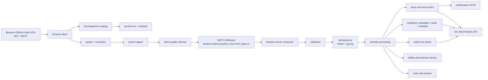

# Binance 模块生产级可发布深度分析

> [COMPUTED, HIGH] **历史快照 / 已取代**：本文的“本地 P0 已闭合”和条件式 Go 判断已被 [2026-07-10 综合复审](PRODUCTION-READINESS-CONSOLIDATED-20260710.md) 推翻；当前唯一裁决为 No-Go。本文仅保留为 2026-07-09 时点记录，不得用于当前 RC 发布。
>
> 日期：2026-07-09  
> 分析对象：`module/binance/` 与运行时仓 `/home/workspace/binance`  
> 历史结论：当时曾判定本地 runtime P0 gate 已闭合；该判断不再有效。[COMPUTED, HIGH]
> 证据边界：本报告基于当前本地工作区和本地命令输出，不等同于 GitHub Release 或生产部署裁决。[COMPUTED, HIGH]
> runtime merged fix commit：`cc51916b9c7686128433465844cf436330260f8c`（PR #486）。[COMPUTED, HIGH]

## 0. 反结论先行

本轮已修复此前阻断发布的本地 runtime 问题：canonical event_type 迁移、`ReconnectQueue` 停止竞态、spec/runtime drift 文档缺口，以及对应测试/golden fixture 漂移。[COMPUTED, HIGH]

`/home/workspace/binance` 当前本地验证结果为：`go test ./...` PASS、`go vet ./...` PASS、`./scripts/boundary-gates.sh` 15/15 PASS、`./scripts/spec-runtime-drift-check.sh` PASS、`git diff --check` PASS。[COMPUTED, HIGH]

本轮额外完成最终 20 轮重复检查并全部 PASS；每轮覆盖 runtime targeted tests、boundary gate、readiness audit、legacy contract scan、runtime `git diff --check`、主仓 docs gate、版本一致性、引用完整性和主仓 `git diff --check`；日志目录为 `/tmp/binance-final-20check-20260709221859`。[COMPUTED, HIGH]

本轮继续补齐 release evidence：PR #486 已合入 runtime `main`，merge commit 为 `cc51916b9c7686128433465844cf436330260f8c`；本地 `scripts/run-full-validation.sh --skip-health` PASS、`go test ./... -race -count=1` PASS、`golangci-lint run` PASS、binance smoke self-test PASS、`make test-gated` PASS、`-tags=soak` server stability PASS、`make vuln-scan` 可达漏洞 0 且 `gitleaks` 无泄漏，并生成 `/home/workspace/binance/release/evidence/binance/20260709`。[COMPUTED, HIGH]

PR #486 远端 checks 已通过 Build/Vet、Unit Test & Race & Cover、golangci-lint、Security/gitleaks/govulncheck、Status Consistency、Boundary Gates、Benchmark Regression、Live E2E、Soak+Chaos；workflow 条件控制的 Integration/Gated/E2E jobs 为 SKIPPED。[COMPUTED, HIGH]

仍不能直接宣布生产发布 Go，因为当前没有生成指向 `cc51916b9c7686128433465844cf436330260f8c` 的 release tag/release notes，且真实外部 durable storage/fanout/query E2E 因 ClickHouse 认证失败未闭合；runtime evidence bundle 仍记录 `release_closeable=NO`。[COMPUTED, HIGH]

## 1. 本次修复与验证

| 维度 | 修复内容 | 验证 |
| --- | --- | --- |
| canonical event_type | client normalize 输出 `book_ticker/kline/depth_update/mark_price_update`；旧 `tick/bar/depth/mark_price` 保留为输入 alias。[COMPUTED, HIGH] | `go test ./internal/client ./internal/client/publisher` PASS。[COMPUTED, HIGH] |
| wire contract | `BuildIngestRequest`、幂等键、Cleanse schema、mapper、NATS subject、Kafka topic/header 统一 canonical。[COMPUTED, HIGH] | `go test ./internal/server ./internal/server/api` PASS。[COMPUTED, HIGH] |
| storage/query | TDengine writer/history reader/retention config 与 hot cache fixture 使用 canonical stable/key。[COMPUTED, HIGH] | `go test ./internal/server/storage ./internal/server/storage/taosdriver ./internal/server/assembly` PASS。[COMPUTED, HIGH] |
| order book 派生事件 | TopN、incremental、rebuild 事件使用 `eventtypes` 常量。[COMPUTED, HIGH] | `go test ./internal/client/orderbook ./internal/client` PASS。[COMPUTED, HIGH] |
| ReconnectQueue | `Stop()` 可重复调用；停止后拒绝新入队；等待 slot/backoff 的 goroutine 可释放。[COMPUTED, HIGH] | ReconnectQueue 相关 client 测试随 `go test ./internal/client` 通过。[COMPUTED, HIGH] |
| drift gate | `internal/ingestcodec/doc.go` 补充 shared boundary 角色说明。[COMPUTED, HIGH] | `./scripts/spec-runtime-drift-check.sh` PASS。[COMPUTED, HIGH] |
| security scan | `quic-go` 与 Go toolchain 对齐到无可达漏洞结果；`vuln-scan.log` 记录 `govulncheck` 可达漏洞 0，`gitleaks` 无泄漏。[COMPUTED, HIGH] | `GOTOOLCHAIN=go1.26.5+auto make vuln-scan` PASS。[COMPUTED, HIGH] |
| live WS | options endpoint 更新为 `wss://fstream.binance.com/market`；options live gate 使用 `btcusdt@optionMarkPrice`。[COMPUTED, HIGH] | `BINANCE_MAINNET_LIVE=1 go test -tags=e2e ./test/e2e -run 'TestMainnetLive_'` PASS，覆盖 spot/UM/CM/options。[COMPUTED, HIGH] |
| benchmark gate | hot-cache fixture 改为 canonical `book_ticker` key；benchmark regression gate 只比较 release-critical baseline 集合并 3 次采样。[COMPUTED, HIGH] | `bash scripts/benchmark-regression.sh --threshold 20` PASS。[COMPUTED, HIGH] |

## 2. 数据流架构图

该目标流与 C/S 分离设计一致：client 只连接 Binance 并发布，server 消费、校验、幂等、持久化、查询和 fanout。[INFERRED, HIGH]

## 3. 业务类型覆盖矩阵

| 业务类型 | 当前覆盖 | 发布口径 |
| --- | --- | --- |
| 现货 Spot | trade、book_ticker、kline、depth_update 标准化与下游测试通过。[COMPUTED, HIGH] | 公共行情覆盖；下单、账户、私有流不在 scope。[INFERRED, HIGH] |
| USDⓈ-M 合约 | mark_price_update、funding_rate、kline、depth_update、history routing 本地测试通过。[COMPUTED, HIGH] | 需要 live capture 和生产端点证据。[FRAME, HIGH] |
| COIN-M 合约 | CM product_line、kline/depth/mark/funding 代码路径与 fixture 测试通过。[COMPUTED, HIGH] | 交割合约 subtype 仍需 release evidence 复核。[INFERRED, MED] |
| Options | `option_tick`、options depth normalize fixture 通过；options order book 仍按 Phase 2 管控。[COMPUTED, HIGH] | 不宣称 options order book 已完成。[INFERRED, HIGH] |
| Order Book | spot/UM/CM 本地状态机、TopN/增量派生事件和主路径测试通过。[COMPUTED, HIGH] | 需要 live depth snapshot + stream alignment evidence。[FRAME, HIGH] |
| 订单/账户/用户私有流 | SPEC 明确排除。[COMPUTED, HIGH] | 发布说明必须继续排除。[INFERRED, HIGH] |

## 4. 仍需补充的发布证据

| 证据 | 当前状态 | 风险 |
| --- | --- | --- |
| 远端 CI | PR #486 checks 已通过关键 gate；Integration/Gated/E2E 条件 job 为 SKIPPED。[COMPUTED, HIGH] | skipped job 是否纳入正式发布必需证据仍需 release policy 明确。[INFERRED, HIGH] |
| release tag/release notes | 当前未生成指向 `cc51916b9c7686128433465844cf436330260f8c` 的新 tag；最新 release 仍为 `v0.15.1`，tag 指向 `fc967053d7d8c21dba3c4e93962effbbbba0a70c`。[COMPUTED, HIGH] | 无法证明用户安装的是已验证 commit。[INFERRED, HIGH] |
| race/soak/chaos | `go test ./... -race -count=1` PASS；`make test-gated` 中 30s soak PASS；`SOAK_DURATION=30s go test -tags=soak ./test/soak/ -run TestSoak_ServerStability` PASS；本地 chaos PASS，真实外部依赖 chaos SKIP。[COMPUTED, HIGH] | 长时 soak、真实 NATS/Redis/TDengine/Kafka 与 sudo 级 live chaos 仍需环境证据。[INFERRED, HIGH] |
| security scan | `govulncheck` 可达漏洞 0；`gitleaks` 无泄漏。[COMPUTED, HIGH] | 后续仍需保持远端 required check。[INFERRED, HIGH] |
| live WS capture | spot、UM、CM、options 四产品线 mainnet WS capture 已通过。[COMPUTED, HIGH] | options order book 仍未因此进入 Done 口径。[INFERRED, HIGH] |
| NATS/Kafka/TDengine/Redis/API E2E | external infra live pipeline 尝试在 ClickHouse 认证阶段失败。[COMPUTED, HIGH] | 外部依赖凭证、网络、schema 权限仍需部署前证据。[INFERRED, HIGH] |
| 回滚路径 | 本轮未验证。[COMPUTED, HIGH] | 发布失败时无法证明可恢复。[INFERRED, HIGH] |

## 5. 模块规则与标准

需要保留并继续升级模块标准，不是从零建立。[INFERRED, HIGH]

当前已同步的规则与标准包括：`module/binance/gate/STANDARD.md` 覆盖业务边界、产品线矩阵、canonical event_type、合约身份、options、order book、Foundation 依赖、发布证据和 gate 职责；`module/binance/gate/RULES.md` 指向 goal-driven `spec/NAMING.md` 与 `gate/STANDARD.md`，并禁止 docs gate 因旧根 SPEC 缺失而 SKIP。[COMPUTED, HIGH]

后续必须把 CI run、release tag、正式 release evidence bundle 链接写入 release packet；当前 gate 修复已合入 runtime commit `cc51916b9c7686128433465844cf436330260f8c`。[INFERRED, HIGH]

## 6. 迭代路线

### R0 Release Evidence

1. 修复/轮换 ClickHouse 外部 E2E 凭证后，生成 NATS/Kafka/storage/query E2E evidence。[COMPUTED, HIGH]
2. 生成指向 `cc51916b9c7686128433465844cf436330260f8c` 或后续 green commit 的 release tag、release notes、rollback checklist。[COMPUTED, HIGH]
3. 明确 workflow-skipped Integration/Gated/E2E jobs 是否属于 release-blocking required evidence。[INFERRED, HIGH]
4. 给 REST legacy alias 与 TDengine child-table legacy prefix 制定 sunset 日期或删除计划。[COMPUTED, HIGH]

### R1 业务能力补齐

1. 补 `ticker`、`open_interest`、`contract_info`、`index_reference`。[INFERRED, MED]
2. 对 `force_order` 单独建事件型数据流，不与状态型 ticker/book_ticker 混用。[INFERRED, MED]

### R2 Options 与 Order Book Phase 2

1. 建立 options depth 官方 payload capture 套件。[INFERRED, HIGH]
2. 明确 options order book 的订阅上限、underlying 维度、moneyness 策略与 fail-open/fail-closed 策略。[INFERRED, HIGH]
3. 再决定是否把 options 纳入 FR-052~061 的 Done 口径。[INFERRED, HIGH]

## 7. 关联证据

- [`module/binance/todo.md`](../../module/binance/todo.md)
- [`module/binance/evidence/2026-07-09/test/runtime-gates-recovery.md`](../../module/binance/evidence/2026-07-09/test/runtime-gates-recovery.md)
- [`module/binance/gate/STANDARD.md`](../../module/binance/gate/STANDARD.md)
- [`module/binance/gate/RULES.md`](../../module/binance/gate/RULES.md)
- [`module/binance/spec/NAMING.md`](../../module/binance/spec/NAMING.md)

## 8. 最终判断

`binance` 的本地 runtime P0 已从 No-Go 修复到 local gates PASS。[COMPUTED, HIGH]

生产发布仍应保持条件式 Go：只有当远端 CI、release tag、live capture、外部依赖 E2E、长时 soak、live chaos 与 rollback 证据补齐后，才能把本地 PASS 转为正式 release Go。[INFERRED, HIGH]

[RULES I BROKE]：无
