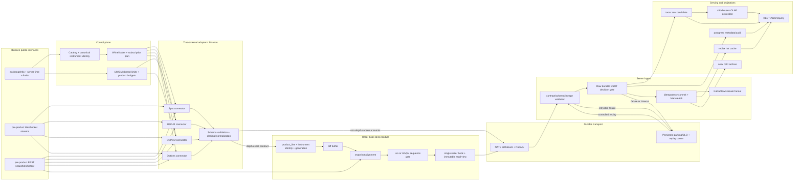
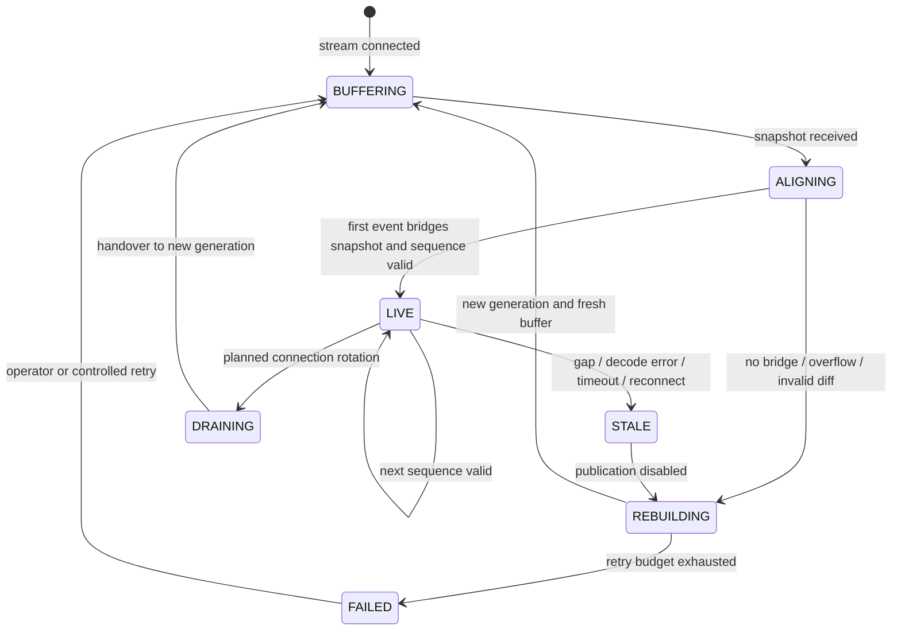

# Binance 模块生产可发布深度分析

> [COMPUTED, HIGH] **历史快照**：本文绑定 runtime `b2547735e9df6b9bb4bb939baaeb74436260ce50`，已被 [2026-07-10 综合复审](PRODUCTION-READINESS-CONSOLIDATED-20260710.md) 取代为当前裁决入口。本文保留作为时点证据，不得用于推导当前 RC 可发布。

> 审计日期：2026-07-10（Asia/Shanghai）。[COMPUTED, HIGH]
> 治理快照：ZoneCNH `5cf596ded21458340fe5713f7f74b979b8225b0c`。[COMPUTED, HIGH]
> runtime 权威快照：`github.com/xhyperium/binance` `origin/main` `b2547735e9df6b9bb4bb939baaeb74436260ce50`。[COMPUTED, HIGH]
> 官方能力时点：2026-07-10；详细证据见[官方能力基线](OFFICIAL-CAPABILITY-BASELINE-20260710.md)。[COMPUTED, HIGH]
> 判定对象：公共行情采集 C/S 模块，而不是完整 Binance 交易 SDK。[COMPUTED, HIGH]

## 0. 技术结论

**当前裁决：No-Go，不能把 `binance` 当前 `main` 认定为生产可发布。**[INFERRED, HIGH]

最强反证不是“功能还不够多”，而是当前候选无法证明已有功能会在正确的制品、正确的产品连接、正确的订单簿身份和正确的持久化确认边界上运行。[INFERRED, HIGH] 最新 runtime 证据明确记录 `release_closeable=NO`，而 2026-07-10 的本地证据投影也继续显示外部门禁 `BLOCKED/NOT_RUN`、真实外部 E2E 未闭合、正式 tag/release notes/rollback 仍未形成；runtime `main` 自身也仍把订单簿 10 项列为 Pending。[COMPUTED, HIGH] 证据见 [runtime release evidence 2026-07-10](../../module/binance/evidence/2026-07-10/test/runtime-release-evidence.md)、[runtime `main` README](https://github.com/xhyperium/binance/blob/b2547735e9df6b9bb4bb939baaeb74436260ce50/README.md#L21-L35) 与 [2026-07-10 runtime evidence bundle](../../module/binance/evidence/2026-07-10/test/runtime-release-evidence.md)。

`module/binance/spec/SPEC.md` 的 `65 Done / release_closeable=YES`、Matrix 的全量 Done、Registry 的 `production/L3` 是治理投影；它们与上述 runtime 发布事实冲突，不能被翻译成“已生产就绪”。[COMPUTED, HIGH] 这是本报告最重要的 `FRAME -> REALITY` 防偷换结论。[INFERRED, HIGH]

当前实现并非“不可用骨架”。[INFERRED, HIGH] 在显式修正本机 `GOROOT` 后，本地完整测试、race、vet 与 15 道 boundary gates 均通过，语句覆盖率约 81.0%；PR #486 的多项远端检查也曾通过。[COMPUTED, HIGH] 这些证据证明了相当规模的确定性实现，但不能替代当前 `main` 的外部依赖 E2E、候选制品、部署和回滚证据。[INFERRED, HIGH]

建议先发布一个边界清楚的 **Public Market Data Profile**：Spot、USDⓈ-M、COIN-M、Options 的公共行情、目录、标准化、可靠传输和查询；交易下单、账户、仓位和 User Data Stream 继续排除。[INFERRED, HIGH] 若未来要做完整交易接入，应单独建立 Goal/Spec，并服从 `orderx`、`riskx`、`positionx` 等既有域边界，不能把它悄然扩进本次行情发布口径。[INFERRED, HIGH]

## 1. 判定语言与审计边界

### 1.1 四级能力语言

下列四级是本报告的审计框架，不代表仓库既有状态机。[FRAME, LOW]

| 级别 | 含义 | 能否据此发布 |
| --- | --- | --- |
| Code Path | 存在实现、装配或声明。[FRAME, LOW] | 否。[FRAME, LOW] |
| Deterministic Pass | 固定输入的 build/test/race/static gate 可复现通过。[FRAME, LOW] | 否。[FRAME, LOW] |
| Release Candidate | 同一不可变 commit 的制品、外部 E2E、风险与回滚证据闭合。[FRAME, LOW] | 可进入最终 Go/No-Go。[FRAME, LOW] |
| Production Released | 已发布制品完成部署后观测、告警和回滚验证。[FRAME, LOW] | 是，但仍需持续运营。[FRAME, LOW] |

当前 `binance` 最多处于 “Deterministic Pass + 部分外部 capture”，尚未达到 Release Candidate。[INFERRED, HIGH]

### 1.2 审计对象

- ZoneCNH 规格侧共审阅 `module/binance/` 的 Goal、Spec、Design、Plan、Tasks、Prompt、Matrix、Gate、Evidence，以及三份跨模块 SSOT。[COMPUTED, HIGH]
- runtime 侧按 `origin/main=b2547735e9df6b9bb4bb939baaeb74436260ce50` 审阅连接器、标准化、订单簿、server ingest、持久化装配、当时构建配置、workflow 和 release evidence。[COMPUTED, HIGH]
- Binance 产品能力侧只使用 Binance Developers、Binance 官方 `binance-spot-api-docs` 和官方 Change Log。[COMPUTED, HIGH]
- 本次没有使用生产凭证，没有执行下单，没有改动外部系统，也没有把本地测试结果称为真实部署结果。[COMPUTED, HIGH]

### 1.3 版本与证据新鲜度

最新 GitHub release 是 [`v0.15.1`](https://github.com/xhyperium/binance/releases/tag/v0.15.1)，而被审 runtime `main` 比该 tag 多 51 个 commit、变更 250 个文件。[COMPUTED, HIGH] 因此 `v0.15.1` 不能作为当前 `main` 的发布制品证据。[INFERRED, HIGH]

`origin/main` 中的 `release/evidence/binance/20260709/status.txt` 记录的生成 commit 是 `b66ea770...`，比被审 `main` 少 8 个 commit。[COMPUTED, HIGH] 即使其中的本地 gate 全绿，也不能覆盖后续变更。[INFERRED, HIGH]

PR #486 的证据与检查可以证明该 PR 时点的质量；历史基线 `b2547735e9df6b9bb4bb939baaeb74436260ce50` 的 18 个 check run 中有 6 个条件跳过，包括 E2E、Live E2E、Benchmark、Soak+Chaos、Integration 和 Gated。[COMPUTED, HIGH] 当前 release 必须重新绑定同一 commit、同一制品与同一 Evidence Bundle。[INFERRED, HIGH]

## 2. 生产就绪总览

| 维度 | 已有证据 | 当前判定 | 发布前退出条件 |
| --- | --- | --- | --- |
| 业务边界 | Spec 明确公共行情，排除下单、账户与私有流。[COMPUTED, HIGH] | 边界合理，但 runtime 仍存在签名接口和公共 client 强制 secret 的漂移。[COMPUTED, HIGH] | 公共 profile 零 secret 启动；签名代码删除、隔离或另立 Goal。[INFERRED, HIGH] |
| Spot | 有公开 WS/REST、catalog、normalize、history 等代码路径。[COMPUTED, HIGH] | 部分实现；连接与订单簿 P0 未闭合。[INFERRED, HIGH] | Spot 独立连接策略、官方序列 replay、真实快照对账与重连证据通过。[INFERRED, HIGH] |
| USDⓈ-M | 有公开 WS/REST、mark/funding/depth 等代码路径。[COMPUTED, HIGH] | 部分实现；复用 Spot stream 配置、delivery 语义和 2026 路由变化未闭合。[COMPUTED, HIGH] | 当前官方 endpoint/stream、UM/CM 共享限流和 delivery contract golden tests 通过。[INFERRED, HIGH] |
| COIN-M | 有公开 WS/REST 与合约数据路径。[COMPUTED, HIGH] | 部分实现；与 UM 的差异不能由换 base URL 证明。[INFERRED, HIGH] | pair/symbol、contract size、expiry、`st` 与 index stream 变更均有 capture/replay。[INFERRED, HIGH] |
| Options | 有 catalog、trade、kline、raw depth 与 `option_tick` 路径。[COMPUTED, HIGH] | 仅可称 partial；订单簿和 history 未闭合，status 与新元数据存在语义缺口。[COMPUTED, HIGH] | Options 独立 200-stream 分片、身份字段、状态、Greeks/OI/mark、depth 对齐与 history 证据闭合。[INFERRED, HIGH] |
| Order Book | runtime 已引入 `orderbook v0.1.0`，并存在本地状态机代码。[COMPUTED, HIGH] | No-Go；身份碰撞、数值、单边 diff、并发对齐和错误完成事件均是正确性风险。[COMPUTED, HIGH] | 四产品线逐一通过官方序列 conformance、gap/rebuild、精度、并发与 restart tests。[INFERRED, HIGH] |
| 传输与持久化 | NATS、taosx、Postgres、Redis、Kafka、ClickHouse、OSS 均有装配代码。[COMPUTED, HIGH] | No-Go；ACK/去重标记可早于实际 durable handoff，persistent DLQ 未在生产装配。[COMPUTED, HIGH] | 定义并验证 durable ACK barrier；故障注入证明不丢、不假 ACK、可重放。[INFERRED, HIGH] |
| 部署制品 | Dockerfile/compose/release workflow 存在。[COMPUTED, HIGH] | No-Go；client service 会启动 server、migration 未进入镜像、生产配置仅启 Spot，且 Docker 路径违反仓库治理。[COMPUTED, HIGH] | 以合规 self-hosted/SRE 路径构建两个不可变制品，执行 migration、canary、rollback。[INFERRED, HIGH] |
| CI/CD | 本地 deterministic gates 可通过。[COMPUTED, HIGH] | No-Go；runtime workflow 的 25 个 `runs-on` 全是 `ubuntu-latest`，违反 CICD-001。[COMPUTED, HIGH] | 所有 job 改为 `[self-hosted, Linux, X64, sre/*]`，部署只走 `sre/deploy`。[INFERRED, HIGH] |
| 治理与追溯 | 规格资料丰富，现有 RULES/STANDARD 覆盖主要主题。[COMPUTED, HIGH] | No-Go；事实冲突、ID 冲突、缺证据仍 Done、版本漂移和机器 gate 假绿。[COMPUTED, HIGH] | canonical IDs、当前 release manifest、有效证据引用和状态回写由机器校验。[INFERRED, HIGH] |

## 3. 业务类型覆盖判定

### 3.1 官方能力与本模块覆盖

Binance 官方提供 Spot、USDⓈ-M、COIN-M 和 Options；四类产品都具备 REST snapshot、WebSocket depth 与官方本地订单簿对齐算法。[COMPUTED, HIGH] Order Book 是横跨四类产品的状态能力，不是第五种业务类型。[INFERRED, HIGH] 详细接口、限流、连接生命周期与 2026 变更见[官方能力基线](OFFICIAL-CAPABILITY-BASELINE-20260710.md)。[COMPUTED, HIGH]

| 业务类型 | 官方能力 | 当前 runtime 能力 | 生产裁决 |
| --- | --- | --- | --- |
| Spot | 公共行情、交易、账户、User Data Stream、REST/WS order book。[COMPUTED, HIGH] | 公共行情代码路径存在；交易/账户不在 Spec 范围。[COMPUTED, HIGH] | Public profile 部分覆盖；当前 No-Go。[INFERRED, HIGH] |
| USDⓈ-M | 永续及交割合约、mark/index/funding/OI/强平/ADL、交易与私有流。[COMPUTED, HIGH] | trade/kline/depth/book ticker/funding/mark 代码路径存在；完整交易不支持。[COMPUTED, HIGH] | Public profile 部分覆盖；当前 No-Go。[INFERRED, HIGH] |
| COIN-M | 币本位永续及交割合约、公共行情、交易与私有流。[COMPUTED, HIGH] | 与 UM 类似的公共路径存在；合约身份解析存在错误风险。[COMPUTED, HIGH] | Public profile 部分覆盖；当前 No-Go。[INFERRED, HIGH] |
| Options | 目录、depth/trade/kline、index/mark/IV/Greeks/OI/exercise/ticker、交易与风险流。[COMPUTED, HIGH] | catalog/trade/kline/raw depth/option tick 部分路径存在；Options order book 明确未完成。[COMPUTED, HIGH] | Partial；不能声明完整 Options market data。[INFERRED, HIGH] |
| Order Book | 四产品线分别有 snapshot+diff 协议；Spot 使用 `U/u`，衍生品使用 `U/u/pu`。[COMPUTED, HIGH] | Spot/UM/CM 有状态机实现；Options postponed；当前实现有多项 P0 语义缺陷。[COMPUTED, HIGH] | 跨产品 No-Go。[INFERRED, HIGH] |
| Orders / Account / Private | 官方四产品均存在不同程度的交易与私有状态能力。[COMPUTED, HIGH] | Spec 明确排除；少量 UM 签名方法未形成可用交易生命周期。[COMPUTED, HIGH] | 不支持，不得出现在本次 release claim。[INFERRED, HIGH] |

### 3.2 不能声称支持的能力

- 不能声称“完整 Binance SDK”或“交易接入”。[INFERRED, HIGH] 当前没有跨产品 Place/Cancel/Amend、User Data Stream、未知执行状态对账、账户/仓位状态机和密钥治理闭环。[COMPUTED, HIGH]
- 不能声称“Options 订单簿已支持”。[INFERRED, HIGH] 模块 Standard 和设计证据都把 Options order book 留在 Phase 2，runtime README 仍把整个 order-book rebuild 组列为 Pending。[COMPUTED, HIGH]
- 不能声称“所有合约类型已正确建模”。[INFERRED, HIGH] UM/CM `exchangeInfo` decoder 会把 delivery contract 标成 perpetual，Options decoder 也未用 status 排除非活跃合约。[COMPUTED, HIGH]
- 不能声称“history 完整”。[INFERRED, HIGH] 当前 backfill 以 timestamp 去重会丢失同毫秒多笔 aggTrades，Options 没有 history，funding/mark 请求还可能走到 kline 路由。[COMPUTED, HIGH]

### 3.3 建议补充的业务能力

以下排序以“先修正确性，再扩功能”为原则。[INFERRED, HIGH]

1. 先闭合现有 `book_ticker`、`kline`、`depth_update`、`trade`、`funding_rate`、`mark_price_update`、`option_tick` 的产品线正确性和发布证据。[INFERRED, HIGH]
2. P1 补齐 `ticker`、`force_order`、`open_interest`、`index_reference`、`contract_info`，并为每项定义 realtime/history/query/orderbook 四维支持状态。[INFERRED, HIGH]
3. Options P1 补齐 mark/IV/Greeks、OI、exercise history 与结构化的 underlying/expiry/strike/CALL-PUT/contractType/underlyingType。[INFERRED, HIGH]
4. Margin、Portfolio Margin、FIX、SBE、完整交易和 Market Maker/MMP 只在有明确业务 Goal、owner、风险模型与边界审批后进入新迭代。[INFERRED, HIGH]

## 4. 当前数据流与目标数据流

### 4.1 当前主干

当前设计文档声明的主干是 Binance WS/REST → client parser/normalize/mapper → NATS → server validation/idempotency → storage/fanout/API。[COMPUTED, HIGH] 该主干方向合理，但没有把产品线连接策略、订单簿 generation、ACK barrier、DLQ/replay 和存储 SSOT 冲突完整表达出来。[INFERRED, HIGH]

### 4.2 目标架构图

下图是建议的生产架构；整图属于设计提案，不是已部署事实。[FRAME, LOW]

### 4.3 必须固定的数据面不变量

1. 一个连接策略只服务一个 product line；endpoint、ping/pong、stream 上限、suffix 集合和订阅预算不能复用 Spot 默认值。[INFERRED, HIGH]
2. 订单簿身份至少是 `exchange + product_line + canonical instrument identity + generation`，不能只用 `symbol`。[INFERRED, HIGH]
3. 价格、数量、tick size 和价位索引使用 decimal/定点数；binary `float64` 不得成为 key 或截断依据。[INFERRED, HIGH]
4. 服务端只在 raw durable SSOT 成功，或失败事件已持久化到可重放 DLQ 后 ACK；`CheckAndSet` 不能先于 durable commit 成为不可逆状态。[INFERRED, HIGH]
5. taosx 与 ClickHouse 的权威关系必须先裁决。[INFERRED, HIGH] 当前 `SPEC.md` FR-005 把 ClickHouse 写成主持久化，而 `STANDARD.md` 把 taosx 定义为 raw SSOT、ClickHouse 定义为 OLAP projection。[COMPUTED, HIGH]
6. 每个对外事件携带 product line、canonical instrument key、exchange update id、event/transaction/receive time、schema version、generation 与 lineage。[INFERRED, HIGH]
7. 缺口、缓存溢出、解析失败、重连和切换 generation 时，订单簿必须停止发布并重新对齐；告警不能替代状态失效。[INFERRED, HIGH]

### 4.4 订单簿状态机

下图是建议状态机；整图属于设计提案。[FRAME, LOW]

`rebuild_complete` 只能在新 generation 已通过 snapshot bridge 和连续性校验后发出。[INFERRED, HIGH] 当前 runtime 在触发真实 re-alignment 前就发出完成事件，因而该事件不能作为恢复成功证据。[COMPUTED, HIGH]

## 5. P0 阻断项

| ID | 阻断项 | 代码/证据 | 必须满足的退出条件 |
| --- | --- | --- | --- |
| P0-01 | Release identity 不闭合。[INFERRED, HIGH] | 最新 tag `v0.15.1` 落后当前 `main` 51 commit；evidence 生成 commit 又落后当前 `main` 8 commit；external gates 为 `release_closeable=NO`。[COMPUTED, HIGH] | 对一个不可变 commit 生成制品哈希、SBOM、全量 CI、外部 E2E、release notes、风险清单、canary 与 rollback evidence。[INFERRED, HIGH] |
| P0-02 | CI/CD 违反宪法。[INFERRED, HIGH] | runtime 25 个 workflow job 全部使用 `ubuntu-latest`；release workflow 含 Docker 路径，而 [CICD-001](../../CONSTITUTION.md#cicd-001) 要求 self-hosted pool 且部署只走 SRE。[COMPUTED, HIGH] | 25/25 job 迁移至合规 pool；移除业务仓内 Docker/ssh/systemctl 部署路径；实际 workflow 与 `module/binance/ci-workflow.yaml` 投影一致。[INFERRED, HIGH] |
| P0-03 | 多产品连接不是独立配置。[INFERRED, HIGH] | [`runtime.go`](https://github.com/xhyperium/binance/blob/b2547735e9df6b9bb4bb939baaeb74436260ce50/internal/client/runtime.go#L481-L491) 生成 Spot 配置，并在 [UM/CM/Options 装配](https://github.com/xhyperium/binance/blob/b2547735e9df6b9bb4bb939baaeb74436260ce50/internal/client/runtime.go#L935-L949)复用；构造器只在字段为空时补默认值，Spot suffix 可能保留；所谓 sharding 没有真实分片实现。[COMPUTED, HIGH] | 四产品各自 endpoint、ping、stream limit、suffix、rotation 和 shard planner；对每产品做 live shadow 与 golden replay。[INFERRED, HIGH] |
| P0-04 | 订单簿 identity、序列与数值不安全。[INFERRED, HIGH] | manager/persistence 只按 `symbol` key，Spot 与 UM 的 `BTCUSDT` 会碰撞；[normalize](https://github.com/xhyperium/binance/blob/b2547735e9df6b9bb4bb939baaeb74436260ce50/internal/client/normalize.go#L325-L342) 拒绝合法单边 diff；[book](https://github.com/xhyperium/binance/blob/b2547735e9df6b9bb4bb939baaeb74436260ce50/internal/client/orderbook/book.go#L73-L85) 只识别少量零字符串，并以 float/tick 截断构造价格 key。[COMPUTED, HIGH] | 复合 identity、decimal key、任意数值零删除、单边 diff、四类官方序列算法、并发 align/gap/rebuild/property tests 全通过。[INFERRED, HIGH] |
| P0-05 | align/rebuild 存在竞态与错误完成信号。[INFERRED, HIGH] | [`align.go`](https://github.com/xhyperium/binance/blob/b2547735e9df6b9bb4bb939baaeb74436260ce50/internal/client/orderbook/align.go#L142-L156) 在复制 buffer 后成功即清空整个 buffer，可丢失并发到达事件；[`manager.go`](https://github.com/xhyperium/binance/blob/b2547735e9df6b9bb4bb939baaeb74436260ce50/internal/client/orderbook/manager.go#L950-L959) 在真实重新对齐前发出 `rebuild_complete`。[COMPUTED, HIGH] | 单写者 session 或带序号的 drain；完成事件绑定新 generation 的 LIVE transition；race + deterministic schedule test 证明无窗口丢失。[INFERRED, HIGH] |
| P0-06 | Server 可在 durable handoff 前确认。[INFERRED, HIGH] | [`ingest.go`](https://github.com/xhyperium/binance/blob/b2547735e9df6b9bb4bb939baaeb74436260ce50/internal/server/ingest.go#L107-L201) 会先 `CheckAndSet`/`MarkDurable` 再 dispatch/storage；失败重试可能被当作 duplicate ACK；生产 assembly 将 `StrictDispatchHandoff=false` 且没有持久化 DLQ writer。[COMPUTED, HIGH] | 以事务/状态机实现 RECEIVE→PERSISTING→COMMITTED；ACK 只在 raw SSOT 或 durable DLQ 成功后发生；kill -9、timeout、partial write、redelivery 测试不丢数据。[INFERRED, HIGH] |
| P0-07 | 生产制品启动错误进程且缺运行材料。[INFERRED, HIGH] | [`Dockerfile`](https://github.com/xhyperium/binance/blob/b2547735e9df6b9bb4bb939baaeb74436260ce50/Dockerfile#L42-L52) 固定 entrypoint 为 `binance-server`；compose 的 client service 未覆盖 entrypoint，最终镜像也未包含 migrations；生产配置未启用 UM/CM/Options/orderbook。[COMPUTED, HIGH] | 按 CICD-001 生成 client/server 两个显式制品；migration 作为受控 release step；四产品 flags 和启动探针在 canary 中验真。[INFERRED, HIGH] |
| P0-08 | Spec/Matrix/Registry 假绿。[INFERRED, HIGH] | 根 Spec 称 65 Done/YES，最新 evidence 称 NO；Matrix 65 行全 Done，但 25 行仍写 `evidence needed`；根/子 Spec 复用 FR ID 表达不同需求；docs gate 仍通过。[COMPUTED, HIGH] | canonical FR/BR/AC/TC/EVID 链唯一；缺证据自动阻断 Done；Registry/Goal/Gate 状态只由当前 release manifest 投影。[INFERRED, HIGH] |
| P0-09 | `binance -> orderbook` 依赖未治理。[INFERRED, HIGH] | runtime `go.mod` 已引入 `github.com/ZoneCNH/orderbook v0.1.0`，但 `FOUNDATION-DEPS.yaml` 没有允许边；宪法规定同域同层不存在编译期依赖。[COMPUTED, HIGH] | 删除直接边并经 `contracts`/事件端口下沉，或先完成依赖矩阵与治理修正；任何新模块仍须 §2.6 双闸门授权。[INFERRED, HIGH] |
| P0-10 | 公共 profile 与 secret/签名代码冲突。[INFERRED, HIGH] | 公共 client config 仍要求 API key/secret；UM signed client 只有局部账户/撤单方法，未被 runtime 使用，且缺 server-time/recvWindow 完整治理。[COMPUTED, HIGH] | 公共路径零 secret；签名代码被删除、内部隔离或进入独立批准的交易 Goal，并通过安全与对账门禁。[INFERRED, HIGH] |

## 6. P1/P2 改进项

### 6.1 P1：进入候选版本前

| ID | 改进项 | 证据与原因 |
| --- | --- | --- |
| P1-01 | 合约与期权身份语义。[INFERRED, HIGH] | UM/CM delivery 被当成 perpetual，Options 未用 status；2026-07-09 官方又新增 `contractType`/`underlyingType`。[COMPUTED, HIGH] |
| P1-02 | History/backfill 正确性。[INFERRED, HIGH] | timestamp 去重会丢同毫秒 aggTrades，Options history 缺失，funding/mark 路由不独立。[COMPUTED, HIGH] |
| P1-03 | Order-book checksum/health 设计。[INFERRED, HIGH] | SampleSize/Concurrency/offset 配置未真正生效，串行全表 REST 对比没有 update-id 对齐，可能误判并触发限流。[COMPUTED, HIGH] |
| P1-04 | Snapshot recovery 真实性。[INFERRED, HIGH] | snapshot path 只含 symbol 且位于 `/tmp`；恢复后仍回到 BUFFERING，后续 alignment 建新 book，当前 “O(1) fast recovery” 声明不成立。[COMPUTED, HIGH] |
| P1-05 | 控制面和版本收敛。[INFERRED, HIGH] | 活跃治理文档混有 v4.0.1/v4.0.0/v3.14.0/v3.9.0；`.config/goal` 仍指向旧 v3.9.0/48 FR 和非 canonical `GB-*` gate。[COMPUTED, HIGH] |
| P1-06 | 可观测性采用产品线基数。[INFERRED, HIGH] | 需要按 product line、connector、generation、instrument tier 聚合连接、lag、gap、rebuild、ACK latency、DLQ 与 storage SLO，避免 symbol 高基数直接打满 metrics。[INFERRED, HIGH] |
| P1-07 | 当前 commit 的 test evidence。[INFERRED, HIGH] | 本地显式 `GOROOT=/usr/local/go` 时 test/race/vet/boundary gates 通过；默认环境因持久化 GOROOT 1.26.4 与实际 Go 1.26.5 不匹配而失败。[COMPUTED, HIGH] 候选 CI 必须锁定 toolchain，避免环境修复依赖人工知识。[INFERRED, HIGH] |

### 6.2 P2：发布后受控迭代

- 建立官方 schema/changelog watcher，对 endpoint retirement、新字段、stream 上限、shared limits 和 Options 元数据变化产生兼容性任务。[INFERRED, HIGH]
- 引入 fuzz/property tests，重点覆盖 JSON schema evolution、decimal、序列组合、重复/乱序/缺口和产品身份碰撞。[INFERRED, HIGH]
- 把 8 个 archived task 从活跃 tasks 物理隔离，并由 release manifest 生成 gate/coverage/版本摘要，减少手工复写。[INFERRED, HIGH]
- 将 capability matrix 作为唯一机器事实，而不是从 README、Spec、Standard 和 runtime 各自推断支持状态。[INFERRED, HIGH]

## 7. 是否需要建立 Binance 模块规则与标准

**不需要新建一套平行规则或标准文件。**[INFERRED, HIGH] 现有 [`gate/RULES.md`](../../module/binance/gate/RULES.md) 已有 R1-R13，现有 [`gate/STANDARD.md`](../../module/binance/gate/STANDARD.md) 已覆盖业务边界、产品线、事件类型、合约身份、Options、Order Book、依赖、发布证据和 Stop Conditions。[COMPUTED, HIGH]

真正缺少的是把现有文字规则收敛成可执行 contract，并补齐下列规则。[INFERRED, HIGH]

| 建议规则 | 规范内容 | 机器门禁 |
| --- | --- | --- |
| SCOPE-001 | Public profile 禁止 API secret、signed endpoint、User Data Stream 和交易 claim。[INFERRED, HIGH] | 启动测试零凭证；AST/import/config 扫描；release claim allowlist。[INFERRED, HIGH] |
| PRODUCT-001 | 每个 product line 独立 endpoint、ping/pong、stream limit、suffix、rate budget、capture fixture。[INFERRED, HIGH] | `product_contract_test` 表驱动四产品；官方 fixture version gate。[INFERRED, HIGH] |
| IDENTITY-001 | key 必含 product line 与 canonical instrument identity；期权字段结构化。[INFERRED, HIGH] | 跨产品同 symbol collision test；catalog round-trip test。[INFERRED, HIGH] |
| ORDERBOOK-001 | Spot `U/u` 与衍生品 `U/u/pu` 独立 conformance；单写者 generation；gap 即停止发布并重建。[INFERRED, HIGH] | golden replay、property/fuzz、race、forced scheduling、live shadow。[INFERRED, HIGH] |
| NUMERIC-001 | price/qty/tick 全程 decimal/定点数；任意数值零表示删除。[INFERRED, HIGH] | 极小 tick、高精度、科学计数法、zero variants tests。[INFERRED, HIGH] |
| DURABILITY-001 | ACK 发生在 raw SSOT 或 durable DLQ 后；idempotency 状态可恢复且不先行终结重试。[INFERRED, HIGH] | storage/dispatch fault injection、redelivery、kill -9、replay test。[INFERRED, HIGH] |
| SSOT-001 | 明确 taosx 与 ClickHouse 的 raw/projection 关系，所有文档和代码只保留一个解释。[INFERRED, HIGH] | schema/adapter/Spec consistency gate。[INFERRED, HIGH] |
| DEP-001 | 编译期依赖必须存在于 `FOUNDATION-DEPS.yaml`，同域同层默认禁止。[INFERRED, HIGH] | `go list -deps` 与 dependency SSOT diff gate。[INFERRED, HIGH] |
| CICD-001-BNC | 全部 job 使用合规 self-hosted pool；业务仓禁止内联部署与 Docker 路径。[INFERRED, HIGH] | workflow AST/YAML gate，禁止词与 runner pool hard fail。[INFERRED, HIGH] |
| RELEASE-001 | Evidence Bundle 与 commit/artifact hash 一一绑定，并设证据过期规则。[INFERRED, HIGH] | manifest schema、commit equality、required jobs、external E2E、rollback checklist gate。[INFERRED, HIGH] |
| CAPABILITY-001 | `product_line × event_type × realtime/history/query/orderbook` 使用 supported/postponed/unsupported 三态。[INFERRED, HIGH] | 生成 README/Spec 投影；不允许手工冲突状态。[INFERRED, HIGH] |

`RULES.md` 中现有 R4/R5/R6 和 `STANDARD.md` Stop Conditions 应从文字审查升级为 L3 hard gate。[INFERRED, HIGH] 当前 `check-binance-docs.sh` 只验证少数文件中的词面锚点，版本 checker 也漏掉多份活跃文档，因而能在事实冲突时保持绿色。[COMPUTED, HIGH]

## 8. 模块边界与“深模块”建议

`binance` 应只拥有真正的外部变化：Binance endpoint、wire payload、签名/限流规则的公共子集、产品连接生命周期和从交易所语义到 canonical contract 的转换。[INFERRED, HIGH]

订单簿模块应拥有本地 book 的 sequence、alignment、generation、rebuild、snapshot、TopN 与 read view，并把这些复杂性藏在一个小接口后面。[INFERRED, HIGH] 推荐的最小接口形状是 `ApplyDepth(event) -> transition/result`、`View(instrument, generation)`、`Health(instrument)` 和 `Reset(reason)`；接口是测试接缝，不是把内部 policy 全部外露。[FRAME, LOW]

`binance` 与 `orderbook` 之间应通过下沉到 `contracts`/`domain_market` 的稳定事件 contract 或异步消息接缝协作。[INFERRED, HIGH] 如果治理决定保留直接编译依赖，必须先证明它不违反同域同层依赖规则，并在 `FOUNDATION-DEPS.yaml` 注册，不得让 `go.mod` 成为事实上的架构裁决者。[INFERRED, HIGH]

不要为了本报告自动创建新仓库或新模块。[INFERRED, HIGH] ZoneCNH 新模块需要宪法 §2.6 双闸门和人工显式授权。[COMPUTED, HIGH]

## 9. 分阶段迭代路线

### R0：冻结错误发布叙事

- 把当前状态统一投影为 `release_closeable=NO`，保留本地 gate PASS 作为独立字段。[INFERRED, HIGH]
- 选定 Public Market Data Profile 和一个不可变候选 commit；不再以 `main` 浮动头生成 release evidence。[INFERRED, HIGH]
- 退出条件：Spec、Matrix、Registry、runtime README、Evidence Bundle 对同一候选和同一状态无冲突。[INFERRED, HIGH]

### R1：治理与执行平面

- 迁移全部 runtime workflow 到合规 self-hosted pool，删除业务仓内 Docker/ssh/systemctl 部署路径。[INFERRED, HIGH]
- 修复 canonical ID、version/gate、capability matrix 和 dependency SSOT。[INFERRED, HIGH]
- 退出条件：CICD、dependency、docs-state gates 对已知冲突能红灯，且在修复后全绿。[INFERRED, HIGH]

### R2：产品连接与订单簿正确性

- 拆分四产品连接配置、stream planner 与连接轮换；实现 product-aware order-book identity 和 decimal book。[INFERRED, HIGH]
- 修复单边 diff、zero、buffer drain、generation、rebuild complete、health/checksum 与 snapshot recovery。[INFERRED, HIGH]
- 退出条件：四产品官方 fixture、故障序列、race/fuzz/property 和 mainnet shadow 对账全部通过。[INFERRED, HIGH]

### R3：耐久性与可部署制品

- 重构 ingest ACK/idempotency 状态机，装配 persistent DLQ，裁决 raw SSOT。[INFERRED, HIGH]
- 构建独立 client/server 制品和受控 migration；生产配置显式启用已承诺产品线。[INFERRED, HIGH]
- 退出条件：JetStream PubAck/ManualAck、外部存储/fanout/query、断电重放、canary 与 rollback 演练对同一制品闭合。[INFERRED, HIGH]

### R4：业务能力补齐

- 修复 delivery/options metadata 与 history，再逐项实现 ticker、OI、index、force order、contract info、Options Greeks/mark/exercise。[INFERRED, HIGH]
- 退出条件：capability matrix 的每个 supported 单元格都有 FR→AC→TC→EVID 和线上 SLO。[INFERRED, HIGH]

### R5：发布与观测

- 生成 tag、notes、SBOM、artifact digest、风险接受、rollback checklist 与发布后观测报告。[INFERRED, HIGH]
- 退出条件：同一 commit 的 G0-G11/Release Manifest 全 PASS，canary 观测窗口无未接受 P0/P1，回滚演练可复现。[INFERRED, HIGH]

## 10. 发布验收清单

以下清单全部满足后，才建议把 No-Go 改为 Go。[INFERRED, HIGH]

- [ ] 发布 profile 只声明机器 capability matrix 中的 supported 能力。[INFERRED, HIGH]
- [ ] Spot、UM、CM、Options 使用独立连接与限流策略。[INFERRED, HIGH]
- [ ] 四产品订单簿官方协议 conformance 全通过，Options 不再 postponed 或明确从 release claim 排除。[INFERRED, HIGH]
- [ ] product-aware identity、decimal、generation 和 gap/rebuild 不变量有测试与 live shadow 证据。[INFERRED, HIGH]
- [ ] ACK/idempotency/DLQ 在外部故障注入下证明不丢数据且可重放。[INFERRED, HIGH]
- [ ] raw SSOT、projection、cache、archive 的责任唯一且与 Spec/Standard 一致。[INFERRED, HIGH]
- [ ] client/server 候选制品启动正确进程，包含所需 migration/config，且不依赖 Docker 路径。[INFERRED, HIGH]
- [ ] 25/25 workflow job 使用合规 self-hosted pool，部署只走 `sre/deploy`。[INFERRED, HIGH]
- [ ] release tag、artifact digest、CI URL、外部 E2E、risk/rollback/post-deploy observation 绑定同一 commit。[INFERRED, HIGH]
- [ ] Spec/Matrix/Goal/Registry/runtime README 不再出现 YES/NO、Done/Pending、版本或 gate 口径冲突。[INFERRED, HIGH]

## 11. 方法、局限与稳健性

- 本报告采用三路并行审计：官方能力、ZoneCNH 规格治理、runtime 代码/CI/发布证据，并由主线程交叉核验冲突。[COMPUTED, HIGH]
- 本地 runtime 默认 `go test ./...` 受持久化 `GOROOT` 版本错配影响；显式使用 `/usr/local/go` 后普通测试、race、vet 和 boundary gates 通过。[COMPUTED, HIGH] 因此该环境问题被记录为可复现性缺口，不被误判为业务代码失败。[INFERRED, HIGH]
- 没有可用的真实外部数据库凭证，未完成本次独立的 JetStream→外部 durable stores→fanout→query E2E；已有 evidence 同样记录该门禁未闭合。[COMPUTED, HIGH]
- 没有进行交易或私有 API 测试，因为它们不在当前模块批准范围内，也没有获得生产凭证授权。[COMPUTED, HIGH]
- GitHub `main`、release 和 Binance 官方 API 会继续变化；本报告对事实的裁决只绑定页首快照和日期。[COMPUTED, HIGH]
- 现有文字 gate 大量通过而代码审阅仍发现语义缺陷，说明词面/存在性检查不能单独证明生产正确性。[INFERRED, HIGH]

## 12. 仍需负责人裁决的问题

1. Public Market Data Profile 是否是首个正式 release 的唯一范围，还是要把交易/私有流另立 Goal？[INFERRED, HIGH]
2. raw durable SSOT 最终是 taosx 还是 ClickHouse，另一者是否只作 projection？[INFERRED, HIGH]
3. `binance` 与 `orderbook` 的合规接缝采用 canonical contract、消息边界，还是申请依赖治理例外？[INFERRED, HIGH]
4. Options order book 是首版硬要求，还是从首版 capability claim 明确排除并作为后续 release？[INFERRED, HIGH]
5. ACK barrier 要求 raw SSOT 单写成功，还是还要求 Kafka/OSS 等多个 sink 同步成功；允许的降级策略是什么？[INFERRED, HIGH]

本报告的默认建议分别是：公共行情单独发布、taosx raw/ClickHouse projection、使用下沉 canonical contract、Options order book 未完成前明确排除、ACK 以 raw SSOT 或 durable DLQ 为最小不可逆屏障。[INFERRED, HIGH]

## 13. 关键证据索引

- [官方能力与生产基线](OFFICIAL-CAPABILITY-BASELINE-20260710.md)。[COMPUTED, HIGH]
- [模块根 Spec](../../module/binance/spec/SPEC.md)、[Traceability Matrix](../../module/binance/matrix/TRACEABILITY.md)、[RULES](../../module/binance/gate/RULES.md)、[STANDARD](../../module/binance/gate/STANDARD.md)。[COMPUTED, HIGH]
- [最新 runtime gate recovery evidence](../../module/binance/evidence/2026-07-09/test/runtime-gates-recovery.md)。[COMPUTED, HIGH]
- [runtime 被审 commit](https://github.com/xhyperium/binance/commit/b2547735e9df6b9bb4bb939baaeb74436260ce50)、[最新 release v0.15.1](https://github.com/xhyperium/binance/releases/tag/v0.15.1)、[2026-07-10 runtime release evidence](../../module/binance/evidence/2026-07-10/test/runtime-release-evidence.md)。[COMPUTED, HIGH]
- [CICD-001](../../CONSTITUTION.md#cicd-001)、[依赖方向](../../docs/constitution/03-dependency-direction.md)、[Foundation dependency SSOT](../../module/FOUNDATION-DEPS.yaml)、[Module Registry](../../module/registry.yaml)。[COMPUTED, HIGH]

## 14. 与历史报告的关系

本报告复核并取代 2026-07-09 报告中“本地 P0 已闭合即可条件 Go”的当前性结论。[INFERRED, HIGH] 历史报告仍保留为当时分析记录；新发现的订单簿身份/数值/并发问题、durable ACK 问题、制品启动错误和 CICD-001 冲突使当前裁决收紧为 No-Go。[COMPUTED, HIGH]

[RULES I BROKE]：无
