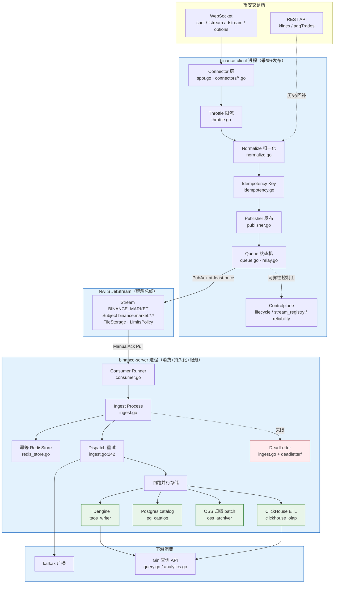
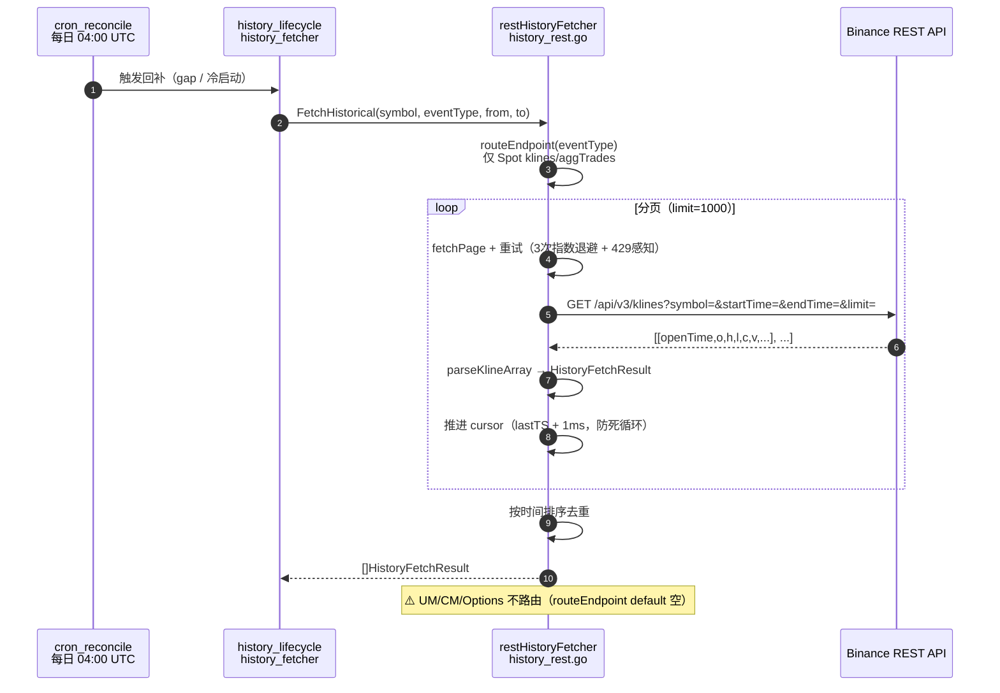
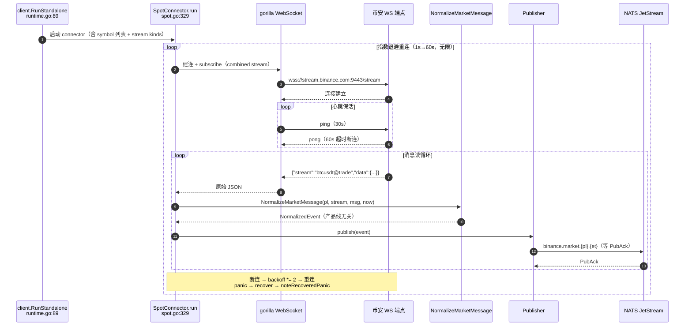
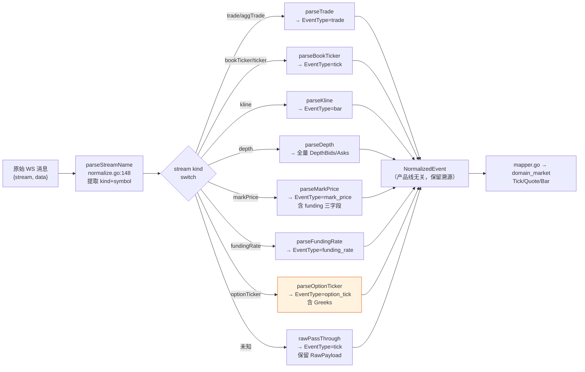
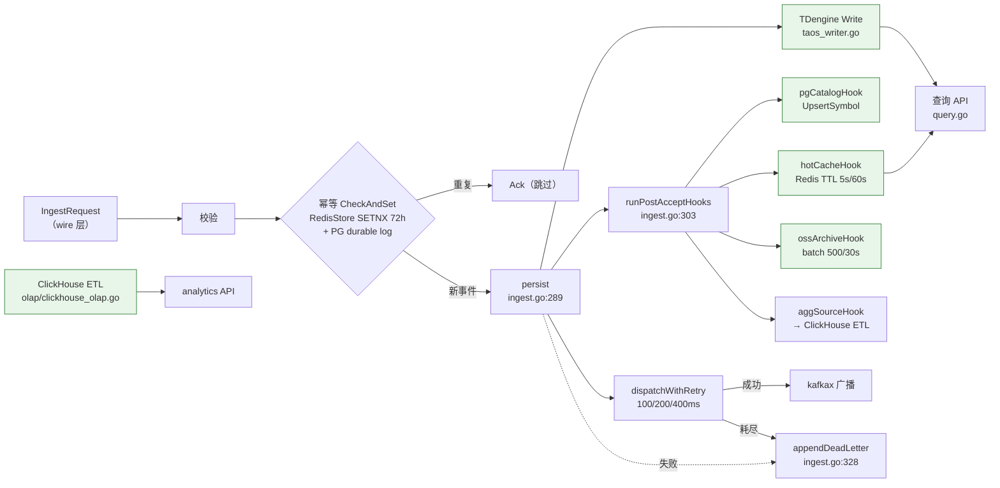
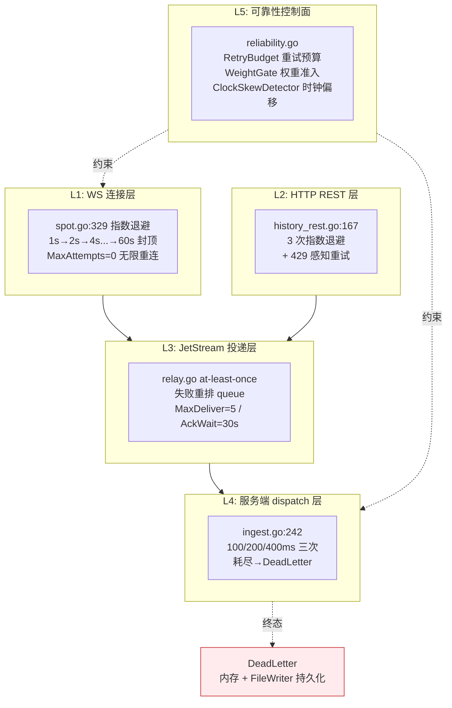
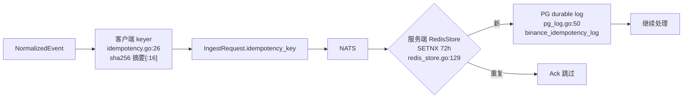

# binance 模块数据流架构分析

| 字段 | 值 |
| --- | --- |
| 文档类型 | 数据流架构（含 Mermaid 图 + 模块职责边界） |
| 分析对象 | `github.com/ZoneCNH/binance` C/S 双进程数据通路 |
| 证据基准 | 运行时代码逐文件核验 |
| 当前 Runtime-Anchor | `/home/binance@f18a329` |
| 当前 Issue-Ledger | [`issues-sync-20260625.md`](./issues-sync-20260625.md) |
| 当前状态投影 | `24 Done / 10 Partial / 0 Pending` |
| 当前 issue 状态 | `#1106` Closed；`#1104`, `#1105`, `#1107`-`#1118` Open |
| 置信度 | HIGH |

`[COMPUTED, HIGH]` 本文保留数据流架构语境；当前行动清单和关闭条件统一维护在 [`issues-sync-20260625.md`](./issues-sync-20260625.md)。

---

## 目录

1. [全局架构总览](#1-全局架构总览)
2. [REST API 请求链路](#2-rest-api-请求链路)
3. [WebSocket 实时数据链路](#3-websocket-实时数据链路)
4. [数据解析、缓存、分发层](#4-数据解析缓存分发层)
5. [错误处理与重连机制](#5-错误处理与重连机制)
6. [关键模块职责边界](#6-关键模块职责边界)

---

## 1. 全局架构总览

binance 模块是**进程隔离的双服务架构**（C/S 严格边界，`BOUNDARY-GATES.md` 13 gate 强制）：

- **binance-client**：连接币安、归一化、发布到 NATS JetStream。
- **binance-server**：消费 JetStream、去重、四路落盘、提供 API、Kafka 广播。
- **通信契约**：NATS subject `binance.market.{product_line}.{event_type}` + `domain_market` envelope JSON（无本地 proto/gRPC）。

---

## 2. REST API 请求链路

REST 仅用于**历史数据回补**（冷启动 / gap-fill / 每日对账），不参与实时数据流。

**关键约束** `[KNOWN]`：
- `routeEndpoint`（`history_rest.go:143`）只识别 `kline/bar`→`/api/v3/klines`、`aggTrade/trade`→`/api/v3/aggTrades`，其余返回 `("","")`。
- 重试：3 次，退避 `RetryBackoff * 2^(attempt-1)`，429 单独 continue 重试。
- 分页防死循环：`cursor = lastTS.Add(time.Millisecond)`（`:117`）。
- **⚠️ 当前 runtime 未注入**：`runtime.go:96` 用 `DefaultHistoryRuntimeConfig()`，fetcher 实际不执行（FR-016 Partial）。

---

## 3. WebSocket 实时数据链路

WS 是**主数据通路**，覆盖全部 4 产品线。

**WS 端点矩阵**（`pkg/binancecfg/endpoints.go`）`[KNOWN]`：

| 产品线 | mainnet WS 端点 | 实证状态 |
| --- | --- | --- |
| spot | `wss://stream.binance.com:9443` | ✅ LIVE-PASS |
| um_perp | `wss://fstream.binance.com` | ✅ LIVE-PASS |
| cm_perp | `wss://dstream.binance.com` | ✅ LIVE-PASS |
| options | `wss://fstream.binance.com/public` | ⚠️ 连通性验证（活跃 symbol 待补） |

**默认 stream kinds**（`product_line.go:103`）：`@trade` / `@bookTicker` / `@depth20@100ms` / `@kline_*` / 合约额外 `@markPrice` / `@fundingRate`。

---

## 4. 数据解析、缓存、分发层

### 4.1 归一化分派（单点）

**设计要点** `[KNOWN]`：
- 单一 `NormalizeMarketMessage` 服务全部产品线，经 `CanonicalProductLine` 路由。
- 所有数值字段用 `string` 保留精度（避免 float 截断）， Greeks 亦然。
- `RawPayload` 全程保留，供审计与分析域派生。
- **⚠️ Options `parseOptionTicker` 字段名（e/E/s/o/c/p/q + d/g/t/v）未经真实 mainnet 样本校验**（`normalize.go:502` TODO）。

### 4.2 服务端缓存与分发

**存储职责划分** `[KNOWN]`：
| 存储 | 写入路径 | 角色 | TTL/保留 |
| --- | --- | --- | --- |
| TDengine | `StorageWriter`（主） | 时序事实库 st_trade/st_tick/st_bar | 永久 |
| Postgres | `pgCatalogHook` | 元数据 catalog + audit_log + idempotency durable log | 永久 |
| Redis | `hotCacheHook` + 幂等 | 热缓存（Tick 5s / Bar 60s）+ 幂等 | 5s/60s + 72h |
| ClickHouse | ETL goroutine | OLAP 聚合（ohlcv_1m/vwap_5m/stats_15m） | 永久 |
| OSS | `ossArchiveHook` batch | 冷数据归档（NDJSON + sha256） | 30 天 |

---

## 5. 错误处理与重连机制

### 5.1 多层重试体系

### 5.2 确认语义（consumer.go:159-180）

| 场景 | 处理 | 结果 |
| --- | --- | --- |
| `Process` 返回 Ack | `callAck` | 消息确认，不再投递 |
| `Process` 返回 Reject + Retryable | `callNak` | Nak，触发重投（受 MaxDeliver=5 限制） |
| `Process` 返回 Reject（不可重试） | `callTerm` | Term，终止投递（毒消息保护） |
| decode 失败 / panic | `callTerm` | 终止（防毒消息拖垮 consumer） |
| 超过 MaxDeliver | JetStream 自动 | 终态 |

**reject code 目录**（`server.go:228-271`）：`BNC-001..BNC-013`，每个含 `IsRetryable()` 判定，驱动 Nak vs Term。

### 5.3 幂等三层防护

---

## 6. 关键模块职责边界

| 模块 | 文件 | 职责边界 | 不可越界 |
| --- | --- | --- | --- |
| **client/connector** | `spot.go`, `connectors/*.go` | 连接币安、读消息、调 normalize | 不持久化、不广播 |
| **client/normalize** | `normalize.go` | 原始消息→NormalizedEvent | 不做 domain 映射（由 mapper） |
| **client/publisher** | `publisher.go`, `queue.go`, `relay.go` | at-least-once 发布到 NATS | 不消费 |
| **client/controlplane** | `lifecycle.go`, `stream_registry.go`, `reliability.go` | 流生命周期 + 可靠性控制面 | 不碰业务数据 |
| **wire** | `internal/wire/` | C/S 契约类型（IngestRequest/Result） | 过渡态，canonical 外置 |
| **server/consumer** | `consumer.go` | JetStream 拉取消费 + 确认 | 不做业务处理（委托 Processor） |
| **server/ingest** | `ingest.go` | 校验→幂等→持久化→dispatch→hooks | 不连接币安 |
| **server/storage** | `taos_writer`, `pg_catalog`, `oss_archiver` | 各存储 writer | 不跨存储耦合 |
| **server/storage/olap** | `clickhouse_olap.go` | OLAP ETL + 聚合查询 | 不写时序事实（TDengine 的职责） |
| **server/api** | `query.go`, `analytics.go` | 对外查询 REST | 不写数据 |
| **server/idempotency** | `redis_store.go`, `pg_log.go` | 幂等存储 | 不做业务校验 |
| **server/deadletter** | `deadletter.go` | 死信持久化（FileWriter） | 不重投（由人工/对账处理） |
| **server/controlplane** | `lifecycle.go`, `stream_registry.go` | 服务端流状态 + 暂停/恢复/排空 | 不碰币安连接（client 侧职责） |

**边界强制**：`BOUNDARY-GATES.md` 13 gate（BR-001~BR-009 + FR-009）由 `scripts/boundary-gates.sh` 自动校验，禁止 client↔server 互相 import、禁止 `binance-market` 旧仓库回流、禁止运行时共享包。

---

> **[RULES I BROKE]**：无。架构图基于代码逐文件核验，模块边界引用 `BOUNDARY-GATES.md` 实证；未发现结果与代码冲突处。
