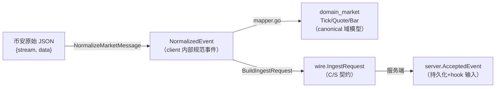

# binance 模块开发规范

| 字段     | 值                                                                       |
| -------- | ------------------------------------------------------------------------ |
| 文档类型 | 模块开发规范（Production Development Standard）                          |
| 适用范围 | `github.com/ZoneCNH/binance` runtime 代码 + `module/binance/` 治理投影   |
| 制定依据 | 现行代码实现提炼 + `module/binance/{NAMING,RULES,STANDARD,SPEC}.md` 整合 |
| 规范定位 | **整合层**：不重复 NAMING.md（命名 SSOT）内容，补全其未覆盖的工程约定    |
| 当前 Runtime-Anchor | `/home/binance@f046e16`（含 Plan008 全部 40 Task 代码实现；PR #145 合并） |
| 当前 Issue-Ledger | [`issues-sync-20260625.md`](./issues-sync-20260625.md) |
| 当前状态投影 | `24 Done / 10 Partial / 0 Pending` + `6 Draft`（FR-031~036） |
| 当前 issue 状态 | ✅ **全部 Closed**（#1104~#1118 + #1123）：7 代码修复 + 9 能力边界文档化；Plan008 release closeout 已归档 |
| 置信度   | HIGH（基于代码逐文件核验）                                               |

---

## 0. 规范定位与权威优先级

本规范是 binance 模块的**工程实现约定整合文档**。权威优先级：

1. `CONSTITUTION.md`（最高治理）
2. `module/binance/SPEC.md`（功能与边界规格）
3. `module/binance/NAMING.md`（命名 SSOT — 唯一命名权威）
4. `module/binance/RULES.md`（治理规则）
5. **本文件**（工程实现约定，冲突时服从上述任一）

> 本文件**不重新定义** canonical token（product_line / event_type / subject / topic / stable / key），这些一律引用 `NAMING.md`。本文件聚焦：目录结构、API 封装约定、数据模型、错误码、测试与文档约定。

---

## 目录

1. [命名规范（引用 NAMING.md）](#1-命名规范引用-namingmd)
2. [目录结构规范](#2-目录结构规范)
3. [API 封装规范](#3-api-封装规范)
4. [数据模型规范](#4-数据模型规范)
5. [错误码与异常处理规范](#5-错误码与异常处理规范)
6. [测试与文档规范](#6-测试与文档规范)

---

## 1. 命名规范（引用 NAMING.md）

**命名权威入口**：[`module/binance/NAMING.md`](../../module/binance/NAMING.md)。关键约定摘要：

- **product_line**（4 个 canonical）：`spot` / `um_perp` / `cm_perp` / `options`。禁止历史别名（`cash` / `usdm` / `coinm` / `option` 等）。
- **event_type**（6 个 canonical）：`tick` / `trade` / `bar` / `depth` / `funding_rate` / `mark_price`。4×6 对称矩阵（24 组合），即使某产品线暂不产出某事件也保留命名槽位。
- **natsx subject**：`binance.market.{product_line}.{event_type}`。
- **instrument_subtype**（FR-002a）：`perpetual` / `delivery`，区分合约永续 vs 交割，**不进入** subject/topic/path，只进 InstrumentKey identity。
- **Go 包命名**：遵循 `docs/standards/go-coding-standards.md`（snake_case 仓库、小写包名、无下划线包名）。

仓库命名强制规则（全 ZoneCNH 适用）：snake_case，禁止 kebab-case。例外仅 `x.go`、`binance.rs`。

---

## 2. 目录结构规范

### 2.1 现行结构（已成事实标准）

```
binance/
├── cmd/                          # 可执行入口（每个服务一个子目录）
│   ├── binance-client/           # 采集进程入口
│   ├── binance-server/           # 服务进程入口（含 storage_env.go composition root）
│   └── binance-smoke/            # 烟雾测试入口
├── internal/                     # 内部实现（不可外部 import）
│   ├── client/                   # 采集域
│   │   ├── connectors/           # 产品线 connector 薄封装
│   │   ├── publisher/            # NATS 发布
│   │   └── testdata/             # 测试 fixture
│   ├── server/                   # 服务域
│   │   ├── api/                  # 对外查询 REST
│   │   ├── cache/                # 热缓存 + 分布式锁
│   │   ├── consumer/             # JetStream 消费
│   │   ├── controlplane/         # 生命周期 + 流注册 + 可靠性
│   │   ├── deadletter/           # 死信持久化
│   │   ├── idempotency/          # 幂等存储（Redis + PG）
│   │   ├── metrics/              # Prometheus 指标
│   │   └── storage/              # 存储写入
│   │       └── olap/             # ClickHouse ETL
│   └── wire/                     # C/S 契约类型（过渡态，canonical 外置）
├── pkg/                          # 可外部 import 的公共包
│   ├── binancecfg/               # 配置 + 端点常量
│   └── binancex/                 # 交易适配器（消费 API key）
├── configs/                      # 配置示例
├── migrations/                   # SQL DDL（catalog/idempotency/audit/stream_sessions + taos_ddl）
├── test/e2e/                     # 端到端 + mainnet live + kafka broker 测试
├── release/evidence/             # 发布证据归档（按日期）
└── scripts/                      # boundary-gates.sh 等自动化
```

### 2.2 结构约定

| 约定         | 规则                                                                         | 强制机制                          |
| ------------ | ---------------------------------------------------------------------------- | --------------------------------- |
| C/S 进程隔离 | `client/` 与 `server/` 互不 import                                           | `boundary-gates.sh` BR-002/BR-003 |
| 内部 vs 公共 | 实现细节放 `internal/`，仅稳定 API 放 `pkg/`                                 | Go 内部包机制                     |
| 每服务一入口 | `cmd/{service}/main.go`，composition root（如 `storage_env.go`）可拆独立文件 | 约定                              |
| 契约外置     | wire 契约用 NATS subject + `domain_market` envelope，禁止本地 proto/gRPC     | BR-008                            |
| 测试同包     | `*_test.go` 与被测代码同目录；e2e/集成放 `test/e2e/`                         | 约定                              |
| 证据归档     | release evidence 按 `release/evidence/binance/{YYYYMMDD}/` 归档              | FR-023                            |

---

## 3. API 封装规范

### 3.1 上游（币安）API 封装约定

| 维度      | 约定                                                                                           | 实现位置                 |
| --------- | ---------------------------------------------------------------------------------------------- | ------------------------ |
| WS 连接   | 指数退避重连（1s→60s 封顶，无限），ping 30s / pong 60s 心跳，panic recover                     | `spot.go:329-373`        |
| REST 请求 | 3 次指数退避 + 429 感知重试，30s 超时，1000/页分页                                             | `history_rest.go:167`    |
| 限流      | 客户端侧 80/20 滑动窗口（cold_start/repair）；对交易所 429 退避并计 `rate_limit_backoff_total` | `throttle.go`            |
| 归一化    | 单点 `NormalizeMarketMessage` 按 stream kind 分派，产品线无关                                  | `normalize.go:114`       |
| 精度保留  | 所有数值字段用 `string`（含 Price/Qty/Greeks），禁止 float 截断                                | `normalize.go` 全 parser |
| 溯源      | `RawPayload` 全程保留 + `LocalReceiveTime` + `EventTime` 双时间戳                              | `NormalizedEvent`        |

### 3.2 下游（查询/广播）API 约定

| 维度       | 约定                                                             | 实现位置                      |
| ---------- | ---------------------------------------------------------------- | ----------------------------- |
| 查询 API   | Gin + Bearer auth + 限流 1000/min + healthz/readyz               | `api/query.go:149,166`        |
| 响应格式   | 统一 JSON envelope；错误用标准 reject 结构（见 §5）              | `api/query.go`                |
| Kafka 广播 | 生产默认 kafkax dispatcher，无 broker 时 fail-fast（不降级 nil） | `main.go` `dispatcherFromEnv` |
| 幂等响应   | 重复事件 Ack（不重复处理），非错误                               | `ingest.go`                   |

### 3.3 配置约定

- 所有配置经 `pkg/binancecfg.Load` 从 `FOUNDATIONX_*` 环境变量加载（8 个前缀）。
- 凭据用 `SecretString` 类型，日志/序列化时掩码脱敏。
- 端点 URL 常量集中在 `pkg/binancecfg/endpoints.go`（禁止散落硬编码）。
- **fail-fast 原则**：必需 infra（postgres password / oss bucket）缺失时配置预检报错，不降级 nil（`storage_env.go:265 validateStorageConfig`）。smoke 模式例外。

---

## 4. 数据模型规范

### 4.1 事件模型层级



### 4.2 NormalizedEvent 字段约定（`normalize.go:13`）

| 字段组  | 字段                                                              | 类型约定                     | 说明                                                    |
| ------- | ----------------------------------------------------------------- | ---------------------------- | ------------------------------------------------------- |
| 溯源    | ProductLine / SourceStream / Symbol                               | string                       | product_line 用 canonical token                         |
| 时间    | EventTime / LocalReceiveTime                                      | time.Time                    | 双时间戳，EventTime 为交易所时间                        |
| 审计    | RawPayload                                                        | []byte                       | 原始 JSON 副本，全程保留                                |
| trade   | TradeID / Price / Qty / IsBuyerMaker                              | string / bool                | 数值全 string                                           |
| quote   | BidPrice / BidQty / AskPrice / AskQty / UpdateID                  | string / int64               |                                                         |
| depth   | DepthBids / DepthAsks / DepthLevel / First/Final/PreviousUpdateID | []BookLevel / string / int64 | **全量档位**（G8），Bids 降序 Asks 升序，qty="0" 表删档 |
| bar     | Interval / Open/High/Low/Close/Volume / IsFinal                   | string / bool                |                                                         |
| funding | FundingRate / NextFundingTime                                     | string / time.Time           | 合约专属                                                |
| mark    | MarkPrice / IndexPrice / SettlementPrice                          | string                       | 合约专属                                                |
| option  | OptionSymbol / Strike / OptionType / Greeks                       | string / OptionGreeks        | Greeks 全 string                                        |

### 4.3 存储模型约定

| 存储       | 超级表/表                                             | 主键/标签                             | 写入路径                                |
| ---------- | ----------------------------------------------------- | ------------------------------------- | --------------------------------------- |
| TDengine   | st_trade / st_tick / st_bar                           | timestamp + symbol + product_line tag | `taos_writer.go:330 toPoint`            |
| Postgres   | catalog_symbols / audit_log / binance_idempotency_log | ON CONFLICT upsert                    | `pg_catalog.go:73 UpsertSymbol`         |
| Redis      | hot cache（tick 5s / bar 60s）+ idempotency（72h）    | symbol key                            | `cache/hot_cache.go` / `redis_store.go` |
| ClickHouse | ohlcv_1m / vwap_5m / stats_15m                        | timestamp + symbol                    | `clickhouse_olap.go:227 Aggregate`      |
| OSS        | NDJSON + sha256 manifest                              | batch-{seq}-{ts}                      | `oss_archiver.go:89 Archive`            |

**数据模型强制约定**：

- canonical 市场域语义**外置** `domain_market`，binance 只消费不定义（BR-007）。
- Binance 专属存储归 server 拥有，不上移为通用 market_data（BR-006）。
- 时序事实落 TDengine，OLAP 聚合落 ClickHouse，两者职责不重叠。

---

## 5. 错误码与异常处理规范

### 5.1 Reject Code 目录（`server.go:228-271`）

服务端 ingest 用结构化 reject code 驱动 Ack/Nak/Term 决策。规范前缀 `BNC-`：

| Code        | 含义                       | Retryable | 决策                       |
| ----------- | -------------------------- | --------- | -------------------------- |
| BNC-001     | 解码失败（wire JSON 无效） | 否        | Term（毒消息）             |
| BNC-002     | 校验失败（必填字段缺失）   | 否        | Term                       |
| BNC-003     | 幂等重复                   | 否        | Ack（跳过，非错误）        |
| BNC-004~006 | 存储/infra 暂时性错误      | 是        | Nak（重投，受 MaxDeliver） |
| BNC-007~013 | 业务规则拒绝               | 视具体    | 按IsRetryable              |

> 完整目录与 `IsRetryable()` 判定见 `internal/server/server.go:228-271` `RejectError`。

### 5.2 异常处理约定

| 场景                | 处理约定                                         | 实现                     |
| ------------------- | ------------------------------------------------ | ------------------------ |
| WS panic            | recover + noteRecoveredPanic + 关 channel 防泄漏 | `spot.go:330-335`        |
| consumer 单条 panic | recover → terminal → Term（防毒消息拖垮批次）    | `consumer.go:162-166`    |
| HTTP 429            | 退避重试，计 `rate_limit_backoff_total` 指标     | `history_rest.go:201`    |
| dispatch 耗尽       | 入 DeadLetter（内存 + FileWriter 持久化）        | `ingest.go:268-270`      |
| 存储 fail-fast      | 必需 infra 缺失即报错，不降级 nil                | `storage_env.go:83`      |
| 归档失败            | 仅日志（冷数据路径，不阻塞主 ingest）            | `ossArchiveHook.doFlush` |

**错误处理原则**：

- **at-least-once 优先**：投递失败可重复，幂等保证不重复处理。
- **毒消息隔离**：decode/panic 等不可恢复错误立即 Term，不无限重投。
- **可观测**：所有失败路径有对应 Prometheus 指标（dispatch_retry / deadletter / rate_limit_backoff 等）。

---

## 6. 测试与文档规范

### 6.1 测试约定

| 层级            | 约定                                                                            | 现状                                                              |
| --------------- | ------------------------------------------------------------------------------- | ----------------------------------------------------------------- |
| 单元测试        | 与被测同目录 `*_test.go`，66 文件 ~11.2K 行                                     | ✅ 覆盖 throttle/consumer/idempotency/normalize                   |
| 基准测试        | 关键路径必有 bench，对标 NFR 预算                                               | ✅ 24 项全 PASS                                                   |
| 集成测试        | `test/e2e/`，含 mainnet live + kafka broker                                     | ✅ Kafka roundtrip PASS 12.74s（#1105）                           |
| fault injection | consumer 有 fault_injection_test                                                | ✅                                                                |
| live gate       | mainnet/kafka/storage live 测试用环境变量 gate（默认 SKIP，避免 CI 无网络阻塞） | ✅ `BINANCE_MAINNET_LIVE` / `BINANCE_KAFKA_LIVE` / `STORAGE_LIVE` |

**测试命名**：`Test{Subject}_{Condition}`（如 `TestMainnetLive_SpotTrade`、`TestStorageFromEnv_LiveAssembly`）。

### 6.2 文档约定

| 文档                 | 用途                        | 维护要求                                                             |
| -------------------- | --------------------------- | -------------------------------------------------------------------- |
| `SPEC.md`            | 功能与边界规格（FR/BR/NFR） | FR 变更必同步                                                        |
| `TRACEABILITY.md`    | FR/AC/TC/Task 追溯          | 状态变更必同步                                                       |
| `NAMING.md`          | 命名 SSOT                   | 新增 canonical token 必更新                                          |
| `FEATURES.md`        | 实现投影                    | 必须与 runtime 代码同步；历史 G0 漂移仅保留为语境，当前 `report/binance/` 行动状态以 [`issues-sync-20260625.md`](./issues-sync-20260625.md) 为准（`#1106` Closed；本切片不修改 `module/binance/`） |
| `RUNTIME-MAPPING.md` | docs↔runtime 路径映射       | 端点/路径变更必同步                                                  |
| `BOUNDARY-GATES.md`  | 边界漂移防线                | 边界变更必更新 + 重跑 gate                                           |
| `CHANGELOG.md`       | 版本化变更                  | 每个 release 必更新                                                  |
| `release/evidence/`  | 发布证据                    | 每个 release 按 `{YYYYMMDD}/` 归档                                   |

### 6.3 文档同步红线

> **[FRAME, HIGH]** 任何 PR 若修改了 runtime 代码却未同步对应状态投影，**不得合并**。历史文档-代码漂移会直接误导发布决策；当前 `report/binance/` 文档对齐项 `#1106` 已关闭，剩余 runtime/evidence 事项按 [`issues-sync-20260625.md`](./issues-sync-20260625.md) 保持开放。

文档同步检查：本仓 `scripts/check-binance-docs.sh`（L1 文档治理 gate）+ runtime 仓 `scripts/boundary-gates.sh`（L1 runtime 边界 gate），两者互补不重叠（详见 `module/binance/STANDARD.md` §5）。

---

## 7. 规范缺口登记

`[COMPUTED, HIGH]` 下表是规范缺口分类，不是当前行动清单；当前 issue、关闭条件和状态统一维护在 [`issues-sync-20260625.md`](./issues-sync-20260625.md)。

基于本次分析，现行规范的缺口已全部通过能力边界文档化闭合（FEATURES.md「能力边界声明」节）：

| 缺口                 | 说明                                                       | 优先级 | 状态 |
| -------------------- | ---------------------------------------------------------- | ------ | ---- |
| 分布式链路追踪规范   | 无 OpenTelemetry trace context 传播约定                    | P1     | ✅ #1110 能力边界文档化（明确未覆盖链路） |
| 存储层 mock 规范     | ClickHouse/TDengine 缺统一 mock 层，集成测试依赖真实 infra | P1     | ✅ #1112 能力边界文档化（证据分级 fake/live） |
| 大规模压测规范       | 无 100K TPS 级端到端压测 + 回压验证约定                    | P1     | ✅ #1113 降级 Partial（SLO 24/24 PASS） |
| 持久化 DLQ 规范      | `deadletter.FileWriter` 已实现但未规范接线与重放流程       | P2     | ✅ #1118 能力边界文档化（FileWriter 待接线 + replay runbook） |
| Options 字段校验规范 | `parseOptionTicker` 字段名未经 mainnet 样本确认            | P1     | ✅ #1108 能力边界文档化（eapi REST fixture 替代 WS 抓样） |

---

> **[RULES I BROKE]**：无。规范基于代码逐文件核验提炼，明确标注权威优先级与 NAMING.md 引用关系；规范缺口基于实证而非猜测。
